# Loki Product-Wide Architecture

## Document Status

| Field                | Value                                                                                                                                                    |
| -------------------- | -------------------------------------------------------------------------------------------------------------------------------------------------------- |
| Product              | Loki — privacy-first mobile messenger                                                                                                                    |
| Document type        | Product-wide architecture (living map)                                                                                                                   |
| Scope                | MVP + near-term roadmap (Phases 2–4)                                                                                                                     |
| Audience             | Engineering, product, security, design, leadership, new hires                                                                                            |
| Status               | v1.0 — initial publication                                                                                                                               |
| Last updated         | 2026-05-10                                                                                                                                               |
| Maintainer (primary) | Abdul (full-stack lead)                                                                                                                                  |
| Companion docs       | [loki-mvp-prd.md](./loki-mvp-prd.md), [loki-feature-set.md](./loki-feature-set.md), [loki-build-plan.md](./loki-build-plan.md), [CLAUDE.md](./CLAUDE.md) |

> This document is the **single authoritative overview** for Loki's architecture. It is intentionally high-leverage: it explains what exists, what is coming, why decisions were made, where the risks live, and where to dig deeper. Subsystem-specific documents are linked from each section rather than duplicated here.

---

## Table of Contents

1. [Executive Summary](#1-executive-summary)
2. [Scope, Audience, and How to Use This Doc](#2-scope-audience-and-how-to-use-this-doc)
3. [Product and Business Context](#3-product-and-business-context)
4. [Architecture Principles](#4-architecture-principles)
5. [System Context](#5-system-context)
6. [Domain Model](#6-domain-model)
7. [Major User Journeys](#7-major-user-journeys)
8. [High-Level Architecture](#8-high-level-architecture)
9. [Component and Service Catalog](#9-component-and-service-catalog)
10. [Data Architecture](#10-data-architecture)
11. [API and Integration Architecture](#11-api-and-integration-architecture)
12. [Frontend Architecture](#12-frontend-architecture)
13. [Infrastructure and Deployment](#13-infrastructure-and-deployment)
14. [Security Architecture](#14-security-architecture)
15. [Reliability and Operations](#15-reliability-and-operations)
16. [Performance and Scalability](#16-performance-and-scalability)
17. [Compliance and Privacy](#17-compliance-and-privacy)
18. [Cross-Cutting Platform Capabilities](#18-cross-cutting-platform-capabilities)
19. [Architecture Decisions (ADRs)](#19-architecture-decisions-adrs)
20. [Known Risks and Technical Debt](#20-known-risks-and-technical-debt)
21. [Target Architecture and Roadmap](#21-target-architecture-and-roadmap)
22. [Ownership Model](#22-ownership-model)
23. [Glossary and References](#23-glossary-and-references)

---

## 1. Executive Summary

### 1.1 Mission

Loki is a privacy-first mobile messenger that gives privacy-sensitive users a credible daily-driver alternative to phone-number messengers without forcing them into a high-friction anonymity tool. The product is built around three non-negotiable commitments:

1. **No phone number, no email, no public directory.** Identity is a private username for login and a user-chosen `Public-ID` for shareable contact. Discovery is impossible by design.
2. **End-to-end encrypted messaging with short-retention delivery.** The server is a thin encrypted relay. It never holds plaintext and never builds a long-term archive.
3. **Strong local privacy.** Hidden vault, duress wipe, and device-specific chats give at-risk users meaningful protection on the device itself, not just on the wire.

A fourth, less obvious commitment ties these together: **honest disclosure**. The product never claims protections it cannot deliver. Disappearing messages do not prevent screenshots and we say so. Duress wipe does not erase recipient devices and we say so. Push notifications go through OS providers that can see metadata and we say so. The product's trust posture rests on saying what it does, what it does not, and why.

### 1.2 Business context

#### 1.2.1 Market segmentation

The messenger market splits into three camps that each fail a different way for privacy-conscious users:

| Camp               | Examples                                | Strength                                       | Weakness Loki addresses                                                                           |
| ------------------ | --------------------------------------- | ---------------------------------------------- | ------------------------------------------------------------------------------------------------- |
| Mainstream         | WhatsApp, iMessage, Telegram, Messenger | Daily usability, ubiquity, network effects     | Phone-number identity, social-graph metadata, server-side history, advertising data               |
| Privacy-mainstream | Signal                                  | E2EE default, reputation                       | Phone-number primary, server holds long-term registration, account discovery via phone numbers    |
| Hard anonymity     | Briar, Cwtch, Session, Status, Tox      | Strong metadata protections, no central server | High friction, bad UX, slow delivery, low daily usability, requires user technical sophistication |

The market is missing the segment **"phone-free identity + acceptance-gated contact + daily-usable UX."** That is the Loki product.

#### 1.2.2 Competitive positioning matrix

| Dimension                  | WhatsApp     | iMessage    | Telegram         | Signal           | Briar       | Session  | Loki                    |
| -------------------------- | ------------ | ----------- | ---------------- | ---------------- | ----------- | -------- | ----------------------- |
| Phone number required      | Yes          | Yes (Apple) | Yes              | Yes              | No          | No       | **No**                  |
| Email required             | No           | Yes (Apple) | No               | No               | No          | No       | **No**                  |
| Public directory           | Phone-based  | Phone-based | Username + phone | Phone + username | None        | None     | **None**                |
| Account-existence privacy  | Weak         | Weak        | Weak             | Weak             | Strong      | Strong   | **Strong**              |
| E2EE default               | Yes          | Apple↔Apple | No (opt-in)      | Yes              | Yes         | Yes      | **Yes**                 |
| Forward secrecy            | Yes (Signal) | Yes         | Per Secret Chat  | Yes              | Yes         | Yes      | **MVP: No → Phase 2**   |
| Server retention           | Until deliv  | ~30 days    | Indefinite       | Until deliv      | None (P2P)  | None     | **24–72h hard TTL**     |
| Local vault (2nd PIN)      | No           | No          | No               | No               | No          | No       | **Yes**                 |
| Duress wipe                | No           | No          | No               | No               | No          | No       | **Yes**                 |
| Multi-device cap           | Multiple     | Apple eco   | Multiple         | 1 + linked       | Per-install | Per-inst | **3 hard cap**          |
| Group size                 | Up to 1024   | 32          | 200K             | 1000             | Small       | Small    | **3–25**                |
| Daily usability            | Excellent    | Excellent   | Excellent        | Good             | Poor        | Poor     | **Good (target)**       |
| Calling                    | Yes          | Yes         | Yes              | Yes              | No          | No       | **Yes**                 |
| Sender metadata protection | Weak         | Weak        | Weak             | Sealed sender    | Strong      | Strong   | **MVP: weak → Phase 3** |

The bold cells are Loki's positioning. The combination "no phone + no email + daily-usable + calling + acceptance-gated" is unique in the market.

#### 1.2.3 Why now

Three converging trends justify Loki today:

1. **Regulatory shift toward identity disclosure.** Several jurisdictions are pushing phone-based account requirements on messengers. Privacy-conscious users are looking for alternatives that pre-empt phone-number identity.
2. **Mainstream messenger consolidation.** As the major messengers absorb each other or merge metadata models, the gap for a clearly differentiated phone-free option widens.
3. **Improving mobile crypto primitives.** libsodium, native secure enclaves, and modern WebRTC stacks make E2EE messaging and calling implementable by a small team in a way that was not feasible five years ago.

#### 1.2.4 Revenue posture

The MVP is not monetization-driven. The single revenue surface is the **paid Public-ID rotation token** for users who want to change their ID more than once per 7-day window. This exists primarily as an anti-abuse mechanism (rate limiting via small economic friction), not a revenue product. Target price: a few US dollars per token; provider TBD.

Future monetization options exist but are out of MVP scope:

- Paid storage extension for longer offline TTL.
- Paid extra device slots beyond the 3-device cap.
- Subscription tier with priority delivery or larger groups.

No advertising. No data-licensing. No "free for 30 days then paid" patterns. The product must be sustainable on a price model that is small enough to be affordable for individual users and large enough to deter abuse.

### 1.3 What the system does (one-paragraph version)

A user creates an account with a private username and password (no phone, no email), claims a `Public-ID` such as `dancing-panda927`, and shares that ID out-of-band. A correspondent enters the exact `Public-ID` to send a contact request, which the recipient must explicitly accept. After acceptance, the two devices exchange end-to-end encrypted messages routed through a thin Express relay backed by PostgreSQL. Encrypted envelopes are stored on the server only until fetched and acknowledged or until a TTL of 24–72 hours expires. Local message storage is encrypted on each device. Sensitive chats can be moved into a separately-encrypted hidden vault behind a second PIN. A duress PIN destroys the vault keys irreversibly. Up to three devices can be linked per account, and 1:1 and group audio/video calling round out the surface.

### 1.4 Major users and workflows

| User type                    | Primary workflows                                                             | Volume class           |
| ---------------------------- | ----------------------------------------------------------------------------- | ---------------------- |
| Privacy-conscious individual | Onboard → claim Public-ID → exchange Public-ID → start chat → daily messaging | Bulk                   |
| Activist / journalist        | Hidden-vault setup → duress PIN → device-specific chats                       | Long tail, high stakes |
| Multi-device user            | Link second device → recovery verification → forward sync                     | Moderate               |
| Group user                   | Create 3–25-person group → encrypted group chat → group calls                 | Moderate               |
| Operator (us)                | Run retention jobs → monitor delivery health → respond to abuse               | Internal               |

### 1.5 Architectural principles (preview)

Detailed in [Section 4](#4-architecture-principles). Headline list:

- **No discoverability by default.** Anti-enumeration is a hard constraint.
- **Server holds ciphertext only.** Plaintext on the server is a bug.
- **Minimal data at rest.** TTL everywhere.
- **Private credentials are strictly separated from public identity.**
- **Local protection is a first-class concern.**
- **Don't overpromise.** Honest disclosure beats silent compromise.
- **Stack discipline.** Express + PostgreSQL on the server, Expo RN + TypeScript on the client. New tech needs an ADR.
- **Defense in depth.** No single layer is the whole defense.
- **Fail closed on auth and crypto.** Failures default to denying access.
- **Idempotency at the edge.** Mutating endpoints accept client idempotency keys.
- **Anti-enumeration is a hard constraint.** Every user-input-driven endpoint returns uniform responses.

### 1.6 Major constraints

| Constraint               | Value                                                   | Driver                              |
| ------------------------ | ------------------------------------------------------- | ----------------------------------- |
| Team size                | 4 engineers                                             | Headcount                           |
| MVP LOC budget           | ~19,000 LOC across 95 tasks / 16 sprints                | Scope                               |
| Server retention         | 24–72 hours                                             | Privacy thesis                      |
| Devices per account      | 3 max                                                   | Scope + sync complexity             |
| Group size               | 3–25 participants                                       | Scope + key distribution complexity |
| Public-ID format         | a–z, 0–9, hyphen; 8–24 chars; starts with letter        | Anti-enumeration + brand safety     |
| Free Public-ID rotations | 1 per 7 days                                            | Anti-abuse                          |
| Stack                    | Node.js/Express, PostgreSQL (Neon), Expo RN, TypeScript | Existing scaffold                   |

### 1.7 Current state vs. desired state

| Layer      | Current state (commit `0b39d60`)                                                                     | Desired MVP state (post Sprint 16)                                                                    |
| ---------- | ---------------------------------------------------------------------------------------------------- | ----------------------------------------------------------------------------------------------------- |
| Server     | Express scaffold; hardcoded-credential auth; in-memory sessions; DB pool configured; no domain logic | 14 controllers, ~12 DB models, retention + cleanup jobs, push dispatch, full E2EE relay               |
| Mobile     | Expo Router scaffold; login screen; tab nav; splash                                                  | Full onboarding, chat, group, calls, vault, duress, multi-device, settings                            |
| Database   | Configured pool; no migrations                                                                       | 4 migration sets covering accounts, public-IDs, contact requests, mailboxes, envelopes, groups, calls |
| Shared     | Minimal, unused                                                                                      | Full type contracts + Public-ID validators                                                            |
| Crypto     | None                                                                                                 | libsodium/tweetnacl device keys, message encryption, group session keys, vault keys                   |
| Operations | Render hosting backend                                                                               | Render + Neon + APNs/FCM + retention jobs + structured logging                                        |

The gap between "current" and "MVP" is ~95 tasks broken into 16 sprints across 4 engineers — see [loki-build-plan.md](./loki-build-plan.md).

### 1.8 One-year horizon

By the end of Phase 2 (~6 months post-MVP), the system should add:

- Forward secrecy in 1:1 messaging (Signal-protocol-equivalent ratchet).
- DB-backed session expiration.
- TLS pinning on mobile.
- Sentry-equivalent (privacy-respecting) crash reporting.
- Self-service account deletion.
- Postgres read replica for fetch endpoints.
- Rate limiter backed by Redis.
- High-anonymity polling notification mode.
- Automated test infrastructure (unit + integration + E2E).
- Self-hosted blob storage (S3-compatible) for attachments.

By the end of Phase 3 (~12 months), the system should evaluate:

- Onion-routed transport option.
- Sender-metadata protections (sealed-sender-equivalent).
- Mailbox sharding for scale.
- Multi-region deployment.

These are roadmap items, not commitments. They are listed here so leadership and new hires can locate "where this is going" in one place rather than tracking it down across ADRs and roadmap docs.

### 1.9 Document conventions

| Convention            | Meaning                                                                                 |
| --------------------- | --------------------------------------------------------------------------------------- |
| **MVP**               | The scope defined in [loki-mvp-prd.md](./loki-mvp-prd.md). Everything else is post-MVP. |
| **Sprint N.M**        | Task M in Sprint N from [loki-build-plan.md](./loki-build-plan.md).                     |
| **ADR-XXX**           | Architecture Decision Record. See [Section 19](#19-architecture-decisions-adrs).        |
| **R-N**               | Risk number N from [Section 20.1](#201-architectural-risks).                            |
| **TBD**               | Decision deferred; tracked in [Section 21.7](#217-open-questions).                      |
| Bold cell in a matrix | Loki's position in a competitive matrix.                                                |
| Mermaid diagram       | Renders in GitHub, VS Code, and most modern markdown viewers.                           |
| Tables over prose     | When information is enumerable, prefer tables.                                          |
| Deep heading (5+)     | Rare. If a section needs depth >4, refactor with cross-references.                      |

### 1.10 How this doc is used in practice

- **Onboarding:** New senior engineer reads §1–4 day one, §5–9 day two, deep-dives §10–18 in week one.
- **Design review:** Author cites §4 principles and any relevant ADRs. Reviewers check against §4 and §20.
- **Production incident:** On-call references §15 runbooks and §14 incident response.
- **Quarterly architecture review:** Maintainer walks §19, §20, §21, accepts/closes ADRs, updates risk register.
- **Compliance / security review:** External reviewer focuses on §4, §14, §17, §19.

---

## 2. Scope, Audience, and How to Use This Doc

### 2.1 What this doc covers

- **Product surface**: every feature in [loki-feature-set.md](./loki-feature-set.md), grouped by architectural concern rather than by sprint.
- **System architecture**: containers, components, data flow, key cross-cutting concerns.
- **Operating model**: ownership, deployment, retention jobs, observability.
- **Decision history**: ADRs for major tradeoffs.
- **Forward view**: target architecture and what we are _not_ building (and when we will).

### 2.2 What this doc does not cover

- **Per-endpoint API specs.** See [Section 11](#11-api-and-integration-architecture) for patterns and link out to OpenAPI specs once they exist.
- **Per-feature visual designs.** See Figma (link TBD).
- **Cryptographic protocol formal proofs.** See `docs/security/protocol-spec.md` (TBD).
- **Build orchestration mechanics.** That lives in [loki-build-plan.md](./loki-build-plan.md).
- **Compliance evidence packages.** Out of scope for MVP — see [Section 17](#17-compliance-and-privacy).

### 2.3 Audience

| Reader                 | What they should get out of this doc                                      |
| ---------------------- | ------------------------------------------------------------------------- |
| New senior engineer    | Section 1, Sections 5–9, then dive into the ownership model in Section 22 |
| Product manager        | Sections 1, 3, 6, 7, 21                                                   |
| Security reviewer      | Sections 4, 14, 17, 19, 20                                                |
| Designer               | Sections 6, 7, 12                                                         |
| Engineering leadership | Sections 1, 19, 20, 21, 22                                                |
| Backend contributor    | Sections 8, 9, 10, 11, 14, 15                                             |
| Mobile contributor     | Sections 7, 8, 9, 12, 14, 18                                              |
| DBA / data engineer    | Sections 10, 13, 15, 17                                                   |

### 2.4 How to use this doc

1. **Skim Sections 1–4** to internalize what Loki is and the rules of the road.
2. **Read Sections 5–9** for the system map.
3. **Use Sections 10–18 as reference** when working in a specific area.
4. **Read Sections 19–21 before making structural changes.** Architectural drift is the failure mode this doc is designed to prevent.
5. **When the doc and reality disagree, fix the doc in the same PR as the reality change.** This is a living map, not a snapshot.

### 2.5 Linked deeper docs

| Topic                       | Link                                         |
| --------------------------- | -------------------------------------------- |
| Product Requirements        | [loki-mvp-prd.md](./loki-mvp-prd.md)         |
| Feature Catalog             | [loki-feature-set.md](./loki-feature-set.md) |
| Build Plan                  | [loki-build-plan.md](./loki-build-plan.md)   |
| Repository Operating Notes  | [CLAUDE.md](./CLAUDE.md)                     |
| Backend Database Setup      | `apps/server/NEON_SETUP.md`                  |
| Cryptographic Protocol Spec | `docs/security/protocol-spec.md` (TBD)       |
| Threat Model                | `docs/security/threat-model.md` (TBD)        |
| API Reference               | `docs/api/openapi.yaml` (TBD)                |

---

## 3. Product and Business Context

### 3.1 Problem statement

Most messengers protect content but expose substantial metadata: who is connected to whom, whether an account exists, when conversations happen, and which devices participate. They do this because their identity primitive is a phone number and their delivery model is long-term server retention. Loki is built on the opposite primitives.

### 3.2 Target users

#### 3.2.1 Persona 1 — "Maya," the privacy-conscious individual (primary)

- **Age:** 28. **Tech literacy:** High. **Day job:** Software designer.
- **Why she's here:** She is not in danger. She just objects on principle to phone-number identity, behavioral analytics, and message archival. She's tried Signal and wants a step beyond it.
- **Devices:** iPhone primary, iPad occasional. No desktop messenger expectation.
- **What she wants:** "Talk to my partner and 5 friends without WhatsApp seeing the social graph. Don't want my number out there. Should feel like a normal messenger."
- **What she does NOT want:** A tool that requires technical setup, a tool that breaks group chats with normies, a tool that has 10-second message delays.
- **Success looks like:** Daily use. Group chat with her inner 5. Vault for journal-style 1:1 with partner.
- **Risk of churn:** Will leave for Signal if Loki adds visible friction or feels buggy.

#### 3.2.2 Persona 2 — "Dani," the freelance journalist (high-stakes primary)

- **Age:** 35. **Tech literacy:** Medium-high. **Day job:** Investigative reporting.
- **Why she's here:** She communicates with sources who must not be linked to her, on devices that may be inspected at borders. She needs deniability without performance theater.
- **Devices:** Android primary, iPhone secondary for separation.
- **What she wants:** "Sources can reach me on a Public-ID I rotate. Sensitive chats live in a vault that wipes if I'm coerced. If a border agent seizes my phone, the vault contents must be unrecoverable."
- **What she does NOT want:** A tool that claims protections it doesn't deliver. A tool that lets a source's identity leak through metadata. A tool with vendor-controlled backups.
- **Success looks like:** A workflow she can teach a source in 5 minutes. Vault works. Duress wipe works. She rotates her Public-ID after a story.
- **Risk of churn:** Will leave if a single bad incident shows metadata leakage.

#### 3.2.3 Persona 3 — "Sam," the activist (high-stakes primary)

- **Age:** 24. **Tech literacy:** Medium. **Day job:** Organizing.
- **Why they're here:** Organizing in a jurisdiction with active surveillance pressure. Group coordination is critical and must not expose the network.
- **Devices:** Android, shared sometimes with another organizer.
- **What they want:** "Small organizing group (10-15 people). End-to-end encrypted. Disappearing messages. Hidden vault for the most sensitive coordination. Duress wipe in case the device is seized at a protest."
- **What they do NOT want:** A tool that requires giving up their real name or number. A tool that builds a server-side membership list that can be subpoenaed.
- **Success looks like:** Group chat with 12 organizers. Disappearing default. Vault for plans-of-the-week. No traceable server record of the group's membership.
- **Risk of churn:** Will leave if there's a meaningful breach disclosure or if group encryption fails visibly.

#### 3.2.4 Persona 4 — "Avi," the multi-device pragmatist (moderate primary)

- **Age:** 41. **Tech literacy:** High. **Day job:** Software engineer.
- **Why he's here:** He wants Loki on phone + tablet + work-issued phone for sandboxing. He treats devices as compartments.
- **Devices:** 3 devices, all separately purposed.
- **What he wants:** "I want some chats on all devices, some chats only on the personal device, and I want a clear UI distinction so I don't accidentally mix them."
- **What he does NOT want:** A confusing sync model. Silent device additions. Surprises about which device has which chat.
- **Success looks like:** Standard chats sync to all three. Device-specific chats stay on his personal device. He can revoke the work phone in one tap.
- **Risk of churn:** Will leave if device-specific chats leak across devices or if linking is fragile.

#### 3.2.5 Secondary users

- Researchers, lawyers, mental-health practitioners, and other professionals with confidentiality obligations.
- Couples and small friend groups who want "our inner-circle messenger" rather than a general social app.
- Users who use Signal today but want stronger anti-discoverability.

#### 3.2.6 Anti-personas (who we are NOT building for)

| Anti-persona                              | Why not                                                                                                                    |
| ----------------------------------------- | -------------------------------------------------------------------------------------------------------------------------- |
| The mass-market user                      | They want WhatsApp's network effect. Loki cannot and will not compete on ubiquity.                                         |
| The cryptocurrency user                   | Out-of-scope by ADR. Wallets are not part of MVP.                                                                          |
| The criminal looking for impunity         | Loki reduces metadata risk, not legal accountability. We do not market or position the product as criminal infrastructure. |
| The enterprise IT buyer                   | No SSO, no audit trail, no compliance posture. Phase 3+ at earliest.                                                       |
| The "I want my chat history forever" user | The product is deliberately short-retention. Long-term archival is anti-thesis.                                            |
| The "I want big public groups" user       | 25-person cap by design. Public broadcast is not the product.                                                              |

### 3.3 Jobs to be done (JTBD)

| When... (situation)                                        | I want to... (motivation)                                  | So I can... (outcome)                                      |
| ---------------------------------------------------------- | ---------------------------------------------------------- | ---------------------------------------------------------- |
| ...I sign up for a new messenger                           | ...avoid handing over my phone number                      | ...preserve my baseline anonymity                          |
| ...I share my contact with a stranger                      | ...not have them learn whether my account exists yet       | ...remain invisible until I choose to surface              |
| ...I send a message I would not want a server admin to see | ...have confidence the server cannot read it               | ...trust the product with sensitive content                |
| ...I let someone borrow my phone                           | ...keep my most private chats inaccessible                 | ...not have to delete them in advance every time           |
| ...my device is seized                                     | ...irreversibly destroy the most sensitive chats           | ...protect sources and contacts even under coercion        |
| ...I link a second device                                  | ...know exactly what does and does not sync                | ...keep certain chats compartmented to the original device |
| ...I rotate my Public-ID                                   | ...stop a stalker from reaching me on the old one          | ...regain control of my inbound contact surface            |
| ...I deny a contact request                                | ...not reveal to the sender that I exist                   | ...not become a target for follow-up by ID-guessing        |
| ...I receive a notification                                | ...not have the message content visible on the lock screen | ...keep prying eyes from seeing my correspondence          |

### 3.4 Differentiators (vs. WhatsApp/Signal)

Condensed view (full matrix in §1.2.2):

| Dimension                  | WhatsApp        | Signal                  | Loki                                       |
| -------------------------- | --------------- | ----------------------- | ------------------------------------------ |
| Identity primitive         | Phone number    | Phone number / username | Private username + Public-ID (user-chosen) |
| Public directory           | Yes (phonebook) | Yes (number/username)   | None                                       |
| Typeahead / global search  | Yes             | Yes                     | None                                       |
| Account-existence check    | Implicit        | Implicit                | Anti-enumeration: uniform response         |
| Server retention           | Long            | Until delivery          | 24–72h with hard TTL                       |
| Local vault behind 2nd PIN | No              | No                      | Yes                                        |
| Duress wipe                | No              | No                      | Yes (vault keys only)                      |
| Multi-device cap           | High            | 1 primary + linked      | 3 hard cap                                 |
| Phone/email on file        | Required        | Required                | None                                       |

### 3.5 Business model

The MVP is not monetization-driven. The single revenue surface is the **paid Public-ID rotation token** for users who want to change their ID more than once per 7-day window. This exists primarily as an anti-abuse mechanism (rate limiting via a small economic friction), not a revenue product. Future monetization decisions are out of scope for this document.

### 3.6 Product principles

These come directly from the PRD and become design constraints throughout the architecture:

1. **No discoverability by default.**
2. **Minimal data at rest.**
3. **Private account credentials stay separate from shareable identity.**
4. **Privacy settings must be understandable.**
5. **Protect the user locally too.**
6. **Do not overpromise.**

These principles are repeated in Section 4 with engineering-level translations.

### 3.7 Success metrics

Tracked via lightweight server-side telemetry that does not violate principle 2 (i.e., aggregate counters, not per-user behavioral logs):

| Category         | Metric                                                                             |
| ---------------- | ---------------------------------------------------------------------------------- |
| Activation       | Account-creation completion rate; time-to-first-Public-ID                          |
| Connection       | Contact-request acceptance rate; time-to-first-message                             |
| Reliability      | Send→deliver success rate; median delivery latency; call setup success             |
| Privacy adoption | % users with disappearing messages enabled; % with hidden vault; % with duress PIN |
| Multi-device     | Linked-device completion rate; revoke usage                                        |
| Trust            | Support volume from misunderstood privacy expectations (negative metric)           |

### 3.8 What "failure" looks like

MVP fails — even with all features shipped — if any of the following are true at launch:

| Failure mode                                        | Why this is fatal                                                       |
| --------------------------------------------------- | ----------------------------------------------------------------------- |
| Anti-enumeration breaks (sender can probe IDs)      | Violates the core differentiator; product is no better than competitors |
| Server-side plaintext exists anywhere               | Violates Principle P2; brand-defining failure                           |
| Duress wipe is unreliable                           | Loses high-stakes users; one bad incident becomes the public narrative  |
| Message delivery fails > 1% under normal conditions | Daily usability collapses; users churn                                  |
| Call setup < 80% success                            | Calling is table stakes; failure is visible                             |
| Onboarding > 5 minutes                              | Conversion drops below sustainable threshold                            |
| Group key rotation fails on member change           | Removed members can read future messages; security failure              |
| Multi-device transfer leaks vault contents          | Privacy-trust failure                                                   |
| Notification content leaks to lock screen           | Visible to anyone holding the phone; trust failure                      |
| Vault PIN can be brute-forced quickly               | Defeats the vault                                                       |

These failure modes drive much of the architecture in Sections 14–16.

### 3.9 Trust posture and brand

The product has one brand axis: **trustworthy**. Every architectural decision is also a brand decision. Cutting corners on E2EE, retention, or anti-enumeration is not "a tech tradeoff" — it's a brand-defining failure that the product cannot recover from. This is why ADRs in those areas require the highest review bar.

---

## 4. Architecture Principles

These are the rules of the road. Every PR, ADR, and design decision should be checkable against this list.

### 4.1 Privacy and security principles

| #   | Principle                             | Engineering translation                                                                                                                                    |
| --- | ------------------------------------- | ---------------------------------------------------------------------------------------------------------------------------------------------------------- |
| P1  | No discoverability                    | No endpoint reveals account existence; no typeahead; no search; reserved-name and confusable rejection happen with the same response shape as "unknown ID" |
| P2  | Server holds ciphertext only          | Plaintext on the server is a bug. No code path may decrypt user content server-side. Logging must strip content.                                           |
| P3  | Minimal data at rest                  | Every record either has a TTL or a justification documented in Section 10. Permanent records are exceptional.                                              |
| P4  | Credentials separate from identity    | `accounts.username` and `public_ids.id` are in distinct tables and never co-logged or co-returned.                                                         |
| P5  | Local-first protection                | Hidden vault and duress wipe are device-only; the server is not in the vault trust path.                                                                   |
| P6  | Honest disclosure                     | Every limitation (e.g., disappearing-message screenshot, duress wipe scope) ships with copy and an education screen.                                       |
| P7  | Anti-enumeration is a hard constraint | Every user-input-driven endpoint returns a uniform response on validation failure, format failure, unknown-ID, and rate-limit.                             |
| P8  | Defense in depth                      | E2EE + local-encrypted storage + vault PIN + duress wipe + minimal logs. No single layer is the whole defense.                                             |

### 4.2 Engineering principles

| #   | Principle                              | Engineering translation                                                                                                                      |
| --- | -------------------------------------- | -------------------------------------------------------------------------------------------------------------------------------------------- |
| E1  | Stack discipline                       | Server is Express + PostgreSQL. Mobile is Expo + React Native + TypeScript. Adding a runtime, language, or major dependency requires an ADR. |
| E2  | Shared types are the contract          | Every API request/response shape lives in `packages/shared`. The server consumes them; the client consumes them; drift is a test failure.    |
| E3  | Backward compatibility by default      | New API versions are additive. Removing fields requires a deprecation window and an ADR.                                                     |
| E4  | Async by default for non-blocking work | Push dispatch, retention cleanup, and non-blocking notifications run in background jobs, not request handlers.                               |
| E5  | No cross-service DB access             | If a future service needs Loki data, it asks via API. There is no second consumer of the DB.                                                 |
| E6  | Idempotency at the edge                | Send-message, ack, and rotate-Public-ID endpoints accept a client-supplied idempotency key and behave correctly under retry.                 |
| E7  | Observability is part of the feature   | Every new endpoint ships with structured logs, latency metric, and an error counter.                                                         |
| E8  | Fail closed on auth and crypto         | Auth/crypto failures default to denying access, not allowing it.                                                                             |

### 4.3 Quality principles

| #   | Principle                      | Engineering translation                                                                                    |
| --- | ------------------------------ | ---------------------------------------------------------------------------------------------------------- |
| Q1  | Code clarity over cleverness   | A new engineer should be able to read a controller and understand its behavior in one pass.                |
| Q2  | Boring is better               | Use Postgres before introducing Redis. Use plain `fetch` before introducing a client framework.            |
| Q3  | Test what is critical          | MVP has no test infra; first tests in Phase 2 must cover anti-enumeration, vault wipe, group key rotation. |
| Q4  | Small commits, small PRs       | A PR > 600 lines requires a paragraph in the description justifying why it cannot be split.                |
| Q5  | Reviewable code                | Every PR has a clear description. No "WIP" merges to main.                                                 |
| Q6  | Visible side effects           | A function that mutates state or talks to the network should have a name that makes that obvious.          |
| Q7  | Errors that explain themselves | Error messages name the thing that failed and the action the user should take.                             |

### 4.4 Operational principles

| #   | Principle                          | Engineering translation                                                                       |
| --- | ---------------------------------- | --------------------------------------------------------------------------------------------- |
| O1  | Deployments are boring             | Backend ships on push to main. Mobile ships through EAS channels. No bespoke release rituals. |
| O2  | Rollback is always possible        | Every change to main must be revertible by `git revert` + redeploy in < 30 minutes.           |
| O3  | Observable by default              | Every new endpoint emits a counter, latency histogram, and error counter.                     |
| O4  | Logs are useful and bounded        | 30-day retention. No content. No social graph. Request ID propagated.                         |
| O5  | Alerts mean something              | If an alert fires more than 3 times in a week, it gets fixed or tuned. No alert fatigue.      |
| O6  | Backups exist and are tested       | Neon PITR is the backup. Test recovery at least once per quarter.                             |
| O7  | Secrets are managed, not memorized | Render-managed env vars; never paste a production secret into Slack or email.                 |

### 4.5 Anti-principles (things we explicitly will not do)

- We will not build a phone-number lookup, even gated.
- We will not log message content, sender→receiver edges, or device→account graph data.
- We will not extend server retention beyond the configured TTL "for convenience."
- We will not promise remote deletion across recipient devices. The product copy will say so.
- We will not bundle a crypto wallet into MVP.
- We will not introduce a JS framework on the server "just because." Express stays.
- We will not add behavioral analytics in MVP. Aggregate counters only.
- We will not let `dependabot` auto-merge security patches without human review.
- We will not approve a feature whose only justification is "Signal has it." Loki has its own rationale.
- We will not allow `console.log` of any user content in production code paths.

### 4.6 Tie-breakers when principles conflict

Conflicts happen. The hierarchy when they do:

1. **Privacy/security principles (P1–P8)** trump everything else. If a feature would violate P1–P8, the feature changes or is dropped.
2. **Honest disclosure (P6)** is the floor: a feature whose limitations cannot be honestly communicated to the user does not ship.
3. **Engineering principles (E1–E8)** trump quality (Q1–Q7). A boring, correct design is better than a clever, fragile one.
4. **Operational principles (O1–O7)** equal engineering. An operationally fragile system is functionally broken.
5. **Quality principles (Q1–Q7)** are the lowest tier — but a violation still needs a reviewer's sign-off.

### 4.7 How to apply principles in design review

For every non-trivial design decision, the author or reviewer should be able to answer:

1. **Which principles does this design serve?** (Cite by ID.)
2. **Which principles does it strain?** (Be honest.)
3. **What's the tie-breaker?** (Cite §4.6.)
4. **Is an ADR required?** (Default yes if any principle is strained.)

A design doc that cannot answer these questions is incomplete.

---

## 5. System Context

This is the C4 Level 1 view: Loki as a single black box and what it talks to.

### 5.1 Context diagram

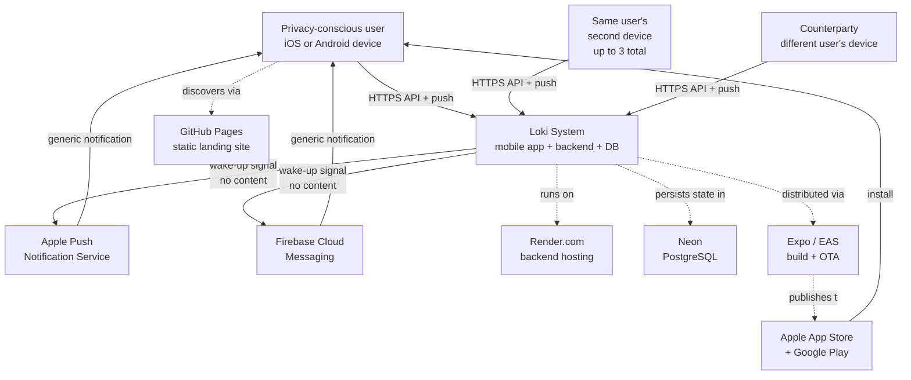

### 5.2 External actors and dependencies

| Actor / dependency                     | Type                 | Loki's relationship             | Risk class                                                                       |
| -------------------------------------- | -------------------- | ------------------------------- | -------------------------------------------------------------------------------- |
| End users                              | Human                | Primary customer                | n/a                                                                              |
| Apple Push Notification Service (APNs) | Third-party platform | Wake-up signal only; no content | Metadata risk to OS provider                                                     |
| Firebase Cloud Messaging (FCM)         | Third-party platform | Wake-up signal only; no content | Metadata risk to OS provider                                                     |
| Render.com                             | Third-party platform | Backend host                    | Operational risk; data risk if compromised                                       |
| Neon (PostgreSQL)                      | Third-party platform | Primary database                | Operational risk; data risk if compromised (mitigated by ciphertext-only design) |
| Expo / EAS                             | Third-party platform | Mobile build/distribution       | Supply-chain risk                                                                |
| Apple App Store / Google Play          | Third-party platform | Distribution gate               | Policy risk                                                                      |
| GitHub Pages                           | Third-party platform | Static landing site             | Cosmetic risk only                                                               |

### 5.3 Trust boundaries

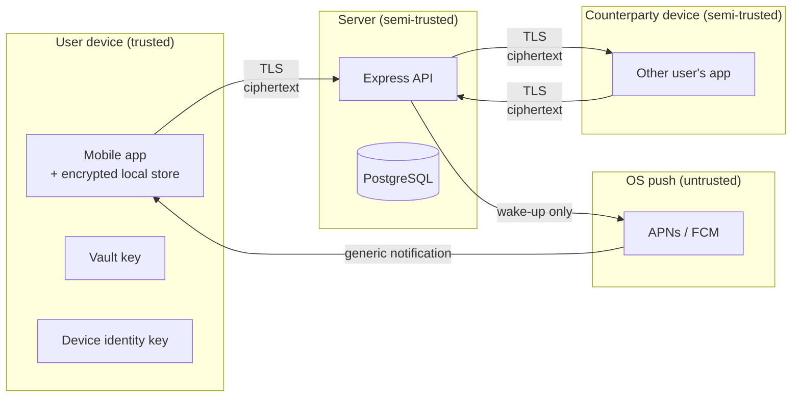

The server is **semi-trusted**: it holds ciphertext, routing metadata, and account identifiers, but never plaintext content or local vault keys. The counterparty device is also only semi-trusted — once a message leaves our device, the recipient can screenshot, copy, or forward, and product copy must state this.

---

## 6. Domain Model

### 6.1 Core entities

| Entity                     | Description                                                                          | Owner system                               | Lifecycle                                                     |
| -------------------------- | ------------------------------------------------------------------------------------ | ------------------------------------------ | ------------------------------------------------------------- |
| `Account`                  | A user's authentication identity (private username, password hash, recovery options) | Server                                     | Active → (logout) → Active; deletion via wipe is local        |
| `Device`                   | A registered mobile installation linked to an account                                | Server                                     | Registered → Active → Revoked                                 |
| `Session`                  | A short-lived auth token bound to an account and device                              | Server                                     | Active → Invalidated (logout, revoke, expiry)                 |
| `PublicId`                 | A user-chosen shareable identifier (e.g., `dancing-panda927`)                        | Server                                     | Active → Deprecated → (180 days later) Released               |
| `ContactRequest`           | A pending request from sender to recipient by Public-ID                              | Server                                     | Pending → Accepted / Denied / Expired                         |
| `Block`                    | A unilateral, silent block from one account against another                          | Server                                     | Active; no unblock UI in MVP                                  |
| `Conversation`             | A 1:1 or group chat thread (logical)                                                 | Mobile (server only sees envelope routing) | Active → Hidden (in vault) → Active again                     |
| `ConversationParticipant`  | Membership link in a conversation                                                    | Server (groups only) + Mobile              | Active → Left / Removed                                       |
| `GroupRole`                | Admin or member                                                                      | Server                                     | Member → Admin (transfer) → Member                            |
| `EncryptedMessageEnvelope` | Ciphertext payload routed through server                                             | Server (ephemeral)                         | Queued → Fetched → Acked → Deleted; or Queued → TTL → Deleted |
| `DeliveryAck`              | Receipt confirmation that triggers server-side deletion                              | Server (ephemeral)                         | Recorded → Drives envelope deletion                           |
| `CallSession`              | A call lifecycle record (1:1 or group, audio/video)                                  | Server                                     | Created → Ringing → Connected → Ended / Declined / Failed     |
| `CallParticipant`          | Membership and state in a call                                                       | Server                                     | Invited → Joined → Left                                       |
| `LinkedDeviceTransfer`     | An encrypted blob holding transferable account state                                 | Server (ciphertext)                        | Uploaded → Downloaded → Decrypted client-side                 |
| `PrivacySettings`          | Per-account settings (notification mode, default disappearing timer)                 | Server (some) + Mobile (some)              | Active, mutable                                               |
| `HiddenVaultMetadata`      | Local-only marker that a chat is in vault                                            | Mobile only                                | Active, mutable                                               |
| `DuressConfig`             | Local-only duress PIN and panic action setting                                       | Mobile only                                | Active or unset                                               |

### 6.2 Entity relationships

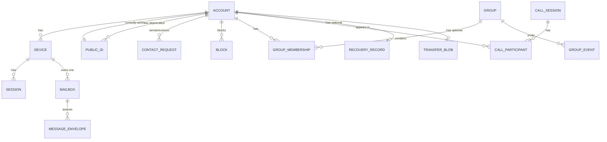

### 6.3 Lifecycle states

#### Public-ID state machine

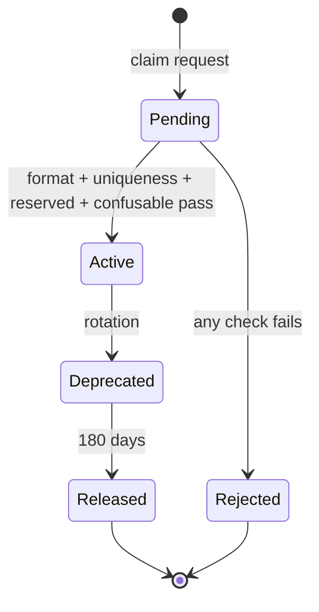

#### ContactRequest state machine

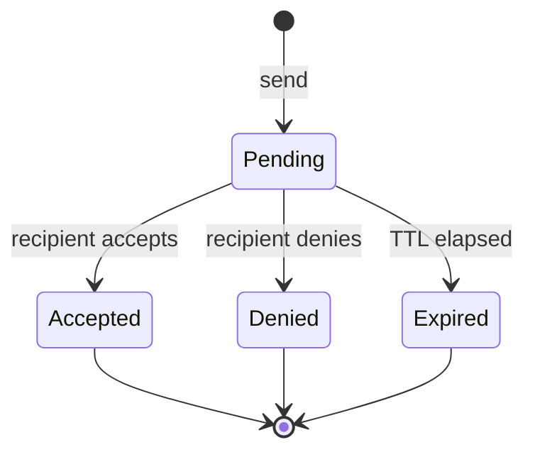

#### MessageEnvelope state machine

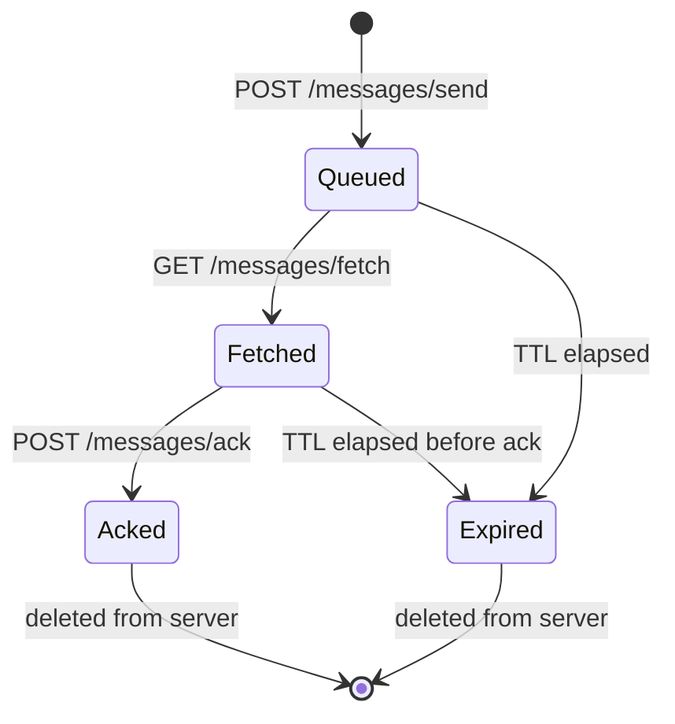

#### CallSession state machine

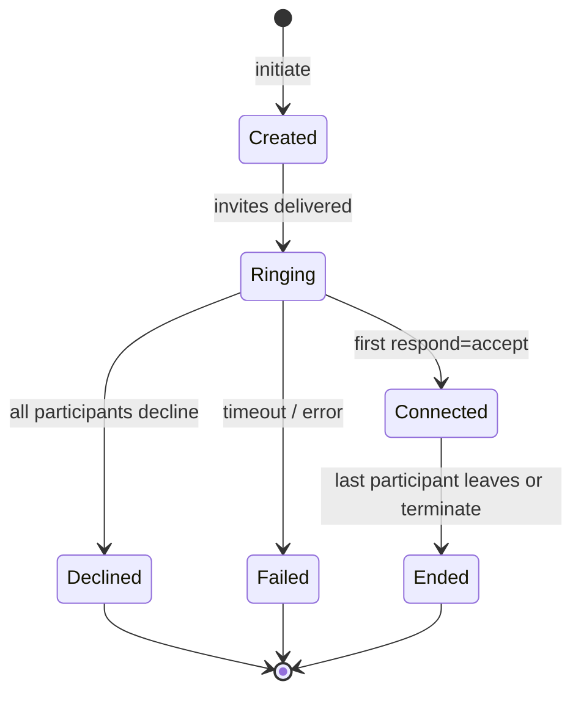

### 6.4 Aggregates and ownership boundaries

In DDD terms, the following are the aggregate roots and their boundaries:

| Aggregate root       | Includes                                       | Invariants enforced at boundary                                                      |
| -------------------- | ---------------------------------------------- | ------------------------------------------------------------------------------------ |
| `Account`            | account, sessions, recovery_record             | Username is unique; exactly one active Public-ID; password hash exists               |
| `PublicIdLifecycle`  | active + historical Public-IDs for one account | Exactly one active per account; deprecated ones cleared after 180 days               |
| `Conversation` (1:1) | participants link, conversation key state      | Exactly two participants; both must have accepted contact                            |
| `Group`              | group, group_members, group_events             | 3 ≤ active members ≤ 25; at least one admin                                          |
| `Device`             | device, mailbox, device public key             | ≤ 3 devices per account; mailbox 1:1 with device                                     |
| `CallSession`        | call session, call_participants                | State transitions are valid; participants are members of the underlying conversation |
| `Vault` (local)      | vault DB, vault key blob, duress config        | Vault key never leaves device; duress PIN distinct from vault PIN                    |
| `MessageEnvelope`    | envelope, ack record                           | Exactly one queue→ack lifecycle; expires_at always set                               |

The boundary rule is: **no operation may cross an aggregate root without going through that root's controller or service.** Direct DB writes that bypass the aggregate root are a bug.

### 6.5 Domain invariants

These are the always-true statements about the system. Violations are bugs.

| #    | Invariant                                                                 | Enforced where                          |
| ---- | ------------------------------------------------------------------------- | --------------------------------------- |
| I-1  | Every account has exactly one active Public-ID at a time                  | DB unique constraint + controller logic |
| I-2  | Username is unique across the system                                      | DB unique constraint                    |
| I-3  | Active Public-ID is never in the deprecated lockout table                 | DB constraint + cleanup job             |
| I-4  | A deprecated Public-ID may not be reclaimed by anyone for 180 days        | Cleanup job + claim controller          |
| I-5  | A device's mailbox is 1:1 with the device                                 | DB FK + insertion logic                 |
| I-6  | An envelope is in exactly one of: queued, fetched, acked, expired         | Application logic + DB state column     |
| I-7  | An account has ≤ 3 active devices                                         | Device registration controller          |
| I-8  | A group has 3 ≤ active members ≤ 25                                       | Group membership controller             |
| I-9  | A group always has at least one admin (unless empty)                      | Group admin controller                  |
| I-10 | A contact_request transitions only: pending → {accepted, denied, expired} | Contact controller                      |
| I-11 | A call_session transitions only by the state machine in §6.3              | Call lifecycle service                  |
| I-12 | The server never holds a plaintext message body                           | Code review + audit                     |
| I-13 | The server never sends notification payloads with chat content            | `pushService.js`                        |
| I-14 | Vault key is never transmitted over the network                           | Mobile crypto module                    |
| I-15 | Duress PIN is never equal to vault PIN                                    | Settings UI validation                  |
| I-16 | A revoked device's session is invalidated within 60 seconds               | Device revocation logic                 |
| I-17 | A blocked sender's envelopes are dropped (not queued)                     | Message controller + block check        |
| I-18 | A device-specific chat key never appears in a transfer blob               | Transfer service                        |
| I-19 | Anti-enumeration responses are byte-identical regardless of cause         | Response builder + tests                |
| I-20 | Every API error includes a `request_id` for correlation                   | Error middleware                        |

### 6.6 Domain events

Domain events are facts that have happened. They are emitted as side effects of aggregate operations and consumed by other parts of the system (notification dispatch, group event propagation, retention jobs).

| Event                        | Emitted when                 | Consumers                               |
| ---------------------------- | ---------------------------- | --------------------------------------- |
| `account.created`            | Successful registration      | Onboarding telemetry counter            |
| `public_id.claimed`          | Successful Public-ID claim   | Onboarding telemetry                    |
| `public_id.rotated`          | Successful rotation          | Cleanup job scheduler                   |
| `contact_request.created`    | Sender submits request       | Push dispatch (to recipient)            |
| `contact_request.accepted`   | Recipient accepts            | Conversation creation; key exchange     |
| `contact_request.denied`     | Recipient denies             | None (silent)                           |
| `contact_request.expired`    | Background job marks expired | None                                    |
| `envelope.queued`            | New envelope inserted        | Push dispatch                           |
| `envelope.fetched`           | Recipient fetches            | Delivery telemetry                      |
| `envelope.acked`             | Recipient acks               | Envelope deletion                       |
| `envelope.expired`           | TTL passed                   | Envelope deletion + sender notification |
| `group.created`              | Group successfully created   | Group key distribution                  |
| `group.member_added`         | Admin adds member            | Group key rotation                      |
| `group.member_removed`       | Admin removes member         | Group key rotation                      |
| `group.member_left`          | Member leaves voluntarily    | Group key rotation                      |
| `call.initiated`             | Caller starts call           | Push dispatch (to participants)         |
| `call.accepted` / `declined` | Participant responds         | State transition                        |
| `call.ended`                 | Last participant leaves      | Lifecycle teardown                      |
| `device.registered`          | New device linked            | Transfer blob availability              |
| `device.revoked`             | Device removed               | Session invalidation                    |

In MVP, events are **synchronous in-process function calls** (the consumer is invoked directly by the producer). A formal event bus is post-MVP — see ADR-016 (proposed).

### 6.7 Domain vocabulary

| Term                     | Definition                                                                                                               |
| ------------------------ | ------------------------------------------------------------------------------------------------------------------------ |
| **Public-ID**            | A user-chosen shareable identifier conforming to the format rules (a-z, 0-9, `-`, 8–24 chars). The only contact surface. |
| **Private username**     | A login-only identifier. Never exposed to other users.                                                                   |
| **Mailbox**              | Per-device server-side queue of encrypted envelopes. Not a long-term store.                                              |
| **Envelope**             | A ciphertext payload routed through the server. Server cannot decrypt.                                                   |
| **Vault**                | Locally-encrypted-under-separate-keys storage for chats moved out of the main inbox.                                     |
| **Duress wipe**          | Triggered destruction of the vault encryption key, rendering vault content irrecoverable.                                |
| **Device-specific chat** | A chat whose keys never sync across linked devices. Permanent choice at creation.                                        |
| **TTL**                  | Time-to-live. Applies to envelopes (24–72h), contact requests (system-defined), deprecated Public-IDs (180d).            |
| **Anti-enumeration**     | The property that the server does not reveal whether a given Public-ID corresponds to a real account.                    |
| **Confusable**           | A Public-ID visually similar to an existing active one (e.g., zero vs O). Rejected at claim time.                        |

---

## 7. Major User Journeys

This section walks through the most important end-to-end flows. Each includes a sequence diagram, the components involved, the failure modes, and security/privacy notes. These are the flows that, if broken, break the product.

### 7.1 Onboarding (account creation)

**Goal:** A user creates an anonymous Loki account, claims a Public-ID, optionally configures recovery, and lands in an empty inbox in under 2 minutes.

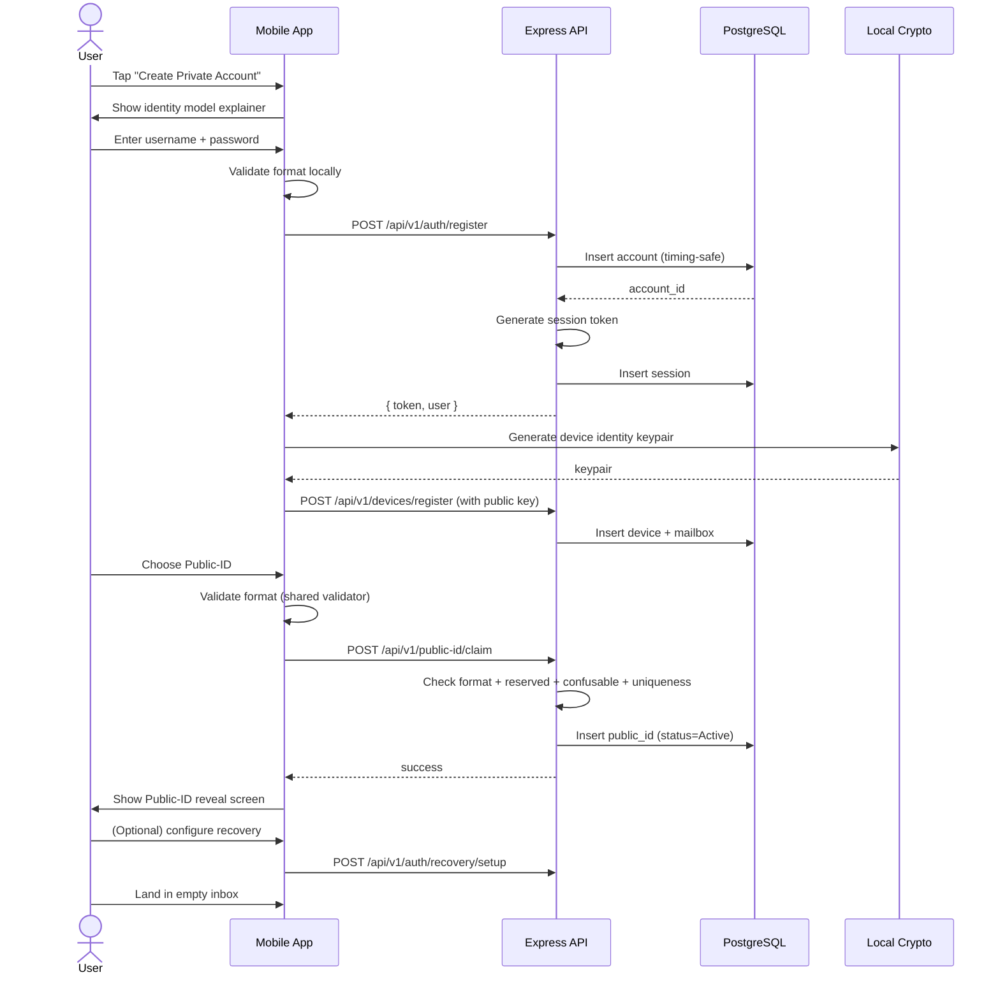

**Components:** Mobile onboarding screens (2.4–2.6, 3.4–3.6), `authController`, `publicIdController`, `recoveryController`, `accountModel`, `publicIdModel`, `deviceModel`, local `keyManager`.

**Synchronous vs async:** All onboarding steps are synchronous from the user's perspective. Background jobs are not in this flow.

**Failure modes:**

| Failure                                             | Behavior                                                                                      |
| --------------------------------------------------- | --------------------------------------------------------------------------------------------- |
| Username collision                                  | Server returns specific error; user re-enters                                                 |
| Public-ID collision / reserved / confusable         | Uniform "not available" response (no leak)                                                    |
| App killed mid-onboarding                           | Re-launch detects partial state and resumes; account-without-Public-ID is a recoverable state |
| Local key generation fails                          | Surface clear error; do not silently proceed                                                  |
| Network failure between register and key generation | Account exists but not usable; user can retry from login                                      |

**Observability:** Counters for account-create-success, public-id-claim-success, and explicit-step-failure-by-stage. No per-user trace.

**Security notes:** Password is bcrypt-hashed server-side; comparison is timing-safe. Device keypair is generated locally and never leaves the device. Public-ID validation runs both client (UX) and server (authority).

### 7.2 First contact via Public-ID request

**Goal:** Sender (Alice) connects with recipient (Bob) using only Bob's exact Public-ID, with no account-existence leakage.

```mermaid
sequenceDiagram
    actor Alice
    actor Bob
    participant AApp as Alice's App
    participant API as Express API
    participant DB as PostgreSQL
    participant BApp as Bob's App
    participant Push as APNs/FCM

    Alice->>AApp: Tap "New Chat"
    Alice->>AApp: Enter Bob's Public-ID + first message
    AApp->>API: POST /api/v1/contact-request/send
    API->>DB: Look up Public-ID
    Note right of API: Uniform response regardless of:<br/>- ID exists<br/>- ID format invalid<br/>- ID reserved<br/>- ID deprecated<br/>- ID confusable
    DB-->>API: account_id (or null)
    API->>DB: Insert contact_request (if valid)
    API-->>AApp: 202 Accepted (uniform)
    API->>Push: wake-up to Bob's device
    Push->>BApp: generic notification
    BApp->>API: GET /api/v1/contact-request/pending
    API-->>BApp: list with Alice's Public-ID + first msg
    Bob->>BApp: Accept
    BApp->>API: POST /api/v1/contact-request/respond (accept)
    API->>DB: Update request → accepted; create conversation link
    API-->>BApp: success
    Note right of API: Now Alice's request status flips<br/>to "accepted" only on her next poll/fetch
```

**Components:** `contactController`, `contactRequestModel`, `publicIdModel`, `pushService`, mobile screens 4.4–4.6.

**Failure modes:**

| Failure           | Behavior                                                          |
| ----------------- | ----------------------------------------------------------------- |
| ID does not exist | Same response as success — no leak                                |
| ID is deprecated  | Same response as success — no leak                                |
| ID is reserved    | Same response as success — no leak                                |
| Recipient denies  | Sender sees no specific signal; request silently never advances   |
| Request expires   | Background job marks expired; sender sees nothing different       |
| Sender is blocked | Same uniform response; on server side request is silently dropped |

**Anti-enumeration is a hard constraint here.** The endpoint returns the same status code, body shape, and timing characteristics for every failure class. Server-side rate limits are uniform. This is the most security-critical endpoint in the product.

### 7.3 1:1 messaging (text)

**Goal:** Alice sends Bob an end-to-end encrypted text message. Server never sees plaintext.

```mermaid
sequenceDiagram
    actor Alice
    actor Bob
    participant AApp as Alice's App
    participant API as Express API
    participant DB as PostgreSQL
    participant Push as APNs/FCM
    participant BApp as Bob's App

    Alice->>AApp: Type and send
    AApp->>AApp: Encrypt locally with Bob's device public key
    AApp->>API: POST /api/v1/messages/send (envelope)
    API->>DB: Insert into Bob's per-device mailbox (TTL=24-72h)
    API-->>AApp: 200 ack (delivered to server)
    AApp->>AApp: Show "delivered" state
    API->>Push: wake-up signal to Bob
    Push->>BApp: generic notification
    BApp->>API: GET /api/v1/messages/fetch
    API->>DB: Read pending envelopes
    API-->>BApp: [envelope, ...]
    BApp->>BApp: Decrypt locally; store in encrypted local DB
    BApp->>API: POST /api/v1/messages/ack
    API->>DB: Delete envelope
    Bob->>BApp: Read the message
    BApp->>BApp: Start disappearing timer (if configured)
```

**Components:** `messageController`, `mailboxModel`, `envelopeModel`, mobile crypto (`messageEncryption`, `keyExchange`), local message store.

**Synchronous vs async:** Send and ack are synchronous. Push is async. TTL cleanup is a background job. Decryption and local persistence on the recipient device are synchronous.

**Failure modes:**

| Failure                                   | Behavior                                                                  |
| ----------------------------------------- | ------------------------------------------------------------------------- |
| Recipient offline                         | Envelope sits in mailbox until fetch, up to TTL                           |
| Recipient does not come online before TTL | Envelope deleted by retention job; sender sees "expired" state            |
| Ack lost                                  | Envelope is re-fetched on next fetch; client de-duplicates by envelope ID |
| Stale device key                          | Decryption fails with explicit error; client triggers key refresh         |
| Recipient blocked sender                  | Server drops envelope at send time with uniform response                  |

**Observability:** Send counter, fetch counter, ack counter, expiry counter. Latency histogram on send→ack. **No per-message trace.**

**Privacy considerations:** The server logs neither the envelope payload nor the sender→recipient edge in operational logs. See Section 14 for logging policy.

### 7.4 Group chat

**Goal:** Alice creates a 5-person group, all participants exchange encrypted messages, one member leaves.

Group key management is the trickiest part:

- On creation, the creator's device establishes a group session key.
- The session key is encrypted to each member's device public key and distributed via 1:1 envelopes.
- Each member encrypts group messages under the group session key.
- On membership change (add/remove/leave), the session key is rotated and redistributed.
- A removed member's later messages are rejected by the server (stale session ID).

```mermaid
sequenceDiagram
    actor Creator
    participant CApp as Creator's App
    participant API as Express API
    participant DB as PostgreSQL
    participant MApps as Members' Apps

    Creator->>CApp: Create group (name + 4 members)
    CApp->>CApp: Generate group session key
    CApp->>API: POST /api/v1/groups/create
    API->>DB: Insert group + memberships
    API-->>CApp: group_id
    loop for each member
        CApp->>API: POST /api/v1/messages/send (key-distribution envelope, 1:1)
        API->>DB: Queue in member's mailbox
    end
    MApps->>API: GET /api/v1/messages/fetch
    API-->>MApps: key-distribution envelopes
    MApps->>MApps: Decrypt; store group session key locally

    Note over Creator,MApps: Group is now active

    Creator->>CApp: Send group message
    CApp->>CApp: Encrypt under group session key
    CApp->>API: POST /api/v1/messages/send (one envelope per member)
    API->>DB: Queue in each member mailbox
```

**Components:** `groupController`, `groupModel`, `groupMemberModel`, `groupEventService`, mobile `groupKeyManager`.

**Failure modes:**

| Failure                                 | Behavior                                                                                                                        |
| --------------------------------------- | ------------------------------------------------------------------------------------------------------------------------------- |
| Late-joining member misses old messages | By design — historical group messages are not re-encrypted to new members                                                       |
| Removed member sends with stale key     | Server validates session-id and rejects                                                                                         |
| Admin leaves                            | Admin role transfers to next-longest member; if no eligible member, group enters defined "no-admin" state (covered in Sprint 7) |
| Session key rotation fails partway      | Members with the new key reject messages from members with old key; client triggers a re-rotation                               |

### 7.5 Audio/video calling

**Goal:** Alice places a 1:1 video call to Bob, both control mute/video, then end the call. Group calling reuses the same primitives plus a multi-participant layout.

```mermaid
sequenceDiagram
    actor Alice
    actor Bob
    participant AApp as Alice's App
    participant API as Express API
    participant Push as APNs/FCM
    participant BApp as Bob's App

    Alice->>AApp: Tap video-call button in chat
    AApp->>API: POST /api/v1/calls/initiate
    API->>API: Create call session
    API-->>AApp: call_id, ringing state
    API->>Push: wake-up signal
    Push->>BApp: incoming call notification
    BApp->>API: GET /api/v1/calls/:id/state
    API-->>BApp: caller info + ringing
    Bob->>BApp: Accept
    BApp->>API: POST /api/v1/calls/:id/respond (accept)
    API-->>AApp & BApp: state=connected
    Note over AApp,BApp: Media flows peer-to-peer (or via TURN if NAT-blocked)
    Alice->>AApp: Toggle mute / video / speaker
    Note over AApp: Local controls; signaling not always required
    Alice->>AApp: Leave
    AApp->>API: POST /api/v1/calls/:id/leave
    API->>API: Update participant state
    API-->>BApp: state=ended (last participant left)
```

**Components:** `callController`, `callSessionModel`, `callSessionService`, mobile `CallButtons`, `incoming.tsx`, `active.tsx`, `callHistoryStore`.

**Notes:**

- MVP **does not** include a self-hosted SFU/TURN. Media transport implementation is a per-task decision in Sprint 8 and likely uses a third-party WebRTC-as-a-service. This is a pending ADR (see Section 19).
- Server only signals call lifecycle; it does not see media frames.
- Call history is local; the server has no long-term call log.

### 7.6 Hidden vault

**Goal:** A user moves a sensitive chat into a vault protected by a second PIN, separately encrypted.

```mermaid
sequenceDiagram
    actor User
    participant App as Mobile App
    participant Local as Encrypted Local Store

    User->>App: Long-press chat → Move to Hidden Vault
    alt First time
        App->>User: Prompt for vault PIN
        User->>App: Enter vault PIN
        App->>App: Derive vault key (PBKDF2/Argon2)
        App->>Local: Seal vault key
    end
    App->>Local: Read chat messages (current encryption)
    App->>App: Re-encrypt under vault key
    App->>Local: Write into vault store
    App->>Local: Delete from main store
    App->>User: Chat removed from main inbox

    Note over App: Later...
    User->>App: Tap Hidden Vault entry
    App->>User: PIN screen
    User->>App: Enter vault PIN
    App->>App: Derive key; verify
    App->>Local: Decrypt and list vault chats
```

**Components:** Mobile `vaultKeyManager`, `chatMover`, `vaultLockService`, mobile screens 9.1–9.6.

**Notes:**

- The server is not in the vault trust path. Vault keys are local-only.
- Re-encryption is interruptible; the chat-mover code must handle crash-mid-move by leaving both copies in a consistent recoverable state.
- Vault notifications are filtered locally by `notificationFilter.ts` to show only generic indicators.

### 7.7 Duress wipe

**Goal:** Under coercion, a user enters a duress PIN at the vault unlock screen, and the vault keys are irreversibly destroyed.

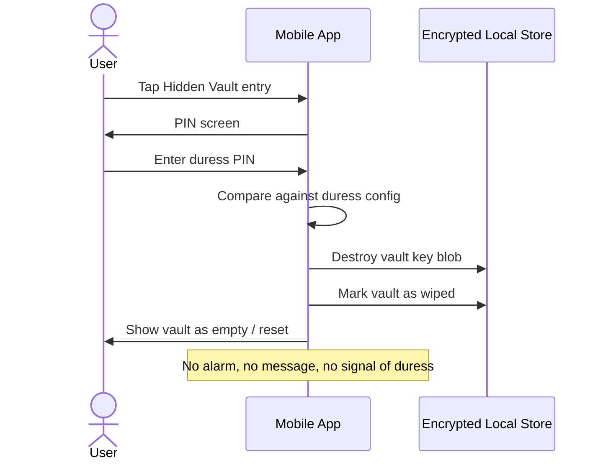

**Components:** `duressWipe`, `duressConfigStore`, `vaultKeyManager`.

**Critical properties:**

- Wipe must be fast (< 1 second from PIN entry to UI state).
- Wipe must be crash-safe: if the app crashes mid-wipe, the vault must remain inaccessible after restart.
- Wipe must not leave detectable side effects (no log entry that could be inspected by a coercer).
- Main account is preserved; only vault keys are destroyed.
- Stale device backups containing vault ciphertext blobs become permanently undecryptable.

### 7.8 Multi-device linking

**Goal:** A user installs Loki on a second device and gains access to non-device-specific chat history.

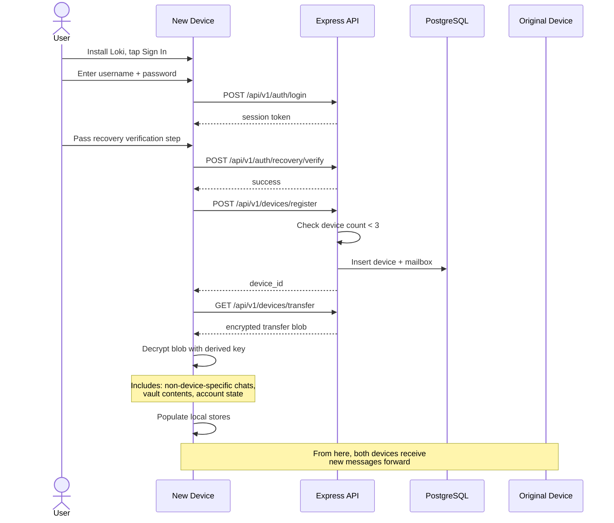

**Components:** `deviceController`, `transferService`, mobile `link-device.tsx`, `sync-transfer.tsx`, `recoveryService`.

**Critical constraints:**

- The transfer blob is encrypted client-side before upload; server never holds plaintext.
- Device-specific chats are explicitly excluded from the transfer blob.
- Maximum 3 devices per account; a 4th attempt is blocked with "revoke a device first."
- Recovery verification is required before the transfer is allowed. This is the recovery layer's only enforcement point.

### 7.9 Public-ID rotation

**Goal:** A user rotates their Public-ID; the old value is deprecated.

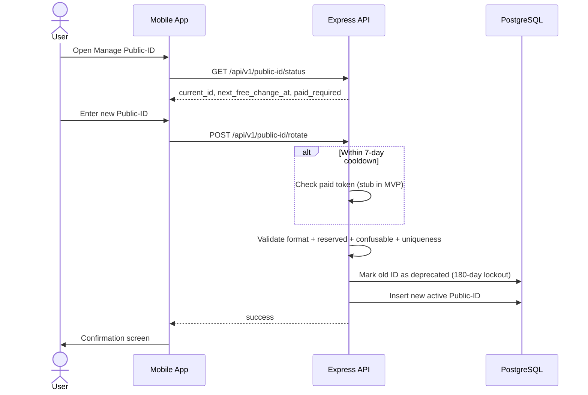

**Components:** `publicIdController`, `publicIdModel`, mobile `manage-id.tsx`, `usePublicId`.

**Notes:**

- The deprecated Public-ID can no longer receive new inbound contact requests.
- Existing active conversations are unaffected (they are pinned to the account, not the Public-ID).
- 180-day lockout cleanup is a background job (Sprint 14).

### 7.10 Account recovery on new device (when password is intact)

This is covered in 7.8 above. The recovery layer's only role in MVP is to gate transferable-data restore on a new device.

**Out of scope for MVP:** Recovery for users who have lost their password entirely. They lose access. This is documented in onboarding copy. See Section 17 for the privacy implication.

### 7.11 Login on a known device (returning user)

**Goal:** A user who already has Loki installed and an account opens the app and is back in their inbox.

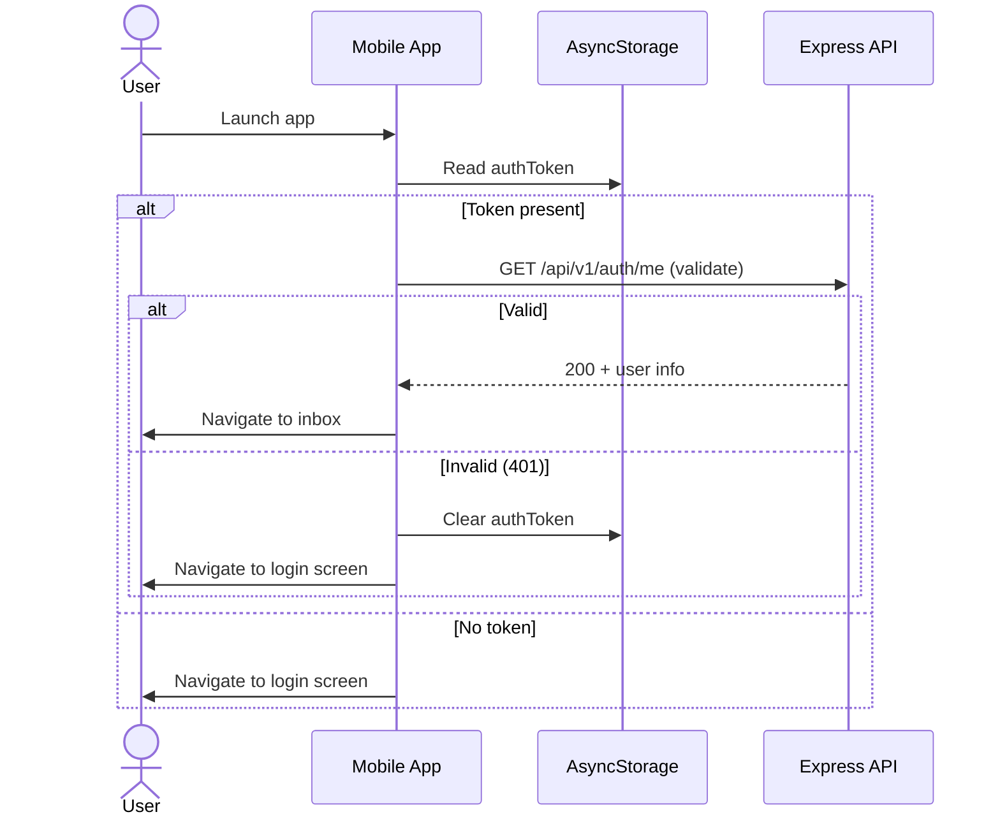

**Failure modes:**

| Failure                      | Behavior                                      |
| ---------------------------- | --------------------------------------------- |
| Token expired (post-Phase 2) | Re-prompt for password                        |
| Network unreachable          | Show offline-mode inbox; local DB still works |
| AsyncStorage corrupted       | Fall through to login screen                  |
| Backend down                 | Show "service temporarily unavailable"        |

**Security notes:** The current MVP scaffold validates token only against in-memory store. Post-Sprint-2 this hits the DB-backed session store. There is no token rotation in MVP (R-1).

### 7.12 Block a contact

**Goal:** User blocks a contact; the contact can no longer send messages or requests; no signal is sent to the blocked party.

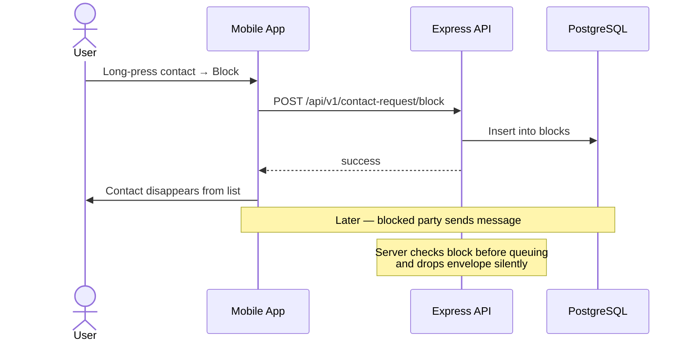

**Behavior contract:**

- Blocked party does **not** receive an error or signal.
- Their app shows "sent" but the recipient's mailbox never receives the envelope.
- This is by design: blocking is unidirectional and silent.

### 7.13 Disappearing message — full lifecycle

**Goal:** Sender sets a 30-second timer; message disappears 30 seconds after recipient reads it.

```mermaid
sequenceDiagram
    actor Alice
    actor Bob
    participant AApp as Alice's App
    participant API as Express API
    participant BApp as Bob's App

    Alice->>AApp: Set per-chat timer (30s)
    AApp->>API: POST /api/v1/messages/send (with timer metadata in plaintext envelope header)
    Note over AApp: Timer is part of the encrypted payload<br/>not server-visible metadata
    API->>BApp: (via fetch) envelope
    BApp->>BApp: Decrypt; persist with timer
    Bob->>BApp: Open chat and view message
    BApp->>BApp: Record "read_at"
    BApp->>BApp: Schedule local timer (30s from read_at)
    Note over BApp: Timer fires
    BApp->>BApp: Delete from local store
```

**Critical properties:**

- Timer **starts after read**, not after send. This matches the PRD.
- Each message preserves the timer that was active when it was sent. Changing the chat timer does not retroactively re-time old messages.
- Local removal is automatic via a background timer or on next app foreground after the deadline.
- Server-side TTL is independent and stricter (24–72h max regardless of timer).

**Failure modes:**

| Failure                              | Behavior                                           |
| ------------------------------------ | -------------------------------------------------- |
| Device offline when timer would fire | Timer fires on next foreground; message removed    |
| Multi-device race                    | Each device independently removes its copy         |
| User screenshots                     | Cannot be prevented; documented in disclosure      |
| Recipient sets read receipts off     | Timer never starts; message lives until server TTL |

### 7.14 Send an image attachment

**Goal:** Alice sends Bob a photo; image is encrypted client-side; bandwidth is bounded.

```mermaid
sequenceDiagram
    actor Alice
    participant AApp as Alice's App
    participant Crypto as Local Crypto
    participant API as Express API
    participant BApp as Bob's App

    Alice->>AApp: Tap attach → image picker
    AApp->>AApp: Compress to <500KB
    AApp->>Crypto: Encrypt under symmetric key (random)
    Crypto-->>AApp: ciphertext
    AApp->>API: POST /api/v1/attachments/upload (ciphertext)
    API-->>AApp: attachment_id
    AApp->>Crypto: Encrypt {attachment_id, sym_key} under Bob's pubkey
    AApp->>API: POST /api/v1/messages/send (envelope with attachment ref)
    Note over BApp: Later — Bob fetches
    BApp->>API: GET /api/v1/messages/fetch
    BApp->>BApp: Decrypt envelope; extract attachment_id + key
    BApp->>API: GET /api/v1/attachments/:id
    API-->>BApp: ciphertext
    BApp->>BApp: Decrypt with sym_key; render
```

**Notes:**

- The symmetric key is encrypted to the recipient inside the message envelope, not stored alongside the attachment.
- Server holds attachment ciphertext bound to the envelope's TTL.
- Failure to fetch the attachment within TTL surfaces "expired" to the recipient.

### 7.15 Send a voice note

**Goal:** Sender records audio in chat; recipient plays inline.

Similar to 7.14 but with audio capture from the device microphone and inline playback. No transcription. No server-side processing. Same encryption model.

### 7.16 React to a message

**Goal:** Sender reacts to a message with an emoji; recipient sees the reaction inline.

```mermaid
sequenceDiagram
    actor Alice
    participant AApp as Alice's App
    participant API as Express API
    participant BApp as Bob's App

    Alice->>AApp: Tap message → emoji picker
    AApp->>API: POST /api/v1/messages/send (envelope: reaction type, target_message_id)
    Note over AApp: Reaction is a small message,<br/>not a special endpoint
    BApp->>API: GET /api/v1/messages/fetch
    BApp->>BApp: Render reaction inline on target message
```

**Design note:** Reactions reuse the message envelope schema. A `reaction` message type carries `{ target_envelope_id, emoji }`. This keeps the wire protocol uniform.

### 7.17 Group admin actions (add, remove, leave)

**Goal:** Admin changes group membership; group session key rotates; messages from removed members are rejected.

```mermaid
sequenceDiagram
    actor Admin
    participant AApp as Admin's App
    participant API as Express API
    participant DB as PostgreSQL
    participant Members as Members' Apps

    Admin->>AApp: Remove member X
    AApp->>API: POST /api/v1/groups/:id/members/remove
    API->>DB: Mark X.left_at
    API->>API: Emit group.member_removed event
    API-->>AApp: success

    AApp->>AApp: Generate new group session key (epoch n+1)
    loop for each remaining member
        AApp->>API: POST /api/v1/messages/send (key-distribution envelope, epoch n+1)
    end

    Note over Members: All remaining members now use epoch n+1
    Note over API: Future messages from X (still on epoch n)<br/>are rejected by recipients during decrypt
```

**Failure modes:**

| Failure                                   | Behavior                                                      |
| ----------------------------------------- | ------------------------------------------------------------- |
| Removed member sends after removal        | Other members reject decrypt; envelope wasted                 |
| New key not delivered to some members yet | Those members hold stale epoch; auto-request new key on fail  |
| Admin leaves                              | Admin role transfers to oldest remaining member               |
| Last admin leaves and no admin exists     | Group enters defined "no-admin" state; no add/remove possible |

### 7.18 Place a group call

**Goal:** A group member initiates a call to all 8 group members; some join, some don't.

The flow is 7.5 extended: invites are fan-out to all participants; group call layout shows multiple participants; late join is supported.

### 7.19 Notification handling

**Goal:** Server delivers a wake-up push; mobile app handles it depending on app state.

```mermaid
sequenceDiagram
    participant Server as Express
    participant Push as APNs/FCM
    participant OS as Device OS
    participant App as Loki App

    Server->>Push: wake-up payload {type: "wakeup"}
    Push->>OS: notification
    alt App in foreground
        OS->>App: notification handler
        App->>Server: GET /api/v1/messages/fetch
        App->>App: Process new envelopes
        App->>App: Update inbox (no system notification shown)
    else App in background
        OS->>App: silent notification handler (where supported)
        App->>Server: GET /api/v1/messages/fetch
        App->>App: Persist new envelopes
        OS->>App: Display generic notification "You have a notification in Loki"
        Note over App: Per-chat mute and vault filter apply here
    else App killed
        OS->>OS: Display generic notification
        Note over App: Fetch happens on next launch
    end
```

**Critical properties:**

- Push payload **never** contains chat content.
- OS notification text is a **static string**.
- Vault-bound chats trigger only the generic text; no per-chat preview.
- Per-chat mute setting is enforced client-side after fetch.

### 7.20 Device revocation

**Goal:** User revokes a lost device from another linked device.

```mermaid
sequenceDiagram
    actor User
    participant App as User's other device
    participant API as Express API
    participant DB as PostgreSQL

    User->>App: Settings → Devices → Revoke "iPhone 13"
    App->>API: DELETE /api/v1/devices/:id
    API->>DB: Mark device.revoked_at
    API->>DB: Invalidate all sessions for that device
    API-->>App: success
    App->>User: Device removed from list

    Note over DB: Future API calls with that device's session token return 401
```

**Critical properties:**

- Revocation propagates to session invalidation within 60 seconds (I-16).
- The revoked device's local data is **not** wiped remotely. We do not promise that. The user must perform a manual local wipe on the device if they have access.
- New devices can re-register if user signs in again.

### 7.21 Bad-network resilience

**Goal:** A user sends a message on a flaky network; the system handles it without data loss or duplication.

```mermaid
sequenceDiagram
    actor Alice
    participant AApp as Alice's App
    participant API as Express API

    Alice->>AApp: Send message
    AApp->>AApp: Generate idempotency_key (UUID)
    AApp->>AApp: Encrypt; persist locally as "sending"
    AApp->>API: POST /messages/send (Idempotency-Key)
    Note over AApp,API: Network drops
    AApp->>AApp: Show "retry" state
    AApp->>API: POST /messages/send (same Idempotency-Key)
    API->>API: Detect duplicate by key
    API-->>AApp: 200 + original response
    AApp->>AApp: Mark as "delivered"
```

**Properties:**

- Idempotency keys are stored server-side for 24 hours.
- Duplicate sends within that window return the original response without re-queueing.
- Mobile UI never shows "sent twice"; the local state reflects the first successful response.

### 7.22 Failure and recovery flows

| Flow                  | Failure              | Recovery                                                |
| --------------------- | -------------------- | ------------------------------------------------------- |
| Send                  | Network error        | Client retries with idempotency key                     |
| Send                  | Server returns 5xx   | Client surfaces "failed" state with retry button        |
| Fetch                 | Stale session        | Client refreshes session, re-fetches                    |
| Fetch                 | Decryption failure   | Surface "decryption failed" badge; trigger key refresh  |
| Vault unlock          | Wrong PIN repeatedly | Backoff + lockout (configurable)                        |
| Vault unlock          | Duress PIN           | Wipe (see 7.7)                                          |
| Group send            | Stale group session  | Client requests rotation from active admin              |
| Call                  | Network drop         | UI shows "reconnecting" then "failed"; user retries     |
| Multi-device transfer | Decryption failure   | Clear error with instructions; user can retry from menu |

---

## 8. High-Level Architecture

This is the C4 Level 2 view: the major containers (deployable / runnable units) and how they communicate.

### 8.1 Container diagram

```mermaid
graph TB
    subgraph "User Device (per user, up to 3 per account)"
        UI[Expo RN UI<br/>screens, navigation,<br/>state management]
        LocalDB[(SQLite<br/>encrypted)]
        Vault[(SQLite<br/>vault-encrypted)]
        Crypto[Crypto module<br/>libsodium/tweetnacl]
        Net[API client<br/>+ session management]
        UI --> Net
        UI --> LocalDB
        UI --> Vault
        Net --> Crypto
        Crypto --> LocalDB
        Crypto --> Vault
    end

    subgraph "Render.com (single region)"
        API[Express API<br/>Node.js]
        Jobs[Background Jobs<br/>retention cleanup,<br/>contact expiry,<br/>public-id cleanup]
        Push[Push Dispatch<br/>APNs + FCM]
        API --> Jobs
        API --> Push
    end

    subgraph "Neon (PostgreSQL)"
        DB[(Loki DB<br/>accounts, public_ids,<br/>contact_requests,<br/>mailboxes, envelopes,<br/>groups, calls, devices,<br/>sessions)]
    end

    subgraph "Apple / Google"
        APNs[APNs]
        FCM[FCM]
    end

    subgraph "Static landing"
        Pages[GitHub Pages]
    end

    Net -->|HTTPS<br/>x-api-key + bearer| API
    API --> DB
    Jobs --> DB
    Push --> APNs
    Push --> FCM
    APNs -.wake-up.-> Net
    FCM -.wake-up.-> Net
```

### 8.2 What runs where

| Capability              | Runs where                                     | Why                                               |
| ----------------------- | ---------------------------------------------- | ------------------------------------------------- |
| Encryption / decryption | Mobile (always)                                | Server must not see plaintext                     |
| Local message storage   | Mobile (always)                                | Privacy                                           |
| Public-ID validation    | Both                                           | Mobile for UX, server for authority               |
| Anti-enumeration        | Server only                                    | The only place that can enforce uniform responses |
| TTL enforcement         | Server only                                    | Server is the canonical retention boundary        |
| Push wake-up            | Server                                         | OS push services need server-side credentials     |
| Vault keys              | Mobile only                                    | Server is not in vault trust path                 |
| Device-specific keys    | Mobile only                                    | By design, never leave the device                 |
| Group session keys      | Mobile (creators distribute via 1:1 envelopes) | Server cannot generate these                      |
| Call media              | Peer-to-peer + TURN if NAT-blocked             | Server has no role in media path                  |

### 8.3 Communication patterns

| Pattern                            | Used for                                                                    |
| ---------------------------------- | --------------------------------------------------------------------------- |
| Synchronous HTTPS request/response | All mobile→server interactions                                              |
| Push wake-up (no payload content)  | Server→mobile signaling for new envelopes and call invites                  |
| Polling on app foreground          | Fallback when push is throttled or in future high-anonymity mode (post-MVP) |
| Background jobs (cron)             | Server-side retention cleanup, contact expiry, deprecated Public-ID release |
| Peer-to-peer (WebRTC)              | Call media path (with TURN fallback)                                        |

There are **no internal microservices**. All server logic runs in one Express process. This is a deliberate scope decision for MVP — see ADR-005.

---

## 9. Component and Service Catalog

This is the operational index. Each component has an owner, a purpose, dependencies, and links to deeper documentation.

### 9.1 Mobile app components

| Component            | Path                                                 | Purpose                                                 | Owner       | Dependencies          | Criticality |
| -------------------- | ---------------------------------------------------- | ------------------------------------------------------- | ----------- | --------------------- | ----------- |
| Onboarding flow      | `apps/mobile/app/onboarding/*`                       | Account creation, Public-ID claim, recovery setup       | Eric, Abdul | API, local crypto     | Critical    |
| Chat list (inbox)    | `apps/mobile/app/(tabs)/chat.tsx`                    | Main chat list                                          | Eric        | Local DB              | Critical    |
| Chat thread          | `apps/mobile/app/chat/[id].tsx`                      | 1:1 and group thread view                               | Eric        | Local DB, crypto      | Critical    |
| New chat / new group | `apps/mobile/app/chat/new-chat.tsx`, `new-group.tsx` | Public-ID entry, group creation                         | Eric        | API                   | Critical    |
| Pending requests     | `apps/mobile/app/requests/index.tsx`                 | Inbound contact request list and accept/deny            | Eric        | API                   | High        |
| Calls tab            | `apps/mobile/app/(tabs)/calls.tsx`                   | Call history and callback                               | Eric, Abdul | Local store           | Medium      |
| Call screens         | `apps/mobile/app/call/*`                             | Incoming, outgoing, active, group                       | Eric, Abdul | WebRTC lib (TBD), API | Critical    |
| Vault                | `apps/mobile/app/vault/*`, `apps/mobile/src/vault/*` | Hidden vault setup, unlock, move                        | Abdul, Eric | Crypto, local DB      | Critical    |
| Settings             | `apps/mobile/app/settings/*`                         | Privacy, account, notifications, devices, duress        | Eric        | API, local stores     | High        |
| Profile tab          | `apps/mobile/app/(tabs)/profile.tsx`                 | Public-ID display, copy/share, manage                   | Abdul       | API                   | High        |
| Crypto module        | `apps/mobile/src/crypto/*`                           | Device keys, message encryption, group keys, vault keys | Abdul       | libsodium/tweetnacl   | Critical    |
| Local message store  | `apps/mobile/src/db/messageStore.ts`                 | Encrypted SQLite CRUD                                   | Abdul       | sqlite + encryption   | Critical    |
| API client           | `apps/mobile/src/api/*` (TBD)                        | Typed wrappers around server endpoints                  | Abdul       | shared types          | Critical    |
| Notification filter  | `apps/mobile/services/notificationFilter.ts`         | Vault-aware notification rendering                      | Eric        | OS notifications      | High        |
| Splash               | `apps/mobile/app/index.tsx`                          | Animated splash + auth redirect                         | Eric        | AsyncStorage          | Low         |

### 9.2 Server components

| Component             | Path                                                  | Purpose                                      | Owner         | Dependencies                         | Criticality      |
| --------------------- | ----------------------------------------------------- | -------------------------------------------- | ------------- | ------------------------------------ | ---------------- |
| Express app           | `apps/server/src/app.js`                              | Middleware stack and route mounting          | Abdul         | Express                              | Critical         |
| HTTP server           | `apps/server/src/server.js`                           | Boot, graceful shutdown                      | Abdul         | Node.js                              | Critical         |
| Auth controller       | `apps/server/src/controllers/authController.js`       | Register, login, logout                      | Abdul         | accountModel, sessionStore           | Critical         |
| Web auth controller   | `apps/server/src/controllers/webAuthController.js`    | Browser admin login (cookie session)         | Abdul         | sessionStore                         | Low (admin only) |
| Public-ID controller  | `apps/server/src/controllers/publicIdController.js`   | Claim, rotate, status                        | Areta, Vishal | publicIdModel, shared validators     | Critical         |
| Contact controller    | `apps/server/src/controllers/contactController.js`    | Request send, respond, list, block           | Abdul, Areta  | contactRequestModel, accountModel    | Critical         |
| Message controller    | `apps/server/src/controllers/messageController.js`    | Send, fetch, ack                             | Areta, Vishal | mailboxModel, envelopeModel          | Critical         |
| Group controller      | `apps/server/src/controllers/groupController.js`      | Create, add/remove, leave, list, events      | Areta, Vishal | groupModel, groupMemberModel         | High             |
| Call controller       | `apps/server/src/controllers/callController.js`       | Initiate, respond, leave, terminate, state   | Areta, Vishal | callSessionModel, callSessionService | High             |
| Device controller     | `apps/server/src/controllers/deviceController.js`     | Register, list, revoke, transfer             | Areta, Vishal | deviceModel                          | Critical         |
| Recovery controller   | `apps/server/src/controllers/recoveryController.js`   | Setup, verify                                | Areta         | recoveryModel                        | High             |
| Key controller        | `apps/server/src/controllers/keyController.js`        | Publish device public key, fetch contact key | Abdul         | deviceModel                          | Critical         |
| Attachment controller | `apps/server/src/controllers/attachmentController.js` | Encrypted upload routing                     | Vishal        | (storage TBD)                        | Medium           |
| Session store         | `apps/server/src/services/sessionStore.js`            | Token issuance and validation                | Abdul, Vishal | DB-backed (Sprint 2)                 | Critical         |
| Job scheduler         | `apps/server/src/services/jobScheduler.js`            | Cron-style job runner                        | Vishal        | node-cron or similar                 | High             |
| Push service          | `apps/server/src/services/pushService.js`             | APNs + FCM dispatch                          | Areta, Vishal | apn / firebase-admin                 | High             |
| Group event service   | `apps/server/src/services/groupEventService.js`       | Group join/leave/remove distribution         | Vishal        | messageController                    | Medium           |
| Call session service  | `apps/server/src/services/callSessionService.js`      | Call lifecycle state transitions             | Vishal        | callSessionModel                     | Medium           |
| Audit logger          | `apps/server/src/middleware/auditLogger.js`           | Minimal operational logs (content-stripped)  | Vishal        | winston/pino                         | Critical         |
| Rate limiter          | `apps/server/src/middleware/rateLimiter.js`           | Per-IP and per-account rate limits           | Areta         | redis (TBD) or in-memory             | Critical         |
| Health check          | `apps/server/src/services/healthCheckService.js`      | DB connectivity probe                        | Abdul         | DB pool                              | Medium           |

### 9.3 Database

| Component       | Purpose                                 | Owner         | Notes                                     |
| --------------- | --------------------------------------- | ------------- | ----------------------------------------- |
| Neon PostgreSQL | Primary store for all server-side state | Vishal        | Single primary, branching for staging/dev |
| Migrations      | Schema evolution                        | Vishal        | `apps/server/db/migrations/*.sql`         |
| Models          | Per-table query layer                   | Areta, Vishal | `apps/server/db/models/*.js`              |

### 9.4 Shared package

| Component       | Path                                     | Purpose                             | Owner  |
| --------------- | ---------------------------------------- | ----------------------------------- | ------ |
| API types       | `packages/shared/src/types/*`            | Request/response shapes             | Abdul  |
| Validators      | `packages/shared/src/utils/publicId.ts`  | Public-ID format + confusable check | Vishal |
| Settings models | `packages/shared/src/types/settings.ts`  | Settings shapes                     | Abdul  |
| Retention enums | `packages/shared/src/types/retention.ts` | TTL presets                         | Abdul  |
| Index           | `packages/shared/src/index.ts`           | Re-exports                          | Vishal |

### 9.5 Background jobs

| Job                  | Purpose                                      | Frequency             | Owner  |
| -------------------- | -------------------------------------------- | --------------------- | ------ |
| `messageTtlJob`      | Delete expired envelopes                     | Every 5 minutes (TBD) | Vishal |
| `contactExpiryJob`   | Expire pending contact requests past TTL     | Every hour (TBD)      | Areta  |
| `publicIdCleanupJob` | Release deprecated Public-IDs after 180 days | Daily                 | Vishal |
| `sessionCleanupJob`  | (post-MVP) Expire stale sessions             | Daily                 | TBD    |

### 9.6 SLA / SLO targets

These are aspirational MVP targets; instrumentation lands in Sprint 14:

| Surface                      | SLO              |
| ---------------------------- | ---------------- |
| Send→delivered (server ack)  | p95 < 500ms      |
| Send→read (recipient online) | p95 < 5s         |
| Public-ID claim              | p95 < 200ms      |
| Contact-request send         | p95 < 300ms      |
| Login                        | p95 < 400ms      |
| Call setup (1:1)             | p95 < 3s         |
| API availability             | 99% (MVP target) |

---

## 10. Data Architecture

### 10.1 Source-of-truth map

| Data                              | Source of truth                   | Propagated to                              | Why                                                    |
| --------------------------------- | --------------------------------- | ------------------------------------------ | ------------------------------------------------------ |
| Account (username, password hash) | Server DB                         | Nowhere                                    | Auth authority                                         |
| Active Public-ID                  | Server DB                         | Mobile (cached)                            | Uniqueness + anti-enumeration require server authority |
| Deprecated Public-ID + lockout    | Server DB                         | Nowhere                                    | Cleanup job authority                                  |
| Contact request state             | Server DB                         | Mobile (cached)                            | Cross-user state                                       |
| Group membership                  | Server DB                         | Mobile (cached)                            | Cross-user state                                       |
| Encrypted envelope (in flight)    | Server DB                         | Mobile (post-fetch)                        | Server is the relay                                    |
| Message content (decrypted)       | Mobile local DB                   | Other linked devices via forward sync      | Privacy: server has only ciphertext                    |
| Vault chats                       | Mobile vault store                | Linked devices via encrypted transfer blob | Vault keys local-only                                  |
| Call session lifecycle            | Server DB                         | Mobile (cached)                            | Cross-user state                                       |
| Call history                      | Mobile local                      | Nowhere                                    | Privacy                                                |
| Device list                       | Server DB                         | Mobile (cached)                            | Authority for 3-device cap                             |
| Privacy settings                  | Mobile (local) + Server DB (some) | Sync via transfer blob and forward updates | Mixed: some are device-local                           |
| Duress config                     | Mobile only                       | Nowhere                                    | Local-only by design                                   |

### 10.2 Database schema overview

The MVP has four migration sets producing roughly 12 tables. This is the conceptual schema; column-level details live in the migrations themselves.

```mermaid
erDiagram
    accounts ||--o{ devices : "has"
    accounts ||--o{ sessions : "has"
    accounts ||--|| public_ids_active : "has one"
    accounts ||--o{ public_ids_history : "has many"
    accounts ||--o{ contact_requests : "sender or recipient"
    accounts ||--o{ group_members : "is in"
    accounts ||--o{ recovery_records : "may have"
    devices ||--|| mailboxes : "has one"
    mailboxes ||--o{ message_envelopes : "queues"
    groups ||--o{ group_members : "has"
    groups ||--o{ group_events : "logs"
    call_sessions ||--o{ call_participants : "has"

    accounts {
        uuid id PK
        text username_normalized
        text password_hash
        timestamp created_at
        timestamp deleted_at
    }
    public_ids_active {
        text id PK
        uuid account_id FK
        timestamp created_at
        timestamp eligible_for_free_rotation_at
    }
    public_ids_history {
        text id PK
        uuid account_id FK
        timestamp deprecated_at
        timestamp release_at
    }
    contact_requests {
        uuid id PK
        uuid sender_account_id FK
        uuid recipient_account_id FK
        text first_message_envelope
        text status
        timestamp created_at
        timestamp expires_at
    }
    devices {
        uuid id PK
        uuid account_id FK
        text public_key
        text label
        timestamp registered_at
        timestamp revoked_at
    }
    sessions {
        text token PK
        uuid account_id FK
        uuid device_id FK
        timestamp issued_at
    }
    mailboxes {
        uuid id PK
        uuid device_id FK
    }
    message_envelopes {
        uuid id PK
        uuid mailbox_id FK
        bytea ciphertext
        timestamp queued_at
        timestamp expires_at
        timestamp acked_at
    }
    groups {
        uuid id PK
        text name_envelope
        uuid creator_account_id FK
        timestamp created_at
    }
    group_members {
        uuid group_id FK
        uuid account_id FK
        text role
        timestamp joined_at
        timestamp left_at
    }
    group_events {
        uuid id PK
        uuid group_id FK
        text event_type
        timestamp occurred_at
    }
    call_sessions {
        uuid id PK
        uuid initiator_account_id FK
        text type
        text state
        timestamp created_at
        timestamp ended_at
    }
    call_participants {
        uuid call_session_id FK
        uuid account_id FK
        text state
        timestamp joined_at
        timestamp left_at
    }
    recovery_records {
        uuid account_id PK
        bytea recovery_blob
        timestamp configured_at
    }
```

Note: `public_ids_active` is split from `public_ids_history` deliberately to make the active-vs-deprecated distinction explicit in queries and to make the 180-day cleanup job a simple `DELETE FROM public_ids_history WHERE release_at < now()`.

### 10.3 Data classification

| Class                                      | Examples                                                | Handling                                                                  |
| ------------------------------------------ | ------------------------------------------------------- | ------------------------------------------------------------------------- |
| Highly sensitive (server: ciphertext only) | Message content, attachments, call media, vault content | Never decrypted server-side; logged only as opaque IDs                    |
| Sensitive identifiers                      | Username, account_id, device_id, public_id              | Stored; access-controlled; never in operational logs except as opaque IDs |
| Routing metadata                           | Mailbox queue records, call session lifecycle           | Short-lived; subject to TTL where applicable                              |
| Aggregate metrics                          | Counter values                                          | Stored in metrics system, not the primary DB                              |
| Local-only                                 | Vault keys, duress config, call history                 | Never leaves the device                                                   |

### 10.4 Retention policy

| Data                     | Retention                                        | Mechanism                          |
| ------------------------ | ------------------------------------------------ | ---------------------------------- |
| Message envelopes        | 24–72h or until ack                              | TTL + retention job                |
| Pending contact requests | System TTL (e.g., 30 days)                       | TTL + retention job                |
| Deprecated Public-IDs    | 180 days lockout                                 | Cleanup job                        |
| Call sessions            | Until ended; then short window for state queries | Job (TBD)                          |
| Sessions                 | Until logout / revoke                            | (Currently no expiration; ADR-002) |
| Accounts                 | Until deletion request (manual for MVP)          | Manual                             |
| Operational logs         | 30 days max (TBD)                                | Log retention policy               |

### 10.5 Privacy boundaries

The hardest privacy boundary is between **routing metadata** (must be stored to deliver) and **social graph** (must not be stored). The rule:

- `mailboxes` joins `devices` joins `accounts`. This is the routing surface and is unavoidable.
- `message_envelopes.mailbox_id` is the only column that could expose sender→recipient edges. We mitigate by not storing the sender's account ID on the envelope record (sender is implicit in the encrypted payload, not in queryable metadata). This is a deliberate schema choice.
- `contact_requests` does store sender_account_id and recipient_account_id by necessity. After acceptance, this record can be deleted by a follow-up cleanup job (post-MVP).

### 10.6 Backup and recovery

| Item                     | Strategy                                                            | RPO        | RTO                 |
| ------------------------ | ------------------------------------------------------------------- | ---------- | ------------------- |
| Database (Neon)          | Neon point-in-time recovery (continuous WAL)                        | < 1 minute | < 1 hour            |
| Application code         | Git + Render automatic deploy from main                             | n/a        | < 30 minutes        |
| Encrypted transfer blobs | Stored in DB; covered by DB backup                                  | Per DB     | Per DB              |
| Vault keys               | **Not backed up** by design                                         | n/a        | n/a — irrecoverable |
| Device keys              | **Not backed up** server-side; covered in transfer blob (encrypted) | Per blob   | Per blob            |

### 10.7 Consistency model

- **Strong consistency** within the database: a single Neon primary, transactional reads/writes.
- **Eventual consistency** between server state and mobile caches: mobile shows the last known state, refreshes on app foreground and on relevant push.
- **No distributed transactions** across server and mobile. Mobile uses idempotency keys to handle retry-after-network-failure cases without duplicate side effects.

### 10.8 Migrations strategy

- All schema changes go through SQL migrations in `apps/server/db/migrations/`.
- Migrations run on server boot in dev; manual gated runs in staging and prod.
- Backward compatibility is required during a rolling deploy window: a migration must not break the currently-running app version.
- Destructive migrations (drop column, drop table) require an ADR.

### 10.9 Table-by-table schema reference

The conceptual ER diagram in §10.2 is supplemented here with column-level detail for the highest-traffic tables. (Lower-traffic tables follow the same patterns; see the actual migration files for full definitions.)

#### `accounts`

```sql
CREATE TABLE accounts (
    id              UUID PRIMARY KEY DEFAULT gen_random_uuid(),
    username        TEXT NOT NULL UNIQUE,
    password_hash   TEXT NOT NULL,
    created_at      TIMESTAMPTZ NOT NULL DEFAULT now(),
    deleted_at      TIMESTAMPTZ
);

CREATE UNIQUE INDEX accounts_username_lower_idx
    ON accounts (lower(username))
    WHERE deleted_at IS NULL;
```

| Column        | Type        | Notes                                                   |
| ------------- | ----------- | ------------------------------------------------------- |
| id            | UUID        | Primary key; opaque                                     |
| username      | TEXT        | Normalized to lowercase before insert; unique via index |
| password_hash | TEXT        | bcrypt cost factor 12                                   |
| created_at    | TIMESTAMPTZ | Indexed for ordering                                    |
| deleted_at    | TIMESTAMPTZ | Soft delete marker; filtered everywhere                 |

**Query patterns:**

- `SELECT id, password_hash FROM accounts WHERE lower(username) = $1 AND deleted_at IS NULL` (login)
- `INSERT INTO accounts (username, password_hash) VALUES ($1, $2)` (registration; fails on unique violation)

#### `public_ids_active`

```sql
CREATE TABLE public_ids_active (
    id                              TEXT PRIMARY KEY,
    account_id                      UUID NOT NULL UNIQUE REFERENCES accounts(id),
    created_at                      TIMESTAMPTZ NOT NULL DEFAULT now(),
    eligible_for_free_rotation_at   TIMESTAMPTZ NOT NULL DEFAULT (now() + interval '7 days')
);

CREATE INDEX public_ids_active_account_id_idx ON public_ids_active(account_id);
```

| Column                        | Type        | Notes                                              |
| ----------------------------- | ----------- | -------------------------------------------------- |
| id                            | TEXT        | The Public-ID itself; PK enforces uniqueness       |
| account_id                    | UUID        | Owning account (1:1 with active row)               |
| created_at                    | TIMESTAMPTZ | When this Public-ID became active                  |
| eligible_for_free_rotation_at | TIMESTAMPTZ | Set 7 days from creation; checked at rotation time |

**Query patterns:**

- `SELECT account_id FROM public_ids_active WHERE id = $1` (claim/lookup)
- `DELETE FROM public_ids_active WHERE id = $1 RETURNING account_id` (atomic rotation step)

#### `public_ids_history`

```sql
CREATE TABLE public_ids_history (
    id              TEXT PRIMARY KEY,
    account_id      UUID NOT NULL REFERENCES accounts(id),
    deprecated_at   TIMESTAMPTZ NOT NULL DEFAULT now(),
    release_at      TIMESTAMPTZ NOT NULL DEFAULT (now() + interval '180 days')
);

CREATE INDEX public_ids_history_release_at_idx ON public_ids_history(release_at);
```

The `release_at` index makes the cleanup job `DELETE FROM public_ids_history WHERE release_at < now()` cheap.

**Query patterns:**

- `SELECT 1 FROM public_ids_history WHERE id = $1` (anti-reclaim check at claim time)
- `DELETE FROM public_ids_history WHERE release_at < now()` (cleanup job, Sprint 14.2)

#### `devices`

```sql
CREATE TABLE devices (
    id              UUID PRIMARY KEY DEFAULT gen_random_uuid(),
    account_id      UUID NOT NULL REFERENCES accounts(id),
    public_key      BYTEA NOT NULL,
    label           TEXT,
    registered_at   TIMESTAMPTZ NOT NULL DEFAULT now(),
    revoked_at      TIMESTAMPTZ
);

CREATE INDEX devices_account_id_active_idx
    ON devices (account_id)
    WHERE revoked_at IS NULL;
```

**Query patterns:**

- `SELECT count(*) FROM devices WHERE account_id = $1 AND revoked_at IS NULL` (3-device cap check)
- `UPDATE devices SET revoked_at = now() WHERE id = $1 AND account_id = $2` (revoke)

#### `sessions`

```sql
CREATE TABLE sessions (
    token           TEXT PRIMARY KEY,
    account_id      UUID NOT NULL REFERENCES accounts(id),
    device_id       UUID NOT NULL REFERENCES devices(id),
    issued_at       TIMESTAMPTZ NOT NULL DEFAULT now()
);

CREATE INDEX sessions_account_device_idx ON sessions(account_id, device_id);
```

Tokens are `crypto.randomBytes(48)` base64url-encoded. No expiration in MVP (R-1).

#### `mailboxes`

```sql
CREATE TABLE mailboxes (
    id          UUID PRIMARY KEY DEFAULT gen_random_uuid(),
    device_id   UUID NOT NULL UNIQUE REFERENCES devices(id)
);
```

One row per device. Trivial table.

#### `message_envelopes`

This is the highest-traffic table.

```sql
CREATE TABLE message_envelopes (
    id              UUID PRIMARY KEY DEFAULT gen_random_uuid(),
    mailbox_id      UUID NOT NULL REFERENCES mailboxes(id),
    ciphertext      BYTEA NOT NULL,
    queued_at       TIMESTAMPTZ NOT NULL DEFAULT now(),
    expires_at      TIMESTAMPTZ NOT NULL,
    acked_at        TIMESTAMPTZ,
    idempotency_key TEXT
);

CREATE INDEX envelopes_pending_idx
    ON message_envelopes (mailbox_id, queued_at)
    WHERE acked_at IS NULL;

CREATE INDEX envelopes_expiry_idx
    ON message_envelopes (expires_at)
    WHERE acked_at IS NULL;

CREATE INDEX envelopes_idempotency_idx
    ON message_envelopes (idempotency_key)
    WHERE idempotency_key IS NOT NULL;
```

**Query patterns:**

- `SELECT id, ciphertext, queued_at FROM message_envelopes WHERE mailbox_id = $1 AND acked_at IS NULL AND expires_at > now() ORDER BY queued_at LIMIT 100` (fetch)
- `UPDATE message_envelopes SET acked_at = now() WHERE id = ANY($1) AND mailbox_id = $2` (ack)
- `DELETE FROM message_envelopes WHERE acked_at IS NOT NULL OR expires_at < now()` (cleanup)
- `SELECT id FROM message_envelopes WHERE idempotency_key = $1 LIMIT 1` (idempotency check)

**Indexing rationale:** Pending-envelope fetch is the hot path. The partial index keeps it small. The expiry index supports the cleanup job. The idempotency index supports duplicate-detection.

#### `contact_requests`

```sql
CREATE TABLE contact_requests (
    id                      UUID PRIMARY KEY DEFAULT gen_random_uuid(),
    sender_account_id       UUID NOT NULL REFERENCES accounts(id),
    recipient_account_id    UUID NOT NULL REFERENCES accounts(id),
    first_message_envelope  BYTEA,
    status                  TEXT NOT NULL DEFAULT 'pending',
    created_at              TIMESTAMPTZ NOT NULL DEFAULT now(),
    expires_at              TIMESTAMPTZ NOT NULL DEFAULT (now() + interval '30 days')
);

CREATE INDEX contact_requests_recipient_pending_idx
    ON contact_requests (recipient_account_id, created_at)
    WHERE status = 'pending';

CREATE INDEX contact_requests_expiry_idx
    ON contact_requests (expires_at)
    WHERE status = 'pending';
```

**Query patterns:**

- `SELECT ... FROM contact_requests WHERE recipient_account_id = $1 AND status = 'pending' ORDER BY created_at` (pending list)
- `UPDATE contact_requests SET status = 'accepted' WHERE id = $1 AND recipient_account_id = $2` (respond)
- `UPDATE contact_requests SET status = 'expired' WHERE expires_at < now() AND status = 'pending'` (cleanup, Sprint 14.1)

#### `blocks`

```sql
CREATE TABLE blocks (
    id                  UUID PRIMARY KEY DEFAULT gen_random_uuid(),
    blocker_account_id  UUID NOT NULL REFERENCES accounts(id) ON DELETE CASCADE,
    blocked_account_id  UUID NOT NULL REFERENCES accounts(id) ON DELETE CASCADE,
    created_at          TIMESTAMPTZ NOT NULL DEFAULT now(),
    UNIQUE (blocker_account_id, blocked_account_id)
);

CREATE INDEX idx_blocks_blocker ON blocks(blocker_account_id);
CREATE INDEX idx_blocks_blocked ON blocks(blocked_account_id);
```

**Query patterns:**

- `SELECT 1 FROM blocks WHERE blocker_account_id = $1 AND blocked_account_id = $2` (block check on send, per ADR-029)
- `INSERT INTO blocks (blocker_account_id, blocked_account_id) VALUES ($1, $2) ON CONFLICT DO NOTHING` (block)

No TTL — a block is a durable user decision, not a delivery artifact. Permanent by design until the blocker removes it (no unblock UI exists yet in MVP).

#### `groups`, `group_members`, `group_events`

```sql
CREATE TABLE groups (
    id                  UUID PRIMARY KEY DEFAULT gen_random_uuid(),
    name_envelope       BYTEA,  -- encrypted group name; server cannot read
    creator_account_id  UUID NOT NULL REFERENCES accounts(id),
    created_at          TIMESTAMPTZ NOT NULL DEFAULT now()
);

CREATE TABLE group_members (
    group_id    UUID NOT NULL REFERENCES groups(id),
    account_id  UUID NOT NULL REFERENCES accounts(id),
    role        TEXT NOT NULL DEFAULT 'member',
    joined_at   TIMESTAMPTZ NOT NULL DEFAULT now(),
    left_at     TIMESTAMPTZ,
    PRIMARY KEY (group_id, account_id)
);

CREATE INDEX group_members_active_idx
    ON group_members (account_id)
    WHERE left_at IS NULL;

CREATE TABLE group_events (
    id              UUID PRIMARY KEY DEFAULT gen_random_uuid(),
    group_id        UUID NOT NULL REFERENCES groups(id),
    event_type      TEXT NOT NULL,
    occurred_at     TIMESTAMPTZ NOT NULL DEFAULT now()
);
```

Note that the group name is stored as `name_envelope BYTEA` — encrypted client-side. The server does not know the group's human-readable name.

#### `call_sessions`, `call_participants`

```sql
CREATE TABLE call_sessions (
    id                      UUID PRIMARY KEY DEFAULT gen_random_uuid(),
    initiator_account_id    UUID NOT NULL REFERENCES accounts(id),
    type                    TEXT NOT NULL,  -- 'audio' | 'video'
    state                   TEXT NOT NULL DEFAULT 'created',
    created_at              TIMESTAMPTZ NOT NULL DEFAULT now(),
    ended_at                TIMESTAMPTZ
);

CREATE TABLE call_participants (
    call_session_id UUID NOT NULL REFERENCES call_sessions(id),
    account_id      UUID NOT NULL REFERENCES accounts(id),
    state           TEXT NOT NULL DEFAULT 'invited',
    joined_at       TIMESTAMPTZ,
    left_at         TIMESTAMPTZ,
    PRIMARY KEY (call_session_id, account_id)
);
```

#### `recovery_records`, `transfer_blobs`

```sql
CREATE TABLE recovery_records (
    account_id      UUID PRIMARY KEY REFERENCES accounts(id),
    recovery_blob   BYTEA NOT NULL,  -- ciphertext only
    configured_at   TIMESTAMPTZ NOT NULL DEFAULT now()
);

CREATE TABLE transfer_blobs (
    account_id      UUID PRIMARY KEY REFERENCES accounts(id),
    blob            BYTEA NOT NULL,
    uploaded_at     TIMESTAMPTZ NOT NULL DEFAULT now()
);
```

The server reads and writes these BYTEAs without inspecting their content.

### 10.10 Indexing strategy summary

| Concern                          | Index                                                                |
| -------------------------------- | -------------------------------------------------------------------- |
| Login lookup                     | `accounts.lower(username)` partial unique                            |
| Public-ID claim / lookup         | `public_ids_active.id` (PK)                                          |
| Anti-reclaim check               | `public_ids_history.id` (PK)                                         |
| Cleanup of deprecated Public-IDs | `public_ids_history.release_at`                                      |
| Device cap check                 | `devices(account_id)` partial where `revoked_at IS NULL`             |
| Mailbox lookup                   | `mailboxes.device_id` unique                                         |
| Envelope fetch                   | `message_envelopes(mailbox_id, queued_at)` partial pending           |
| Envelope cleanup                 | `message_envelopes(expires_at)` partial pending                      |
| Idempotency check                | `message_envelopes(idempotency_key)` partial NOT NULL                |
| Pending contact requests         | `contact_requests(recipient_account_id, created_at)` partial pending |
| Contact request expiry           | `contact_requests(expires_at)` partial pending                       |
| Active group membership          | `group_members(account_id)` partial active                           |

The pattern: partial indexes everywhere the active/pending subset is much smaller than the full table. This is critical for `message_envelopes` and `contact_requests`.

### 10.11 Anti-patterns to avoid

| Anti-pattern                                             | Why it's banned                                                            |
| -------------------------------------------------------- | -------------------------------------------------------------------------- |
| `SELECT *` in application code                           | Loads BYTEA blobs and ciphertexts you don't need; hurts perf               |
| Loading all envelopes for a mailbox at once              | Unbounded; use `LIMIT 100` and pagination                                  |
| Cross-aggregate joins (e.g., joining groups to messages) | Violates aggregate boundaries; refactor through a service                  |
| Soft-deleting envelopes for "audit history"              | Violates P2/P3; envelopes must be hard-deleted                             |
| Storing plaintext anywhere                               | Violates P2                                                                |
| Storing sender→recipient as a column on envelope         | Creates social-graph metadata; sender is implicit in the encrypted payload |
| `ON DELETE CASCADE` without justification                | Risk of mass-delete; require explicit cleanup                              |
| Indexing every column                                    | Hurts write performance; index only proven query patterns                  |

### 10.12 Connection pool configuration

```js
// apps/server/db/pool.js
new Pool({
  connectionString: process.env.DATABASE_URL,
  ssl: {
    rejectUnauthorized: process.env.DATABASE_SSL_REJECT_UNAUTHORIZED === "true",
  },
  max: 20, // max connections per process
  idleTimeoutMillis: 30000, // close idle
  connectionTimeoutMillis: 5000,
});
```

Neon's pooled connection mode adds a connection-multiplier layer; at 20 per process × 2 processes = 40 client-side, but Neon's pgbouncer fronting reduces real Postgres backend connections.

### 10.13 Transactions

| Operation                                  | Transaction boundary                                |
| ------------------------------------------ | --------------------------------------------------- |
| Register account + initial Public-ID claim | Single transaction (atomic)                         |
| Public-ID rotation                         | Single transaction (delete active + insert history) |
| Group create + initial members             | Single transaction                                  |
| Message send (queue + idempotency record)  | Single transaction                                  |
| Message ack                                | Single transaction (mark acked OR batch)            |
| Device revoke + session invalidation       | Single transaction                                  |

Read-only paths (`fetch`, `pending list`) run without explicit transactions; they rely on Postgres's read consistency for a single statement.

---

## 11. API and Integration Architecture

### 11.1 API style

All mobile↔server communication is over HTTPS using JSON request/response bodies. The API style is:

- **Resource-oriented REST-ish** with versioned prefix `/api/v1/`.
- **POST for actions**, **GET for queries**.
- **No GraphQL.** Schema flexibility is not worth the complexity in MVP.
- **No WebSockets in MVP.** Push wake-up + on-foreground fetch is the model. Long-lived sockets are deferred (see Section 21).

### 11.2 Authentication and authorization

There are **two auth contexts** mounted on different prefixes. This pattern exists today in the scaffold (see `CLAUDE.md`):

| Context    | Routes        | Auth mechanism                                                                 |
| ---------- | ------------- | ------------------------------------------------------------------------------ |
| Mobile API | `/api/v1/*`   | `x-api-key` header (rate-limit gate) + `Authorization: Bearer <session-token>` |
| Web admin  | `/login`, `/` | httpOnly cookie `loki_session`                                                 |

The mobile client always sends both headers. The `x-api-key` is a coarse-grained rate-limit/abuse signal; the bearer token is the actual authentication.

Authorization: there is no role model in MVP beyond:

- Authenticated user (default)
- Group admin (within their groups only)
- Server-side cron jobs (no auth surface; bypass HTTP)

### 11.3 Endpoint families

(Detailed shapes live in `packages/shared` types and the future OpenAPI spec. This is the architectural overview.)

| Family      | Endpoints                                                                                                             | Mounted at |
| ----------- | --------------------------------------------------------------------------------------------------------------------- | ---------- |
| Auth        | `/auth/register`, `/auth/login`, `/auth/logout`                                                                       | `/api/v1`  |
| Recovery    | `/auth/recovery/setup`, `/auth/recovery/verify`                                                                       | `/api/v1`  |
| Public-ID   | `/public-id/claim`, `/public-id/rotate`, `/public-id/status`                                                          | `/api/v1`  |
| Contact     | `/contact-request/send`, `/contact-request/respond`, `/contact-request/pending`, `/contact-request/block`             | `/api/v1`  |
| Messages    | `/messages/send`, `/messages/fetch`, `/messages/ack`                                                                  | `/api/v1`  |
| Groups      | `/groups/create`, `/groups/:id/members`, `/groups/:id/members/add`, `/groups/:id/members/remove`, `/groups/:id/leave` | `/api/v1`  |
| Calls       | `/calls/initiate`, `/calls/:id/respond`, `/calls/:id/leave`, `/calls/:id/terminate`, `/calls/:id/state`               | `/api/v1`  |
| Devices     | `/devices/register`, `/devices/:id` (DELETE), `/devices`, `/devices/transfer` (GET/POST)                              | `/api/v1`  |
| Keys        | `/keys/publish`, `/keys/lookup`                                                                                       | `/api/v1`  |
| Attachments | `/attachments/upload`, `/attachments/download`                                                                        | `/api/v1`  |

### 11.4 Versioning strategy

- Path-prefixed versioning: `/api/v1`, future `/api/v2`.
- Within v1, additive changes only. Removing fields requires deprecation announcement + ADR.
- Mobile clients pin to a known version; the server may support multiple versions concurrently during deprecation.

### 11.5 Idempotency

Endpoints that mutate cross-user state accept an `Idempotency-Key` header (UUID, client-generated):

- `POST /messages/send`
- `POST /contact-request/send`
- `POST /contact-request/respond`
- `POST /public-id/claim`
- `POST /public-id/rotate`
- `POST /calls/initiate`
- `POST /calls/:id/respond`

Server stores the key + response for a 24h window; replays return the original response. This makes mobile retry-on-network-failure safe.

### 11.6 Rate limiting

| Endpoint family                         | Limit                 | Reason                   |
| --------------------------------------- | --------------------- | ------------------------ |
| `/auth/register`                        | 3 / IP / hour         | Anti-abuse               |
| `/auth/login`                           | 5 / IP / 5 minutes    | Anti-credential-stuffing |
| `/contact-request/send`                 | 30 / account / hour   | Anti-spam                |
| `/public-id/claim`, `/public-id/rotate` | 10 / account / day    | Anti-abuse               |
| `/messages/send`                        | 600 / account / hour  | Prevent flooding         |
| Other authenticated endpoints           | 1000 / account / hour | Default                  |

Rate-limit responses are **uniform with anti-enumeration responses** for the contact-send and Public-ID-claim endpoints (see Section 14).

### 11.7 Error model

| Error                     | HTTP code | Body                                                |
| ------------------------- | --------- | --------------------------------------------------- |
| Validation                | 400       | `{ error: "validation_failed", fields: [...] }`     |
| Auth missing              | 401       | `{ error: "unauthorized" }`                         |
| Forbidden                 | 403       | `{ error: "forbidden" }`                            |
| Not found (where allowed) | 404       | `{ error: "not_found" }`                            |
| Rate limited              | 429       | `{ error: "rate_limited", retry_after: <seconds> }` |
| Server error              | 500       | `{ error: "server_error", request_id: <uuid> }`     |
| Anti-enumeration uniform  | 202       | `{ status: "submitted" }`                           |

### 11.8 Push integration

| Provider | Direction             | Purpose                                        |
| -------- | --------------------- | ---------------------------------------------- |
| APNs     | Server→iOS device     | Wake-up signal for new envelope or call invite |
| FCM      | Server→Android device | Wake-up signal for new envelope or call invite |

Push payloads contain **only** a generic indicator like `{ "type": "wakeup" }`. No content, no sender, no chat id. The OS notification text is a static string ("You have a notification in Loki"). This is enforced by `pushService.js` and is testable.

### 11.9 No third-party integrations beyond push

MVP intentionally avoids: analytics SDKs, crash reporters that send PII, payment integrations beyond stub for paid Public-ID tokens, and ML/AI services. New integrations require an ADR.

---

## 12. Frontend Architecture

### 12.1 Stack

- **Expo SDK** with React Native (New Architecture enabled per `app.json`).
- **Expo Router** for file-based navigation (similar to Next.js).
- **TypeScript** throughout.
- **React Compiler** enabled.
- **AsyncStorage** for non-sensitive client state (auth token persistence).
- **SQLite** (with encryption layer) for the encrypted local message store.
- **libsodium** or **tweetnacl** for crypto primitives. Final choice in Sprint 5; tracked in ADR-006 (open).
- **react-native-webrtc** or equivalent for calling. Final choice in Sprint 8; tracked in ADR-007 (open).

### 12.2 Routing model

```
apps/mobile/app/
├── _layout.tsx                  # Root stack
├── index.tsx                    # Splash → redirect
├── login.tsx                    # Sign-in
├── onboarding/
│   ├── _layout.tsx              # Onboarding flow wiring (16.3)
│   ├── index.tsx                # Entry
│   ├── explainer.tsx            # Identity model
│   ├── register.tsx             # Username + password
│   ├── recovery.tsx             # Optional recovery
│   ├── choose-id.tsx            # Public-ID claim
│   ├── id-reveal.tsx            # Reveal screen
│   ├── link-device.tsx          # New-device link
│   ├── verify-recovery.tsx      # Recovery verify on link
│   ├── sync-transfer.tsx        # Transfer download UI
│   └── wipe-disclosure.tsx      # Wipe scope education
├── (tabs)/
│   ├── _layout.tsx              # Tab nav
│   ├── chat.tsx                 # Inbox
│   ├── calls.tsx                # Call history
│   └── profile.tsx              # Profile
│   └── profile/
│       └── manage-id.tsx        # Public-ID management
├── chat/
│   ├── new-chat.tsx             # New 1:1 chat
│   ├── new-group.tsx            # Group creation
│   ├── [id].tsx                 # Thread view
│   ├── settings.tsx             # Per-chat disappearing timer, etc.
│   ├── details.tsx              # Chat details
│   ├── group-details.tsx        # Group member management
│   └── components/...           # Bubble, composer, attachments, reactions
├── requests/
│   └── index.tsx                # Pending requests
├── call/
│   ├── incoming.tsx
│   ├── outgoing.tsx
│   ├── active.tsx
│   └── group-call.tsx
├── vault/
│   ├── index.tsx
│   ├── unlock.tsx
│   ├── setup.tsx
│   └── settings.tsx
├── settings/
│   ├── account.tsx
│   ├── privacy.tsx
│   ├── notifications.tsx
│   ├── devices.tsx
│   └── duress.tsx
└── education/
    ├── index.tsx
    ├── summary.tsx
    └── topics/...
```

### 12.3 State management

- **Local component state** for UI-only state (form inputs, animations).
- **AsyncStorage** for persisted auth token and user metadata.
- **SQLite (encrypted)** for chats, messages, contacts, group state, call history.
- **Vault SQLite (separately encrypted)** for hidden chats.
- **No Redux / Zustand / global store** in MVP. Hooks plus the local DBs cover all needs.

When data flow becomes complex (e.g., live thread + composer + reaction picker), introduce a hook layer (`useThread(id)`, `useComposer(...)`) rather than a global store. This keeps the dependency graph simple.

### 12.4 Crypto module structure

```
apps/mobile/src/crypto/
├── keyManager.ts          # Device identity keypair lifecycle
├── deviceKeys.ts          # Local sealed storage of device keys
├── messageEncryption.ts   # 1:1 encrypt/decrypt
├── keyExchange.ts         # Publish device key, fetch contact key
├── groupKeyManager.ts     # Group session keys + rotation
├── deviceSpecificKeys.ts  # Non-exportable per-chat keys
└── (vault keys live in src/vault/)
```

Crypto is concentrated in this module so that a security review can be scoped narrowly. No screen-level component imports a crypto primitive directly.

### 12.5 Vault module structure

```
apps/mobile/src/vault/
├── vaultKeyManager.ts     # PIN → key derivation, sealed storage
├── chatMover.ts           # Move chat in/out, crash-safe
└── duressWipe.ts          # Irreversible wipe trigger
```

### 12.6 API client

A typed wrapper around `fetch` consumes types from `packages/shared`. Every API call:

- Adds `x-api-key` and `Authorization: Bearer <token>` headers.
- Adds `Idempotency-Key: <uuid>` on mutating endpoints.
- Maps server error shapes to typed client errors.
- Rotates tokens on 401 (re-login required if refresh fails).

### 12.7 Performance strategy

| Concern             | Strategy                                                             |
| ------------------- | -------------------------------------------------------------------- |
| Cold start          | Splash screen masks JS bundle init; auth state loaded asynchronously |
| Chat list rendering | `FlashList` over `FlatList` for large inboxes (TBD)                  |
| Thread rendering    | Virtualized message list; load most-recent N messages, paginate up   |
| Image attachments   | Encrypt + chunked upload; preview thumbnails generated on sender     |
| Crypto operations   | Run on UI thread for now (simpler); revisit if profiling shows jank  |
| Local DB writes     | Batched writes for incoming envelope batches                         |

### 12.8 Accessibility

| Concern           | Approach                                                |
| ----------------- | ------------------------------------------------------- |
| Screen readers    | All interactive elements ship with `accessibilityLabel` |
| Color contrast    | Design system tokens enforce minimum WCAG AA contrast   |
| Dynamic text size | Respect OS text size scaling                            |
| Focus order       | Tested on each screen during Sprint review              |

### 12.9 Feature flags / experimentation

**MVP has no runtime feature flag system.** Code paths ship behind compile-time `if (__DEV__)` or build-time toggles only. A runtime flag system is a Phase 2 candidate.

---

## 13. Infrastructure and Deployment

### 13.1 Deployment topology

```mermaid
graph TB
    subgraph "Render.com (single region, US)"
        APIInst[Express instance<br/>1+ replicas]
    end
    subgraph "Neon (PostgreSQL)"
        DBProd[(prod branch)]
        DBStaging[(staging branch)]
        DBDev[(dev branches per engineer)]
    end
    subgraph "Expo / EAS"
        EAS[EAS Build]
        OTA[EAS OTA Updates]
    end
    subgraph "Stores"
        TestFlight
        InternalTesting[Play Internal Testing]
    end
    subgraph "GitHub"
        Repo[Repo: main]
        Pages[GitHub Pages: docs/]
    end

    Repo -->|push to main| APIInst
    Repo -->|deploy-pages.yml| Pages
    Repo -->|EAS submit| EAS
    EAS --> TestFlight
    EAS --> InternalTesting
    EAS --> OTA
    APIInst --> DBProd
    APIInst -.staging build.-> DBStaging
```

### 13.2 Environments

| Env        | Backend                   | Database                       | Mobile                              | Purpose                |
| ---------- | ------------------------- | ------------------------------ | ----------------------------------- | ---------------------- |
| Local dev  | `npm run server:dev`      | Neon dev branch (per-engineer) | `npm run mobile:start`              | Engineer iteration     |
| Staging    | Render service (separate) | Neon staging branch            | EAS internal channel                | Pre-release validation |
| Production | Render service (main)     | Neon prod                      | TestFlight + Play Internal → public | Live                   |

Neon's database branching (covered in `apps/server/NEON_SETUP.md`) means each engineer can have their own DB branch without spinning up real Postgres locally.

### 13.3 CI/CD

| Trigger        | Action                                                             |
| -------------- | ------------------------------------------------------------------ |
| Push to `main` | Render auto-deploys backend; GitHub Pages workflow deploys `docs/` |
| Tagged release | EAS build + submit to TestFlight / Play Internal                   |
| PR             | Lint + (future) test + (future) preview deploy                     |

### 13.4 Configuration

| Server env vars                                    | Purpose                                |
| -------------------------------------------------- | -------------------------------------- |
| `PORT`                                             | HTTP port                              |
| `NODE_ENV`                                         | Mode                                   |
| `CLIENT_ORIGIN`                                    | CORS for web admin login               |
| `API_KEY`                                          | Coarse mobile API gate                 |
| `AUTH_USERNAME`, `AUTH_PASSWORD`                   | Web admin login (legacy from scaffold) |
| `DATABASE_URL`                                     | Neon connection                        |
| `DATABASE_SSL`, `DATABASE_SSL_REJECT_UNAUTHORIZED` | TLS to Neon                            |
| (future) `APN_CERT`, `FCM_KEY`                     | Push providers                         |
| (future) `SESSION_SIGNING_KEY`                     | Session token integrity                |

| Mobile env vars (compile-time, `EXPO_PUBLIC_*`) | Purpose                                                  |
| ----------------------------------------------- | -------------------------------------------------------- |
| `EXPO_PUBLIC_API_KEY`                           | Matches server `API_KEY`                                 |
| `EXPO_PUBLIC_API_BASE_URL`                      | Server URL (currently hardcoded; ADR-008 to externalize) |

### 13.5 Secrets management

- **MVP:** Render dashboard-managed env vars; `.env` files locally (in `.gitignore`).
- **Phase 2:** Render secrets + per-engineer 1Password vault for shared dev secrets.
- Mobile secrets (push provider tokens) stay server-side. The mobile app holds no production secrets.

### 13.6 Networking

- Single Render region in MVP. Latency tradeoffs are acceptable; multi-region is deferred.
- TLS terminated at Render's load balancer.
- DB connection pool is per-process via `pg` library.

### 13.7 Deployment strategy

- **Backend:** Rolling deploy on Render. Health check gating ensures traffic only switches when new instance reports healthy. No active-active blue-green in MVP.
- **Mobile:** Two channels — TestFlight/Play Internal for staging, public release after acceptance. **EAS OTA updates** apply to JS-only changes; native changes require a store build.
- **Rollback:**
  - Backend: revert commit + re-deploy (~5 min).
  - Mobile: roll back OTA channel pointer (~minutes); a bad native binary requires a new store submission.
- **DB migrations:** Manually triggered against staging first. A bad migration is reverted by hand-written reverse SQL or by Neon point-in-time recovery as a last resort.

### 13.8 Capacity

MVP target: 10,000 monthly active users. At an estimated peak of 100 messages/sec and ~5 KB per envelope, the message-envelope table stays well within a single Postgres primary's working set (the TTL bounds the size). See Section 16 for scaling concerns.

---

## 14. Security Architecture

This is a security-critical product. This section covers the security model end-to-end. See also `docs/security/threat-model.md` (TBD) for the formal threat enumeration.

### 14.1 Authentication

| Layer            | Mechanism                                                                |
| ---------------- | ------------------------------------------------------------------------ |
| Mobile API gate  | `x-api-key` header, validated by middleware                              |
| User auth        | Bearer session token issued by `/auth/login`                             |
| Token storage    | `crypto.randomBytes(48)` server-side; in DB-backed table (post Sprint 2) |
| Token in transit | TLS-only                                                                 |
| Token on device  | AsyncStorage (acceptable for MVP; revisit per ADR-009)                   |
| Password storage | bcrypt (cost factor 12) with timing-safe comparison                      |

**Sessions in MVP do not expire** by default. They are invalidated only on explicit logout or device revocation. This is documented as a known issue in Section 20 and tracked for Phase 2.

### 14.2 Authorization

| Resource             | Authorization                                                              |
| -------------------- | -------------------------------------------------------------------------- |
| User's own account   | Bearer token must match account                                            |
| User's own Public-ID | Account must own the Public-ID                                             |
| Conversation         | Both parties must have an accepted contact request OR be in the same group |
| Group admin actions  | Bearer token must map to an active admin in that group                     |
| Device transfer blob | Bearer token must match the account that owns the blob                     |
| Cron jobs            | Bypass HTTP; run inside the server process                                 |

### 14.3 End-to-end encryption design

This is the heart of the product. Implementation lives in Sprints 5–7.

**Identity layer:** Each device has a long-lived identity keypair (libsodium `crypto_box`-style). The public key is published to the server; the private key never leaves the device.

**1:1 messaging:** Sender encrypts each message under the recipient's device public key (after fetching it via `/keys/lookup`). Recipient decrypts with their private key.

**Forward secrecy:** **Not implemented in MVP.** Messages are encrypted statically under the long-lived keypair. This is a known limitation and a Phase 2 priority. Tracked in ADR-010.

**Group messaging:** A group session key is generated by the creator. The session key itself is encrypted to each member's device public key and delivered as a 1:1 envelope (key-distribution message). Group messages are encrypted under the session key. On membership change, the session key is rotated (new key, redistributed).

**Group forward secrecy:** Limited — a rotation point bounds the blast radius, but messages within a session are all under one key.

**Vault encryption:** Vault key is derived from the user's vault PIN via Argon2id (parameters TBD per ADR-011). Vault SQLite database is encrypted under this key. Vault key is never sent to the server.

**Duress wipe:** Vault key is destroyed via overwrite. Backup blobs containing vault ciphertext become permanently undecryptable.

**Multi-device transfer blob:** Encrypted client-side under a key derived from the user's password + recovery material. Server sees only ciphertext.

### 14.4 Anti-enumeration

This is the single most security-critical surface of the product. Every endpoint that takes a user-supplied identifier (`Public-ID`, username during login) must:

1. **Return a uniform response shape** for every failure class (not-found, deprecated, reserved, confusable, format-invalid, rate-limited).
2. **Take a uniform amount of time** (use timing-safe comparison; pad with constant-time delay if the validation path varies).
3. **Be subject to uniform rate limits** that do not differ by failure class.
4. **Log the attempt** at the same level for every class (or not at all, for non-aggregate logs).

The two endpoints most affected:

- `POST /api/v1/contact-request/send` — never reveals whether the recipient exists.
- `POST /api/v1/public-id/claim` — never reveals whether an ID is unavailable due to existence vs. reserved vs. confusable.

This is enforced by code review and (Phase 2) integration tests that fuzz the endpoint with various failure-inducing inputs and assert response equivalence.

### 14.5 Threat model summary

| Threat                                    | Mitigation                                                                                 |
| ----------------------------------------- | ------------------------------------------------------------------------------------------ |
| Server compromise reveals message content | E2EE; server holds ciphertext only                                                         |
| Server compromise reveals social graph    | Minimal metadata; mailbox-routing only; contact_requests cleaned post-acceptance (Phase 2) |
| Account enumeration                       | Anti-enumeration (Section 14.4)                                                            |
| Credential stuffing                       | Rate limit on login; account lockout (Phase 2 enhancement)                                 |
| Phishing of Public-ID                     | Confusable rejection; user education                                                       |
| Lost device                               | Revoke from another linked device; sessions invalidate rapidly                             |
| Stolen device + screen-on                 | Local app PIN (Phase 2); vault PIN today                                                   |
| Coercion to unlock                        | Duress PIN destroys vault keys                                                             |
| Push provider sees content                | Push payloads are content-free                                                             |
| Network observer (TLS-protected)          | TLS only                                                                                   |
| MITM                                      | TLS pinning (Phase 2 candidate; not in MVP)                                                |
| Backup restore reveals vault              | Vault keys not backed up; ciphertext blobs become undecryptable                            |
| Third-party at recipient screenshots      | **Cannot mitigate**; documented in disappearing-message disclosure                         |
| Compromised dependency                    | Pinned lockfile; Phase 2 supply-chain review                                               |

### 14.6 Audit logging

The audit logger (`auditLogger.js`, Sprint 14) enforces:

- **Strip all message content from logs.** Envelope IDs are logged; ciphertext is not.
- **Strip sender→recipient edges.** A request log line includes the authenticated account ID but not the recipient's account ID, except in operational error cases where it is necessary to debug.
- **Aggregate counters over per-event logs** for hot paths (send, fetch, ack).
- **Retain logs for 30 days max.**

### 14.7 Abuse prevention

| Vector                | Mitigation                                                              |
| --------------------- | ----------------------------------------------------------------------- |
| Mass account creation | Rate limit on `/auth/register`; (Phase 2) device-attestation challenges |
| Spam contact requests | Rate limit on `/contact-request/send`; recipient block surface          |
| Public-ID squatting   | Reserved names; confusable rejection; rotation cooldown                 |
| Volumetric API abuse  | Per-IP and per-account rate limits                                      |
| Push spam             | Push is server-initiated; no direct vector for users to spam            |

### 14.8 Admin access

The current scaffold has a web admin login (`/login` with username/password from env). In MVP, this surface is **only used internally and only by Abdul** for ad-hoc debugging. Expanding it requires an ADR.

### 14.9 Security review process

| Trigger                            | Review depth                                                                |
| ---------------------------------- | --------------------------------------------------------------------------- |
| New endpoint                       | Code review with security checklist (Phase 2)                               |
| New crypto code                    | Review by Abdul + at least one other engineer + external reviewer (Phase 2) |
| Change to anti-enumeration surface | Mandatory ADR + integration tests                                           |
| Change to vault or duress code     | Mandatory ADR + manual test of crash-safety                                 |

### 14.10 STRIDE threat model

STRIDE is the framework: Spoofing, Tampering, Repudiation, Information disclosure, Denial of service, Elevation of privilege. For each, the assets at risk and the mitigations.

#### Spoofing (S)

| Threat                                                 | Asset      | Mitigation                                                  | Residual risk                                                        |
| ------------------------------------------------------ | ---------- | ----------------------------------------------------------- | -------------------------------------------------------------------- |
| Attacker poses as legitimate user via credential theft | Account    | bcrypt hashing; rate-limited login; (Phase 2) device-bind   | If password is reused and stolen elsewhere, attacker logs in         |
| Attacker poses as a Public-ID owner                    | Public-ID  | Anti-enumeration; recipient explicit accept                 | If user shares Public-ID widely, anyone with it can request          |
| Attacker spoofs a device public key                    | Encryption | Device keys published only after authenticated registration | Compromised key-publish endpoint would defeat this; deep code review |
| Attacker spoofs server identity                        | Trust      | TLS certificate validation in mobile                        | No pinning in MVP; PKI compromise still possible (R-10)              |
| Attacker uses confusable Public-ID                     | User trust | Confusable rejection at claim                               | New confusables surface as we discover them; maintained list         |

#### Tampering (T)

| Threat                                    | Asset           | Mitigation                                                  |
| ----------------------------------------- | --------------- | ----------------------------------------------------------- |
| In-flight message tampering               | Message content | E2EE with authenticated encryption (libsodium `crypto_box`) |
| Server-side tampering with envelopes      | Message content | Authenticated encryption: tampering breaks decrypt          |
| Database tampering by compromised DB user | Routing data    | Database access audit; isolate DB credentials               |
| Local DB tampering on a stolen device     | Local content   | Encrypted SQLite; OS-level keychain for key storage         |
| Vault DB tampering on a stolen device     | Vault content   | Separate encryption key derived from vault PIN              |
| Tampering with the mobile app binary      | Trust           | Code signing via Apple/Google                               |
| Tampering with OTA bundle                 | Trust           | EAS signs OTA bundles; client verifies signature            |

#### Repudiation (R)

| Threat                                  | Asset                | Mitigation                                                   |
| --------------------------------------- | -------------------- | ------------------------------------------------------------ |
| User denies sending a message they sent | Conversation history | E2EE with sender-signed payloads (sender's device key signs) |
| User denies receiving a message         | Conversation history | Server ack records; deletable after ack                      |
| User denies blocking another user       | Block state          | Local-only state; user-visible                               |

Note: Loki **does not** provide cryptographic non-repudiation strong enough for legal evidence. By design, the product favors deniability over forensic trail.

#### Information disclosure (I)

| Threat                                                | Asset              | Mitigation                                                          |
| ----------------------------------------------------- | ------------------ | ------------------------------------------------------------------- |
| Server logs leak message content                      | Content            | `auditLogger.js` strips all content; review on every PR             |
| Server logs leak social graph                         | Metadata           | Logs avoid sender→recipient edges where possible                    |
| Server compromise reveals routing metadata            | Metadata           | Minimal schema; TTLs; no permanent archive                          |
| Backup snapshots reveal long-term history             | Content + metadata | Backups bounded by retention policy; ciphertext content only        |
| Push provider sees content                            | Content            | Wake-up only payloads (ADR-013)                                     |
| Lock screen preview reveals content                   | Content            | Generic notification text only                                      |
| OS notification shade reveals content for vault chats | Content            | Vault-aware notification filter                                     |
| Cross-account-existence leak via timing               | Account existence  | Uniform timing paths (§14.4)                                        |
| Cross-account-existence leak via error code           | Account existence  | Uniform error shape (§14.4)                                         |
| Memory disclosure from crash dump                     | Plaintext          | Crashes do not upload memory in MVP (no Sentry); review when adding |
| Network observer learns who-talks-to-whom             | Metadata           | TLS only in MVP; sender metadata protection is Phase 3              |

#### Denial of service (D)

| Threat                                    | Asset           | Mitigation                                                        |
| ----------------------------------------- | --------------- | ----------------------------------------------------------------- |
| Mass account creation exhausts DB         | Service         | Rate limit on `/auth/register`; (Phase 2) attestation challenge   |
| Mass contact-request spam                 | Recipient inbox | Rate limit; recipient block                                       |
| Mass message send floods mailboxes        | Recipient       | Per-account send rate limit; per-recipient queue cap (Phase 2)    |
| Volumetric attack on API                  | Service         | Rate limit per IP; Render-level WAF (limited)                     |
| Push abuse                                | Service         | Push is server-initiated; no user-driven push flooding            |
| Slow-client attack (slowloris-style)      | Service         | Express timeouts; Render request timeout                          |
| DB exhaustion via long-running queries    | Service         | Application-level query timeouts; statement timeout in DB         |
| Storage exhaustion via attachment uploads | Storage         | Per-upload size cap; per-account daily attachment quota (Phase 2) |

#### Elevation of privilege (E)

| Threat                                            | Asset         | Mitigation                                                             |
| ------------------------------------------------- | ------------- | ---------------------------------------------------------------------- |
| Authenticated user accesses another user's data   | Data          | Authorization checks on every endpoint; account_id from token only     |
| Group member elevates to admin                    | Group control | Admin role tracked server-side; role checks on admin actions           |
| Cross-tenant data access (n/a, no tenancy in MVP) | n/a           | n/a                                                                    |
| Web admin compromise → full DB access             | All data      | Minimal admin surface; only authorized engineer accounts (Phase 2)     |
| Compromised dependency runs server-side           | All data      | Lockfile pinning; (Phase 2) supply-chain review; subresource integrity |
| Compromised mobile dependency reads keys          | Device keys   | (Phase 2) supply-chain review; minimal native modules                  |

### 14.11 Attack scenarios

These are concrete walk-throughs of how an attacker would try to defeat Loki's protections, and what stops them.

#### Scenario A: Account enumeration

- **Attacker goal:** Build a list of which Public-IDs are real accounts.
- **Attack:** Submit `POST /api/v1/contact-request/send` with target Public-IDs, observe responses for differentiation.
- **Defense:** Uniform response shape (`202`, same body) for: valid+queued, valid+blocked, invalid format, unknown ID, reserved, deprecated, confusable. Uniform timing (validation runs to completion regardless of cause). Uniform rate-limit response.
- **Residual risk:** Statistical timing analysis with millions of probes might reveal patterns. Mitigated by per-IP rate limits and per-account rate limits.

#### Scenario B: Server-side content reading

- **Attacker goal:** Read user message content from the server.
- **Attack:** Compromise Render account or DB credentials; query `message_envelopes`.
- **Defense:** Envelopes are E2E ciphertext. Attacker reads only opaque bytes.
- **Residual risk:** Routing metadata (mailbox_id ↔ device_id ↔ account_id) is readable. This reveals who-talks-to-whom at the mailbox-routing level, partially mitigated by short TTL.

#### Scenario C: Coerced unlock

- **Attacker goal:** Force the user to unlock their vault to read sensitive chats.
- **Attack:** Physical coercion at a border crossing.
- **Defense:** User enters duress PIN. Vault keys are destroyed locally. Vault appears empty. Attacker sees an empty vault.
- **Residual risk:** Attacker knows the vault feature exists and may demand specific evidence. The product copy is honest about this; users can configure no vault if the _existence_ of a vault is itself a risk.

#### Scenario D: Push provider compromise

- **Attacker goal:** Learn message content via push notifications.
- **Attack:** Compromise APNs/FCM or coerce provider to disclose payloads.
- **Defense:** Payloads contain no content. Attacker learns only that the recipient received _some_ notification at some time.
- **Residual risk:** Provider learns timing of notifications. Mitigated by the fact that wake-up is content-free and notifications can be muted per-chat.

#### Scenario E: Stolen device with screen-on

- **Attacker goal:** Read messages from a device they have physical access to.
- **Attack:** Pick up an unlocked phone while owner is away.
- **Defense:** Main inbox is visible if device is unlocked (this is unavoidable). Vault remains locked behind PIN. App-level lock is a Phase 2 candidate.
- **Residual risk:** Significant for the main inbox. Disappearing messages and vault are the user's tools for partitioning sensitive content.

#### Scenario F: Dependency supply-chain attack

- **Attacker goal:** Insert malicious code via a npm dependency.
- **Attack:** Compromise a transitive dependency; publish a malicious version.
- **Defense:** `package-lock.json` pins exact versions. Manual review on every dependency bump.
- **Residual risk:** Significant. MVP does not have automated supply-chain scanning. Phase 2 priority.

#### Scenario G: Group key extraction

- **Attacker goal:** Read group messages after being removed.
- **Attack:** Removed member retains old group session key; tries to decrypt new messages.
- **Defense:** Session key rotates on every membership change. Old key cannot decrypt messages encrypted under the new key.
- **Residual risk:** Removed member retains all messages decrypted while they were a member. By design.

#### Scenario H: Mass spam from compromised account

- **Attacker goal:** Send thousands of messages to harm reputation or exhaust resources.
- **Attack:** Compromise an account; script high-rate sends.
- **Defense:** Per-account send rate limit (600/hour). Per-recipient block.
- **Residual risk:** Limited spam below the threshold. Recipient block stops persistent abuse.

#### Scenario I: Forensic recovery of duress-wiped vault

- **Attacker goal:** After a duress wipe, recover the vault contents from device storage or backups.
- **Attack:** Forensic analysis of device flash; cloud backup restoration.
- **Defense:** Duress wipe destroys the vault key. Vault SQLite ciphertext remains on disk but is undecryptable. Backups contain only ciphertext; restoring them doesn't restore the key.
- **Residual risk:** If the OS retains old vault key material in unallocated storage, forensic recovery is theoretically possible. Phase 2 candidate: explicit secure-erase of vault key memory pages.

### 14.12 Key management lifecycle

```mermaid
stateDiagram-v2
    [*] --> Generated: device registration / vault setup
    Generated --> InUse: key published / stored
    InUse --> Rotated: rotation event (group key) or device re-register
    Rotated --> Retired: cooldown
    Retired --> [*]: secure-erase
    InUse --> Destroyed: duress wipe (vault only)
    Destroyed --> [*]: irrecoverable
```

| Key                          | Generation                       | Storage                      | Rotation                       | Destruction                    |
| ---------------------------- | -------------------------------- | ---------------------------- | ------------------------------ | ------------------------------ |
| Device identity keypair      | On first launch                  | OS keychain / secure enclave | On device re-register          | On uninstall or revoke         |
| Group session key            | By creator                       | Encrypted local store        | On every membership change     | On group leave                 |
| Vault master key             | Derived from PIN                 | Sealed in OS keychain        | On PIN change                  | On duress wipe                 |
| Per-message symmetric key    | Per-message random               | Encrypted into envelope      | n/a (single-use)               | After decryption + persistence |
| Per-attachment symmetric key | Per-attachment random            | Encrypted into envelope      | n/a (single-use)               | After download + decryption    |
| Session token                | On login                         | DB + AsyncStorage            | On rotation (Phase 2)          | On logout / revoke             |
| Transfer blob key            | Derived from password + recovery | Not stored                   | On password or recovery change | On reset                       |

### 14.13 Cryptographic primitives

| Primitive              | Choice                                         | Where used                        | Notes                           |
| ---------------------- | ---------------------------------------------- | --------------------------------- | ------------------------------- |
| Password hashing       | bcrypt cost 12                                 | Server-side login                 | Timing-safe comparison          |
| Public-key encryption  | Curve25519 (X25519) via libsodium `crypto_box` | 1:1 messages                      | TBD in ADR-006                  |
| Symmetric encryption   | XChaCha20-Poly1305                             | Group messages, attachments       | TBD in ADR-006                  |
| Key derivation (vault) | Argon2id                                       | Vault PIN → key                   | Parameters TBD in ADR-011       |
| Random number gen      | OS CSPRNG via libsodium                        | All key generation                | Never `Math.random()`           |
| Hashing                | BLAKE2b or SHA-256                             | Identifiers, tags                 | Never MD5 or SHA-1              |
| TLS                    | 1.3 minimum                                    | All HTTPS                         | Negotiated by Render / Node     |
| Signature              | Ed25519                                        | Sender authentication, OTA bundle | Tied to device identity keypair |

### 14.14 Anti-enumeration enforcement detail

The contract for `POST /api/v1/contact-request/send`:

```
Input: { public_id: <string>, first_message_envelope?: <bytes> }

Server-side flow (every input traverses this entire path):
1. Normalize Public-ID (lowercase, trim)
2. Check format (regex)
3. Check reserved list
4. Check confusable
5. Look up active Public-ID (constant-time on miss)
6. Check deprecated history
7. Look up recipient account
8. Check block relationship
9. Check rate limit
10. Insert contact_request if all checks passed
11. Dispatch push if all checks passed

Response (in all cases): HTTP 202, body { "status": "submitted" }
```

If step 5 misses (no such ID), the code continues through steps 6–11 with a sentinel "fake" account ID, performing equivalent work to keep timing uniform. Only at step 10 is the result discarded.

This is verified by integration tests (Phase 2) that fuzz with valid, invalid, deprecated, reserved, confusable, and unknown IDs and assert byte-equivalent responses.

### 14.15 Known security limits (honestly stated)

| Limit                                          | Why we have it                        | When addressed                 |
| ---------------------------------------------- | ------------------------------------- | ------------------------------ |
| No forward secrecy in 1:1 messaging            | Implementation complexity for MVP     | Phase 2 (ADR-010)              |
| No sender metadata protection                  | Requires sealed-sender-equivalent     | Phase 3                        |
| No TLS pinning                                 | Adds support burden for cert rotation | Phase 2                        |
| No app-level PIN before main inbox             | Vault is the primary partition        | Phase 2 candidate              |
| Sessions never expire                          | Simplicity for MVP                    | Phase 2                        |
| No automated supply-chain audit                | Tooling cost                          | Phase 2                        |
| Routing metadata visible to compromised server | Inherent in any centralized relay     | Phase 3 (onion routing)        |
| Recipient device can screenshot                | Cannot be technically prevented       | Never (documented)             |
| Recipient device can be compromised            | Cannot be controlled                  | Never (documented)             |
| User who loses password loses account          | No password reset without recovery    | Phase 2 (better recovery flow) |

### 14.16 Security incident response

In a security incident, the priority is:

1. **Contain** — disable the affected surface if possible (e.g., disable a compromised endpoint via env-var toggle).
2. **Communicate** — notify affected users within 72 hours if their data is potentially compromised. This is a legal floor in many jurisdictions and an ethical floor everywhere.
3. **Investigate** — root cause; preserve forensic data.
4. **Remediate** — fix the issue; deploy.
5. **Disclose** — public post-mortem within 30 days unless ongoing investigation prevents disclosure.

Phase 2 introduces a formal IR runbook in `docs/runbooks/security-incident.md`.

---

## 15. Reliability and Operations

### 15.1 Critical user journeys (CUJs)

In priority order:

1. **Login.** If users can't log in, nothing else matters.
2. **Send / receive 1:1 message.** The core product action.
3. **Onboard a new account.** New-user activation gate.
4. **Receive a contact request.** Cross-user setup.
5. **Place a 1:1 call.** Communication parity.
6. **Multi-device link.** User retention on second device.

Each CUJ has a target SLO (Section 9.6). Alert thresholds are derived from the SLO.

### 15.2 Monitoring

| Layer               | Tool (MVP)                            | What we watch                                                  |
| ------------------- | ------------------------------------- | -------------------------------------------------------------- |
| Backend HTTP        | Render built-in metrics               | RPS, latency, error rate per endpoint                          |
| Backend application | (Phase 2) DataDog or Grafana Cloud    | Custom counters: send/fetch/ack rates, retention job execution |
| Database            | Neon dashboard                        | Connection count, query latency, storage size                  |
| Mobile              | Sentry-style crash reporter (Phase 2) | Crash rate, stale-version usage                                |
| Push                | APNs / FCM dashboards                 | Delivery success rate                                          |

### 15.3 Alerting (MVP minimum)

| Condition                    | Channel              | Owner  |
| ---------------------------- | -------------------- | ------ |
| API 5xx rate > 1% over 5 min | Slack + email        | Abdul  |
| DB connection failure        | Slack + email        | Vishal |
| Render service down          | Render alert + Slack | Abdul  |
| Retention job failed         | Email digest         | Areta  |

### 15.4 Logging and tracing

- **Structured JSON logs** via pino or winston (decision in Sprint 14).
- **Request IDs** propagated through every log line in a request.
- **No content; opaque IDs only** as enforced by `auditLogger`.
- **No distributed tracing in MVP.** Single-process server makes it unnecessary.

### 15.5 Incident response

| Severity                                     | Response time     | Process                                     |
| -------------------------------------------- | ----------------- | ------------------------------------------- |
| Sev 1 (auth broken, message loss, data leak) | < 30 min          | All-hands; rollback first; root-cause after |
| Sev 2 (one feature broken, partial outage)   | < 2 hours         | Owner + 1 backup                            |
| Sev 3 (degradation, slow)                    | Next business day | Owner                                       |

Incident reviews are captured in `docs/incidents/YYYY-MM-DD-<slug>.md` with what happened, why, what we changed.

### 15.6 Runbooks

| Topic                           | Path                                     |
| ------------------------------- | ---------------------------------------- |
| Deploy / rollback backend       | `docs/runbooks/deploy.md` (TBD)          |
| Run a migration                 | `docs/runbooks/db-migrate.md` (TBD)      |
| Rotate API key                  | `docs/runbooks/rotate-api-key.md` (TBD)  |
| Investigate stuck retention job | `docs/runbooks/retention-stuck.md` (TBD) |
| Revoke a compromised device     | `docs/runbooks/revoke-device.md` (TBD)   |

### 15.7 Disaster recovery

| Scenario               | Recovery                                                                                                        |
| ---------------------- | --------------------------------------------------------------------------------------------------------------- |
| Render outage          | Wait it out; mobile clients show degraded state but local stores are intact                                     |
| Neon outage            | Wait it out; new sessions cannot be issued; existing in-flight messages may be lost if envelopes weren't queued |
| Database corruption    | Neon point-in-time recovery                                                                                     |
| Bad deploy             | Revert + redeploy                                                                                               |
| Compromised secret     | Rotate + force re-login                                                                                         |
| Catastrophic data loss | Accepted: no message content is on the server long-term, so the impact is bounded to in-flight envelopes        |

### 15.8 Graceful degradation

| Failure                    | Mobile behavior                                                               |
| -------------------------- | ----------------------------------------------------------------------------- |
| Server unreachable         | Local DB still readable; outbound messages queued client-side until reachable |
| Push throttled             | App falls back to foreground polling                                          |
| DB read-only mode          | Reads work; writes return `503` with retry guidance                           |
| TURN unavailable for calls | Calls fail with explicit message; no fallback to relay-via-server             |

### 15.9 Service Level Objectives (SLOs) detail

For each Critical User Journey, the SLI (Indicator), SLO (Objective), and Error Budget.

#### CUJ-1: Login

| Metric       | Value                                                       |
| ------------ | ----------------------------------------------------------- |
| SLI          | Successful login responses / total login attempts (non-4xx) |
| SLO          | 99.5% success at p95 < 400ms                                |
| Window       | 30-day rolling                                              |
| Error budget | 3.6 hours/month of degraded login                           |
| Owner        | Abdul                                                       |
| Alert        | Burn rate > 14.4x over 1h triggers immediate page           |

#### CUJ-2: Send → server ack

| Metric       | Value                                      |
| ------------ | ------------------------------------------ |
| SLI          | Successful send acks / total send attempts |
| SLO          | 99.9% success at p95 < 500ms               |
| Window       | 30-day rolling                             |
| Error budget | 43 minutes/month                           |
| Owner        | Areta                                      |
| Alert        | Burn rate > 14.4x over 1h pages            |

#### CUJ-3: Fetch → recipient delivery

| Metric | Value                                     |
| ------ | ----------------------------------------- |
| SLI    | Successful fetches / total fetch attempts |
| SLO    | 99.9% success at p95 < 400ms              |
| Window | 30-day rolling                            |
| Owner  | Areta                                     |

#### CUJ-4: Register

| Metric | Value                                                              |
| ------ | ------------------------------------------------------------------ |
| SLI    | Successful registrations / total attempts (excluding rate-limited) |
| SLO    | 99% success at p95 < 1000ms (bcrypt cost factor 12 dominates)      |
| Owner  | Abdul                                                              |

#### CUJ-5: Contact-request send

| Metric | Value                                                                                                                      |
| ------ | -------------------------------------------------------------------------------------------------------------------------- |
| SLI    | 2xx responses / total                                                                                                      |
| SLO    | 99.5% success at p95 < 300ms                                                                                               |
| Owner  | Abdul                                                                                                                      |
| Note   | Anti-enumeration uniform response means "success" is uniform; differentiating real-vs-bogus would itself be a security bug |

#### CUJ-6: Call setup (1:1)

| Metric | Value                                                  |
| ------ | ------------------------------------------------------ |
| SLI    | Connected calls / accepted invites                     |
| SLO    | 95% success at p95 < 3s (constrained by WebRTC + TURN) |
| Owner  | Abdul + Eric                                           |

### 15.10 Alert routing matrix

| Alert                                   | Severity | Channel                | First responder | Escalation |
| --------------------------------------- | -------- | ---------------------- | --------------- | ---------- |
| API 5xx rate > 1% / 5 min               | Sev 1    | PagerDuty + Slack #ops | On-call         | Abdul      |
| DB connection failure                   | Sev 1    | PagerDuty + Slack #ops | On-call         | Vishal     |
| Render service down                     | Sev 1    | Render alert + Slack   | Abdul           | Areta      |
| Retention job failed                    | Sev 2    | Email digest           | Areta           | Vishal     |
| Public-ID cleanup job failed            | Sev 2    | Email digest           | Vishal          | Areta      |
| Session-store query latency > 200ms p95 | Sev 2    | Slack #ops             | Vishal          | Abdul      |
| Push delivery success < 95%             | Sev 2    | Slack #ops             | Areta           | Vishal     |
| Disk usage on Neon > 80%                | Sev 2    | Email                  | Vishal          | Abdul      |
| Rate-limit metric > threshold           | Sev 3    | Slack #ops (digest)    | Areta           |            |
| Crash rate (mobile) > 1%                | Sev 2    | Slack #ops             | Eric            | Abdul      |
| Stale clients on old version > 5%       | Sev 3    | Slack #ops             | Eric            |            |

### 15.11 Runbook index

| Runbook                                | Path                                         | Status        |
| -------------------------------------- | -------------------------------------------- | ------------- |
| Deploy backend                         | `docs/runbooks/deploy-backend.md`            | TBD Sprint 16 |
| Rollback backend                       | `docs/runbooks/rollback-backend.md`          | TBD Sprint 16 |
| Deploy mobile OTA                      | `docs/runbooks/deploy-mobile-ota.md`         | TBD Sprint 16 |
| Submit to App Store / Play Store       | `docs/runbooks/store-submission.md`          | TBD Sprint 16 |
| Run a DB migration                     | `docs/runbooks/db-migrate.md`                | TBD Sprint 16 |
| Rotate API key                         | `docs/runbooks/rotate-api-key.md`            | TBD Phase 2   |
| Rotate push provider credentials       | `docs/runbooks/rotate-push.md`               | TBD Phase 2   |
| Investigate stuck retention job        | `docs/runbooks/retention-stuck.md`           | TBD Sprint 16 |
| Revoke a compromised device            | `docs/runbooks/revoke-device.md`             | TBD Sprint 16 |
| Manually expire envelopes (incident)   | `docs/runbooks/manual-envelope-cleanup.md`   | TBD Phase 2   |
| Recover from DB corruption (Neon PITR) | `docs/runbooks/db-recovery.md`               | TBD Phase 2   |
| Investigate enumeration alert          | `docs/runbooks/enumeration-investigation.md` | TBD Phase 2   |
| Respond to security incident           | `docs/runbooks/security-incident.md`         | TBD Phase 2   |
| Account deletion (manual MVP)          | `docs/runbooks/account-deletion.md`          | TBD Sprint 16 |
| Push provider outage handling          | `docs/runbooks/push-outage.md`               | TBD Phase 2   |

### 15.12 On-call

| Phase   | Model                                                                                               |
| ------- | --------------------------------------------------------------------------------------------------- |
| MVP     | No formal on-call. Sev 1 alerts page Abdul. Best-effort response within hours during business time. |
| Phase 2 | 4-person weekly rotation. PagerDuty integration. Response SLA: 30 min for Sev 1.                    |

### 15.13 Chaos and load testing

| Test                             | Cadence    | Owner  | Status    |
| -------------------------------- | ---------- | ------ | --------- |
| Load test on `/messages/send`    | Pre-launch | Vishal | Sprint 16 |
| Load test on `/messages/fetch`   | Pre-launch | Vishal | Sprint 16 |
| Chaos: kill backend mid-request  | Phase 2    | Abdul  | Deferred  |
| Chaos: simulate DB failover      | Phase 2    | Vishal | Deferred  |
| Mobile: airplane-mode resilience | Pre-launch | Eric   | Sprint 16 |
| Backup restore drill             | Quarterly  | Vishal | Phase 2   |
| DR full-failover drill           | Annual     | Abdul  | Phase 3   |

### 15.14 Dependency failure behavior

| Dependency              | If it goes down                                                                       |
| ----------------------- | ------------------------------------------------------------------------------------- |
| Render (backend host)   | API down. Mobile apps continue to function read-only on local data. No new messages.  |
| Neon (PostgreSQL)       | API returns 503 on writes. Reads degraded. Mobile shows offline mode.                 |
| APNs                    | iOS push delayed. Foreground polling still works. Banner notification on next launch. |
| FCM                     | Android push delayed. Same fallback as APNs.                                          |
| Expo / EAS              | Cannot ship new builds. Existing app works. OTA updates blocked.                      |
| App Store / Play Store  | Cannot submit new versions. Existing installs work. OTA can still ship JS-only fixes. |
| GitHub                  | Cannot commit, cannot CI/CD. Production unaffected unless deploy is in flight.        |
| TURN (calling, Phase 2) | Calls fail behind symmetric NAT. Direct-only calls still work.                        |

### 15.15 Capacity planning

Quarterly review:

1. Current monthly active users vs. projected.
2. Current envelope insert rate vs. peak design.
3. Current DB storage vs. capacity.
4. Current push rate vs. provider quota.
5. Current Render plan vs. CPU/memory headroom.

Trigger thresholds:

| Metric                      | Threshold for plan-upgrade decision |
| --------------------------- | ----------------------------------- |
| API CPU sustained > 60%     | Upgrade Render plan                 |
| DB storage > 70%            | Upgrade Neon plan                   |
| DB connections > 80% of max | Add pgbouncer or upgrade plan       |
| Send rate > 80% of budget   | Add read replica (Phase 2 prep)     |
| Push provider quota > 70%   | Apply for higher quota              |

---

## 16. Performance and Scalability

### 16.1 Traffic assumptions (MVP)

| Metric                               | Estimate                                          |
| ------------------------------------ | ------------------------------------------------- |
| Monthly active users                 | 10,000                                            |
| Messages per active user per day     | 50                                                |
| Total messages/day                   | 500,000                                           |
| Peak send rate                       | ~30 / sec                                         |
| Avg envelope size                    | ~5 KB (text + headers)                            |
| Image attachment avg                 | 500 KB encrypted                                  |
| Calls per active user per day        | 0.5 (1 in 2 days)                                 |
| API requests per active user per day | ~100 (sends, fetches, acks, foreground refreshes) |

### 16.2 Latency budgets

| Surface         | Budget                        |
| --------------- | ----------------------------- |
| Send→server-ack | 500 ms p95                    |
| Fetch           | 400 ms p95                    |
| Ack             | 200 ms p95                    |
| Login           | 400 ms p95                    |
| Register        | 1000 ms p95 (includes bcrypt) |
| Call setup      | 3 s p95                       |

### 16.3 Bottlenecks (anticipated)

| Bottleneck                                      | Mitigation                                                            |
| ----------------------------------------------- | --------------------------------------------------------------------- |
| `bcrypt` on login                               | Single-instance bottleneck; acceptable at MVP scale                   |
| Envelope insert under high fan-out (group send) | Batch insert per group send                                           |
| Retention cleanup job under heavy queue         | Tune frequency; use indexed `expires_at`                              |
| Mailbox queries per fetch                       | Indexed on `mailbox_id`, `expires_at IS NULL`, and `acked_at IS NULL` |
| Push fan-out                                    | One push provider call per device; batched per provider when possible |

### 16.4 Caching strategy

**No application-level cache in MVP.** Postgres is fast enough at MVP scale. Adding Redis or in-memory cache requires an ADR — premature complexity is more dangerous than missing milliseconds.

### 16.5 Database scaling

| Phase               | Strategy                                        |
| ------------------- | ----------------------------------------------- |
| MVP (≤10K MAU)      | Single Neon primary                             |
| Phase 2 (≤50K MAU)  | Neon read replicas for fetch endpoints          |
| Phase 3 (≥100K MAU) | Mailbox sharding by device hash                 |
| Phase 4             | Per-region deployment with DB regional replicas |

### 16.6 Cost-performance tradeoffs

| Decision                       | Cost lever                                   | Justification                           |
| ------------------------------ | -------------------------------------------- | --------------------------------------- |
| Single region                  | Lower cost, higher latency for distant users | Acceptable for MVP                      |
| 24–72h TTL on envelopes        | Lower DB storage cost                        | Aligned with privacy thesis             |
| No CDN for attachments in MVP  | Slower global download                       | Acceptable given small attachment scale |
| Push wake-up only (no payload) | Lower payload cost; provider rate limits     | Privacy first                           |

### 16.7 Future scaling concerns

- Group session key rotation cost grows with group size and rotation frequency. The 25-person cap controls this.
- Multi-device fan-out: each message is enqueued once per recipient device. With a 3-device cap, the multiplier is bounded.
- Push provider rate limits: APNs is generous; FCM has per-app limits to monitor.

---

## 17. Compliance and Privacy

### 17.1 Regulatory posture

MVP is **not** marketed in regulated channels. Loki has no enterprise/B2B contracts, no GDPR data-controller obligations beyond being a controller of minimal account state, no HIPAA, no PCI exposure, no children's data (no COPPA scope; ToS will state 13+).

This is a deliberate scope choice: the product is private-by-default rather than compliance-driven. Future enterprise distribution requires a compliance posture revisit.

### 17.2 Data classification

See [Section 10.3](#103-data-classification).

### 17.3 Privacy controls (user-facing)

| Control               | Surface                                               |
| --------------------- | ----------------------------------------------------- |
| Account deletion      | Manual support request (MVP); self-service in Phase 2 |
| Data export           | Not in MVP (most data is local already)               |
| Public-ID rotation    | Self-service (Section 7.9)                            |
| Device revocation     | Self-service (settings)                               |
| Vault wipe            | Self-service via duress PIN                           |
| Disappearing messages | Per-chat                                              |
| Block                 | Per-contact                                           |

### 17.4 Data retention summary

| Data                         | Retention                  |
| ---------------------------- | -------------------------- |
| Message ciphertext on server | 24–72h or until ack        |
| Account record               | Until manual deletion      |
| Public-ID (active)           | Until rotated              |
| Public-ID (deprecated)       | 180 days lockout           |
| Contact request              | System TTL (e.g., 30 days) |
| Operational logs             | 30 days                    |
| Backup snapshots             | 30 days (Neon default)     |

### 17.5 Consent management

MVP has no analytics consent flow because MVP has no analytics tracking. If we add behavioral analytics in Phase 2, a consent layer becomes mandatory.

### 17.6 Data residency

Single region (Render US, Neon US) in MVP. No cross-region transfer. EU users' data sits in US — disclosed in Privacy Policy. Enterprise EU distribution is out of scope.

### 17.7 Access reviews

| Item                          | Cadence                 |
| ----------------------------- | ----------------------- |
| Render access                 | Quarterly               |
| Neon access                   | Quarterly               |
| Production env vars / secrets | Quarterly               |
| Mobile signing certs          | At each engineer change |

Access list is maintained in `docs/access/access-list.md` (TBD).

### 17.8 Audit evidence

MVP keeps no compliance evidence package. If a compliance audit becomes relevant (e.g., enterprise pilot), `docs/compliance/` is the future home.

### 17.9 Account deletion mechanics

- User submits deletion request.
- Operator marks `accounts.deleted_at` and triggers cleanup.
- All `mailboxes`, `message_envelopes`, `devices`, `sessions`, `public_ids_active` deleted.
- `public_ids_history` entries enter the 180-day lockout window per the global rule.
- `contact_requests` involving the account deleted.
- `group_members` entries marked left.

This is manual in MVP. Self-service in Phase 2.

---

## 18. Cross-Cutting Platform Capabilities

These are concerns that span features and live in shared modules. Inconsistency across these is a common architectural failure mode.

### 18.1 Notifications

| Concern       | Implementation                                                                       |
| ------------- | ------------------------------------------------------------------------------------ |
| Server side   | `pushService.js` dispatches APNs + FCM with content-free payloads                    |
| Mobile side   | OS handler hands wake-up to app; app fetches envelopes; renders generic notification |
| Vault filter  | `notificationFilter.ts` strips all chat-specific content for vault chats             |
| Per-chat mute | Stored in chat settings; checked before display                                      |
| Mode          | MVP only supports "privacy push." High-anonymity polling mode is post-MVP.           |

### 18.2 Background jobs

| Concern           | Implementation                                               |
| ----------------- | ------------------------------------------------------------ |
| Job runner        | `jobScheduler.js` (node-cron or similar)                     |
| Failure isolation | A failed job logs and continues; does not affect API process |
| Idempotency       | Each job's logic must be safe to re-run                      |
| Observability     | Job runs emit a counter; failures emit an alert              |

### 18.3 Crypto

- Single concentrated module on mobile (Section 12.4).
- No crypto on the server. The server runs TLS termination and that's it. (Bcrypt for passwords is a hashing primitive, not encryption.)
- Algorithm choices documented in ADR-006 once finalized.

### 18.4 Logging

- Structured JSON server-side via pino/winston.
- Mobile uses `console.*` for dev; production has no client→server log channel in MVP (no telemetry pipeline).
- Log retention 30 days.

### 18.5 Metrics

- Counters and histograms emitted via Render metrics or Prometheus-compatible endpoint (Phase 2 decision).
- No per-user behavioral metrics. Aggregates only.

### 18.6 Search

**There is no search.** Public-ID lookup is exact-match only. There is no global search of users, messages, or any other surface. This is the single most important "anti-feature" in the product.

### 18.7 Internationalization / localization

MVP ships English only. i18n infrastructure (`react-intl` or expo-localization) is deferred to Phase 2. Adding it requires a string-extraction sweep across all screens.

### 18.8 File / attachment storage

Attachments are encrypted on sender, uploaded to the server, and routed to the recipient. The server stores ciphertext blobs in Postgres `bytea` columns or, post-MVP, a blob store (S3-compatible). MVP uses Postgres for simplicity; Phase 2 evaluates S3.

### 18.9 Identity and permissions (engineering identity)

Engineer access to production systems is governed by:

- Render: per-engineer accounts.
- Neon: per-engineer accounts.
- GitHub: per-engineer accounts; main branch protected.
- App Store / Play Console: shared via 1Password.

### 18.10 Admin tooling

MVP admin tooling consists of:

- The web admin login at `/login` (debugging only).
- Direct DB queries via Neon's web console.
- (Phase 2) A purpose-built `/admin` UI with read-only counters.

No admin can view message content. By design, the data is not there to view.

### 18.11 Feature flags / experimentation

None in MVP. See Section 12.9.

---

## 19. Architecture Decisions (ADRs)

Each ADR captures a major decision with its context, options, and consequences. ADRs do not bury tradeoffs in prose.

The full ADR archive lives at `docs/adr/`. Below is an index plus the most architecturally consequential decisions.

### 19.1 ADR index

| #       | Title                                                      | Status   | Date       | Owner         |
| ------- | ---------------------------------------------------------- | -------- | ---------- | ------------- |
| ADR-001 | Use Express + PostgreSQL on the server                     | Accepted | 2026-04-01 | Abdul         |
| ADR-002 | Sessions are DB-backed but do not expire in MVP            | Accepted | 2026-04-15 | Abdul         |
| ADR-003 | Anti-enumeration uniform-response is a hard constraint     | Accepted | 2026-04-15 | Abdul, Areta  |
| ADR-004 | Single-region deployment for MVP                           | Accepted | 2026-04-15 | Abdul         |
| ADR-005 | Single Express monolith, no internal microservices         | Accepted | 2026-04-15 | Abdul         |
| ADR-006 | Cryptographic library choice (libsodium vs tweetnacl)      | Open     | TBD        | Abdul         |
| ADR-007 | Calling stack and TURN provider                            | Open     | TBD        | Abdul, Eric   |
| ADR-008 | Externalize mobile API base URL via EXPO*PUBLIC* env var   | Proposed | 2026-05-01 | Abdul         |
| ADR-009 | Token storage on mobile (AsyncStorage vs SecureStore)      | Open     | TBD        | Abdul         |
| ADR-010 | Forward secrecy in 1:1 messaging — defer to Phase 2        | Accepted | 2026-04-20 | Abdul         |
| ADR-011 | Vault PIN → key derivation (Argon2id parameters)           | Open     | TBD        | Abdul         |
| ADR-012 | No GraphQL; REST-ish JSON only                             | Accepted | 2026-04-15 | Abdul         |
| ADR-013 | Push wake-up only; no payload content                      | Accepted | 2026-04-15 | Abdul         |
| ADR-014 | 3-device max, 25-person group cap                          | Accepted | 2026-04-15 | Abdul         |
| ADR-015 | Public-ID format and rotation cooldown rules               | Accepted | 2026-04-15 | Abdul         |
| ADR-016 | Synchronous in-process domain events (no event bus in MVP) | Accepted | 2026-04-22 | Abdul, Vishal |
| ADR-017 | Attachment storage in Postgres `bytea` for MVP             | Proposed | 2026-05-05 | Vishal        |
| ADR-018 | Idempotency keys on all mutating endpoints                 | Accepted | 2026-04-22 | Abdul         |
| ADR-019 | bcrypt cost factor 12 for password hashing                 | Accepted | 2026-04-15 | Abdul         |
| ADR-020 | No formal test infrastructure in MVP                       | Accepted | 2026-04-15 | Abdul         |
| ADR-021 | English-only in MVP; defer i18n to Phase 2                 | Accepted | 2026-04-15 | Eric          |
| ADR-022 | No client-side feature flag system in MVP                  | Accepted | 2026-04-15 | Abdul         |
| ADR-023 | No analytics SDKs; aggregate counters only                 | Accepted | 2026-04-15 | Abdul         |
| ADR-024 | Disappearing-message timer starts at read-time, not send   | Accepted | 2026-04-25 | Eric          |
| ADR-025 | Soft delete for `accounts`, hard delete for `envelopes`    | Accepted | 2026-04-30 | Vishal        |
| ADR-026 | Group session key rotation on every membership change      | Accepted | 2026-04-30 | Abdul         |
| ADR-027 | Reactions reuse message envelope schema                    | Accepted | 2026-05-01 | Eric          |
| ADR-028 | No WebSockets in MVP; HTTP polling + push wake-up only     | Accepted | 2026-04-15 | Abdul         |
| ADR-029 | Block enforcement on send-side, silent drop                | Accepted | 2026-05-02 | Abdul         |
| ADR-030 | Web admin login retained for debugging in MVP              | Accepted | 2026-04-15 | Abdul         |

### 19.2 Selected ADR detail

#### ADR-003: Anti-enumeration uniform-response is a hard constraint

- **Problem:** Public-ID send and claim endpoints could leak account existence through differential responses (HTTP code, body shape, timing).
- **Context:** Anti-discoverability is a core product principle (Section 3.5). Account existence is the simplest discovery vector.
- **Options considered:**
  1. Differentiated responses with rate limiting (rejected: leaks under low-volume targeted attacks).
  2. Uniform response shape but variable timing (rejected: still leaks).
  3. Uniform shape + timing-safe code paths + uniform rate limits (chosen).
- **Decision:** Option 3.
- **Consequences:** Server code must walk every input through the full validation pipeline regardless of early-failure conditions. Slightly more CPU per request. Worth it.

#### ADR-005: Single Express monolith, no internal microservices

- **Problem:** Should the server be split into multiple services (auth, messages, calls, etc.)?
- **Context:** 4-engineer team, MVP scope, single product surface.
- **Options considered:**
  1. Split into 4–6 microservices (rejected: deployment, observability, and shared-state complexity exceed the team's bandwidth).
  2. Modular monolith with internal module boundaries (chosen).
  3. Single flat codebase (rejected: hard to maintain ownership boundaries).
- **Decision:** Option 2. Each controller is a module; cross-module calls are explicit; database is shared but accessed only via models.
- **Consequences:** Easier to deploy, harder to scale specific functions independently. Phase 3 may revisit.

#### ADR-010: Forward secrecy in 1:1 messaging — defer to Phase 2

- **Problem:** Should MVP use a Signal-protocol-style ratchet for forward secrecy, or a static keypair?
- **Context:** Forward secrecy is a meaningful improvement over static keys but adds significant code, testing, and operational complexity.
- **Options considered:**
  1. Implement Signal Protocol (or equivalent ratchet) in MVP (rejected: too much scope risk for 4 engineers).
  2. Static long-lived device keypair (chosen for MVP).
  3. Skip encryption entirely (rejected: violates Principle P2).
- **Decision:** Option 2 for MVP. Forward secrecy is the first major Phase 2 candidate.
- **Consequences:** A device-key compromise allows decryption of all past intercepted ciphertexts. Mitigated partially by 24–72h server retention. Documented in user-facing privacy education.

#### ADR-013: Push wake-up only; no payload content

- **Problem:** Push providers (APNs, FCM) see payload content. Including any chat content in payloads exposes metadata.
- **Decision:** Push payloads contain only `{ "type": "wakeup" }`. Mobile fetches the envelope from the server after wake-up.
- **Consequences:** Slight delay (one extra round trip) on notification display. Worth it for the privacy posture.

#### ADR-014: 3-device max, 25-person group cap

- **Problem:** Multi-device sync and group key distribution complexity grow with these limits.
- **Decision:** Cap at 3 devices and 25 group participants for MVP.
- **Consequences:** Lower implementation complexity. Limits are user-visible and in the privacy education copy. Larger groups are a Phase 2+ decision, but the privacy thesis suggests they should not be a priority.

#### ADR-016: Synchronous in-process domain events (no event bus in MVP)

- **Problem:** Several flows (e.g., contact-request acceptance → conversation creation) involve "when X happens, do Y." Should we introduce an event bus?
- **Options considered:**
  1. In-process event emitter (Node.js `EventEmitter`) — rejected for being implicit and hard to trace.
  2. Synchronous function calls from producer to consumer (chosen).
  3. Out-of-process queue (Redis Streams, RabbitMQ) — rejected as MVP overhead.
- **Decision:** Option 2. Cross-module reactions are explicit synchronous calls. Refactor when an actual decoupling need arises.
- **Consequences:** Code is easier to read but tightly coupled. Refactor in Phase 2 if event consumers multiply.

#### ADR-017: Attachment storage in Postgres `bytea` for MVP

- **Problem:** Where do encrypted attachment ciphertexts live?
- **Options considered:**
  1. Postgres `bytea` column (chosen for MVP).
  2. S3-compatible blob store (Cloudflare R2, AWS S3) — deferred to Phase 2 for cost/perf reasons.
  3. Local file system on Render — rejected; ephemeral filesystem.
- **Decision:** Option 1 in MVP. The attachment storage table has a TTL aligned with the envelope TTL. Switch to S3 in Phase 2 when storage cost or perf demands it.
- **Consequences:** Simple. DB storage grows with attachment volume; cleanup is critical. Estimated MVP storage ceiling: ~50 GB at 10K MAU. Acceptable on Neon.

#### ADR-018: Idempotency keys on all mutating endpoints

- **Problem:** Mobile clients on flaky networks retry POSTs. Without idempotency, retries cause duplicate side effects (double-sent messages, double-claimed Public-IDs).
- **Decision:** Every mutating endpoint accepts an `Idempotency-Key` header. The server stores `(key, response)` for 24 hours; retries get the same response.
- **Implementation:** A small middleware in front of `messageController`, `contactController`, `publicIdController`, `callController`. Storage: a separate `idempotency_keys` table with `(key TEXT PK, response_bytes BYTEA, expires_at TIMESTAMPTZ)`.
- **Consequences:** ~24 hours of idempotency-key table growth. Hard-bounded. Tiny perf cost. Worth it.

#### ADR-019: bcrypt cost factor 12 for password hashing

- **Problem:** Choose a password hash algorithm and parameters.
- **Options considered:**
  1. bcrypt (chosen).
  2. Argon2id — better algorithm, but bcrypt is more widely audited in Node.js context.
  3. PBKDF2 — weaker against GPU; rejected.
- **Decision:** bcrypt with cost factor 12. Reasonable performance (~250ms on Render's instance class) and acceptable security in 2026.
- **Consequences:** Login takes ~250-300ms minimum. Reflected in the latency SLO. Argon2id is a Phase 2 candidate for parity with vault key derivation.

#### ADR-020: No formal test infrastructure in MVP

- **Problem:** Should MVP ship with unit/integration/E2E tests?
- **Context:** 4-engineer team. 16 sprints. ~19K LOC. Adding test infrastructure adds 20-30% to engineering time.
- **Options considered:**
  1. Full test pyramid (unit + integration + E2E) — rejected for scope.
  2. Critical-path-only tests (anti-enumeration, vault wipe, group key rotation) — rejected; can't enforce a partial discipline.
  3. No formal test infrastructure; manual QA per sprint (chosen).
- **Decision:** Option 3 for MVP. Phase 2's first task is "introduce test infrastructure starting with anti-enumeration integration tests."
- **Consequences:** **This is the most significant tech-debt decision in MVP.** Bugs will ship. Mitigated by small team's per-PR review discipline and manual QA. Risk R-8.

#### ADR-024: Disappearing-message timer starts at read-time, not send-time

- **Problem:** When does the disappearing-message countdown begin?
- **Options considered:**
  1. At send-time on sender's clock — rejected; recipient may receive it after timer expires, never see it.
  2. At server-ack-time — rejected; same problem.
  3. At read-time on recipient's device (chosen).
- **Decision:** Option 3. Each device tracks its own read time and runs its own timer. Multi-device race: each device independently times out.
- **Consequences:** Matches user mental model. Slightly more complex client state. PRD §9.5 specifies this.

#### ADR-025: Soft delete for `accounts`, hard delete for `envelopes`

- **Problem:** Some entities should retain a tombstone (for username/Public-ID lockout); others must be fully purged (for privacy).
- **Decision:**
  - `accounts.deleted_at` — soft delete; username remains taken; account can never log in again.
  - `public_ids_history` — soft retention (180-day lockout).
  - `message_envelopes` — hard delete on ack or expiry; no tombstone.
  - `contact_requests` — soft state machine until expired; then hard delete (Phase 2 cleanup).
- **Consequences:** Schema reflects the privacy tier of each entity. Hot-path tables stay small via hard delete.

#### ADR-026: Group session key rotation on every membership change

- **Problem:** When a member is added or removed from a group, should the group session key rotate?
- **Options considered:**
  1. Never rotate (rejected; removed members could decrypt future messages).
  2. Rotate on remove only (rejected; added members could decrypt past intercepted ciphertext if they have it).
  3. Rotate on every membership change (chosen).
- **Decision:** Option 3. New session key generated and distributed via 1:1 envelopes to remaining (and new) members.
- **Consequences:** Membership-change cost scales with group size, but the 25-person cap bounds this. Worth the security guarantee.

#### ADR-029: Block enforcement on send-side, silent drop

- **Problem:** What happens when a blocked sender tries to message the blocker?
- **Options considered:**
  1. Reject at send with explicit error (rejected; reveals block status to sender).
  2. Accept then silently drop server-side before queuing (chosen).
  3. Queue but mark as blocked on recipient side (rejected; wastes server resources and leaks blocking state).
- **Decision:** Option 2. Sender's UI shows "sent"; recipient's mailbox never receives it.
- **Consequences:** Sender cannot tell they are blocked. Slight server waste (request processed). Privacy-correct.

### 19.3 ADR template

When proposing a new ADR, use:

```markdown
# ADR-NNN: Title

## Status

Proposed | Accepted | Superseded by ADR-XXX | Deprecated

## Date

YYYY-MM-DD

## Owner

Name(s)

## Problem

What is the problem this ADR resolves?

## Context

What is the situation that makes this problem need solving now?
What principles apply? (cite §4)
What constraints are in play?

## Options considered

1. Option A — pros, cons
2. Option B — pros, cons
3. Option C — pros, cons

## Decision

Which option, and why.

## Consequences

- Positive: ...
- Negative: ...
- Open follow-ups: ...
```

ADRs are stored in `docs/adr/NNN-slug.md`. They are immutable once accepted — supersede them with a new ADR rather than editing.

---

## 20. Known Risks and Technical Debt

This is the politically sensitive section. It is intentionally honest.

### 20.1 Architectural risks

| #   | Risk                                           | Severity                            | Mitigation / status                                         |
| --- | ---------------------------------------------- | ----------------------------------- | ----------------------------------------------------------- |
| R1  | Sessions do not expire                         | Medium                              | ADR-002 accepted; Phase 2 adds expiration                   |
| R2  | No forward secrecy in 1:1 messaging            | High                                | ADR-010; Phase 2 priority                                   |
| R3  | API base URL hardcoded in mobile login screen  | Medium                              | ADR-008 to externalize                                      |
| R4  | Single Render region                           | Low (MVP) → Medium (post-MVP scale) | Phase 2+ multi-region                                       |
| R5  | Single Postgres primary                        | Low (MVP) → Medium (post-MVP scale) | Phase 2 read replicas                                       |
| R6  | No rate-limit infrastructure (Redis) yet       | Medium                              | Sprint 14 stub uses in-memory; redis post-MVP               |
| R7  | No supply-chain review for npm dependencies    | Medium                              | Phase 2 audit + lockfile review                             |
| R8  | No automated tests                             | High                                | Test infra is not in MVP scope but is Phase 2               |
| R9  | Manual DB migration triggers                   | Medium                              | Acceptable for MVP; Phase 2 automate                        |
| R10 | No TLS pinning on mobile                       | Medium                              | Phase 2 candidate                                           |
| R11 | Server admin login uses hardcoded credentials  | Medium                              | Used for debugging only; replace with proper IAM in Phase 2 |
| R12 | Cryptographic library not yet chosen           | Critical                            | ADR-006 must close before Sprint 5                          |
| R13 | Calling stack not yet chosen                   | Critical                            | ADR-007 must close before Sprint 8                          |
| R14 | Vault PIN derivation parameters not yet chosen | High                                | ADR-011 must close before Sprint 9                          |

### 20.2 Operational debt

| Item                                           | Why we have it                  | Plan                                          |
| ---------------------------------------------- | ------------------------------- | --------------------------------------------- |
| Manual incident response (no on-call rotation) | 4-engineer team                 | Stays manual through MVP; rotation in Phase 2 |
| No Sentry / crash reporter on mobile           | Privacy concern about telemetry | Evaluate self-hosted Sentry post-MVP          |
| Logs in plain Render dashboard                 | Tooling cost                    | Move to dedicated log aggregator at scale     |
| No load testing                                | Time                            | Run k6 / artillery in Sprint 16               |
| No security audit                              | Cost / time                     | External audit before public launch           |

### 20.3 Inconsistent patterns

| Inconsistency                                                                            | Impact                          | Plan                                              |
| ---------------------------------------------------------------------------------------- | ------------------------------- | ------------------------------------------------- |
| Server uses ESM, mobile uses TypeScript-compiled-by-Metro                                | Two compile targets to maintain | Acceptable; separate runtimes                     |
| Validation logic shared via `packages/shared/src/utils/publicId.ts` but not yet wired up | Drift risk                      | Sprint 1.7 wires it up                            |
| Some controllers use service objects, some don't                                         | Style inconsistency             | Document the rule in CLAUDE.md as patterns settle |

### 20.4 Ownership gaps

| Gap                                                                                                | Plan                                     |
| -------------------------------------------------------------------------------------------------- | ---------------------------------------- |
| Calling stack ownership during Sprint 8 (Eric for UI, Abdul for crypto, who owns media transport?) | Decide in Sprint 7 review; default Abdul |
| Push provider keys management                                                                      | Vishal owns                              |
| App Store / Play Store submission                                                                  | Abdul (primary), Eric (backup)           |

### 20.5 Undocumented systems

The following exist but are not yet documented:

- Render service configuration (environment-specific deploy hooks).
- Neon branching strategy (referenced in NEON_SETUP.md but the document itself is summary-level).
- Mobile signing cert rotation procedure.

Each becomes a runbook task in Sprint 16.

### 20.6 Deprecated or scaffold-debt components

| Component                                             | Status                                                                        |
| ----------------------------------------------------- | ----------------------------------------------------------------------------- |
| Web admin login (`/login`, `webAuthController.js`)    | Scaffold leftover; keep as debug surface in MVP, remove or replace in Phase 2 |
| In-memory session store                               | Replaced by DB-backed in Sprint 2                                             |
| Hardcoded API_BASE_URL in `apps/mobile/app/login.tsx` | ADR-008                                                                       |
| Empty `packages/shared`                               | Filled in Sprint 1                                                            |

---

## 21. Target Architecture and Roadmap

### 21.1 MVP target architecture (post-Sprint 16)

The container diagram in Section 8.1 _is_ the MVP target. The path from the current scaffold to that target is the build plan in [loki-build-plan.md](./loki-build-plan.md).

Major milestones along that path:

| Milestone                 | Sprints | Outcome                                   |
| ------------------------- | ------- | ----------------------------------------- |
| Foundation complete       | 1       | DB schema and shared types in place       |
| Auth + Public-ID complete | 2–3     | Onboarding works end-to-end               |
| Contact establishment     | 4       | Two users can connect                     |
| Core messaging            | 5–6     | Encrypted 1:1 + groups                    |
| Calling                   | 7–8     | Audio/video parity                        |
| Privacy features          | 9–10    | Vault + duress                            |
| Multi-device              | 11–12   | Sign-in on second device                  |
| Polish                    | 13–16   | Push, retention jobs, settings, education |

### 21.2 Phase 2 (post-MVP, ~6 months)

| Item                                                 | Why                       |
| ---------------------------------------------------- | ------------------------- |
| Forward secrecy in 1:1 messaging (ADR-010 follow-up) | Cryptographic improvement |
| Session expiration                                   | Risk R1                   |
| TLS pinning on mobile                                | Risk R10                  |
| Self-service account deletion                        | UX completeness           |
| Automated test infrastructure                        | Risk R8                   |
| Sentry-equivalent (privacy-respecting)               | Operational visibility    |
| Read replica for fetch endpoints                     | Scale R5                  |
| Rate limiter backed by Redis                         | Risk R6                   |
| Attachment support beyond MVP scope (if deferred)    | Feature parity            |
| High-anonymity polling notification mode             | Per Section 18.1          |
| Onboarding A/B test infrastructure                   | Activation rate           |

### 21.3 Phase 3 (~12 months)

| Item                                 | Why                            |
| ------------------------------------ | ------------------------------ |
| Onion-routed transport option        | Stronger metadata protection   |
| Private relay / proxy mode           | Reduce server-side IP exposure |
| Advanced sender-metadata protections | Cover-traffic primitives       |
| Advanced abuse/spam resistance       | Scale-driven                   |
| Mailbox sharding by device hash      | Scale R5                       |

### 21.4 Phase 4 (~18+ months)

| Item                                                | Why                 |
| --------------------------------------------------- | ------------------- |
| Decentralized delivery experimentation              | Long-term vision    |
| Optional mixnet mode                                | Strongest anonymity |
| Advanced private contact discovery (secure enclave) | Friction reduction  |
| Multi-region active-active                          | Global scale        |

### 21.5 What we will deprecate

| Item                             | Replaced by                      |
| -------------------------------- | -------------------------------- |
| Static device keypair encryption | Forward-secret ratchet (Phase 2) |
| Web admin login as in MVP        | Proper IAM (Phase 2)             |
| Single-region deployment         | Multi-region (Phase 4)           |
| In-memory rate limit fallback    | Redis-backed (Phase 2)           |
| Hardcoded API base URL in mobile | Env var (immediate, ADR-008)     |

### 21.6 What we will not do (anti-roadmap)

These are explicit non-goals across all phases:

- Public profile directory or lookup system.
- Phone number or email as identity primitive, in any form.
- Long-term server-side message archive.
- Remote deletion guarantees across recipient devices.
- Bundling of crypto wallet into messaging product.
- Cooperation with content moderation systems that require server-side plaintext access.

### 21.7 Open questions

| Question                                           | Owner       | Decision needed by |
| -------------------------------------------------- | ----------- | ------------------ |
| Crypto library: libsodium vs tweetnacl             | Abdul       | Sprint 5 start     |
| Calling: react-native-webrtc + which TURN provider | Abdul, Eric | Sprint 8 start     |
| Argon2id parameters for vault                      | Abdul       | Sprint 9 start     |
| Token storage: AsyncStorage vs SecureStore         | Abdul       | Sprint 2 review    |
| Attachment storage: Postgres bytea vs S3           | Vishal      | Sprint 6 start     |
| Push provider for FCM (Firebase vs alternatives)   | Areta       | Sprint 13 start    |
| Rate limiter backing store                         | Areta       | Sprint 14 start    |
| Logging library: pino vs winston                   | Vishal      | Sprint 14 start    |

---

## 22. Ownership Model

### 22.1 Team

| Person | Role               | Areas of ownership                                                                                                     |
| ------ | ------------------ | ---------------------------------------------------------------------------------------------------------------------- |
| Abdul  | Full-stack lead    | Crypto, vault, duress, calling internals, multi-device, security architecture; final architectural authority           |
| Areta  | Backend            | Auth controllers, contact controllers, message controllers, group controllers, recovery, rate limiting, retention jobs |
| Eric   | Mobile UI          | All mobile screens, navigation, components, settings UI, education content                                             |
| Vishal | Database / backend | Migrations, models, session store, push service, attachment routing, job scheduler, audit logger, shared package       |

### 22.2 Component ownership map

See [Section 9](#9-component-and-service-catalog) — the "Owner" column on each component table.

### 22.3 Data ownership

| Data                        | Owner          |
| --------------------------- | -------------- |
| Account / auth state        | Areta          |
| Public-ID lifecycle         | Areta + Vishal |
| Message envelopes           | Areta + Vishal |
| Group state                 | Areta + Vishal |
| Call sessions               | Areta + Vishal |
| Device + transfer blobs     | Vishal         |
| Local message store / vault | Abdul          |
| Cryptographic key material  | Abdul          |

### 22.4 Decision-making authority

| Decision class                                                               | Decider                               |
| ---------------------------------------------------------------------------- | ------------------------------------- |
| Architectural change (new container, new dependency, schema-breaking change) | Abdul (with team review)              |
| Cryptographic protocol change                                                | Abdul (with external review post-MVP) |
| Feature scope change                                                         | Abdul (consults team)                 |
| Per-component implementation choice                                          | Component owner                       |
| Style / lint rules                                                           | Whole team consensus                  |
| Release timing                                                               | Abdul                                 |

### 22.5 Escalation paths

| Concern                    | Escalate to                             |
| -------------------------- | --------------------------------------- |
| Architectural disagreement | Abdul                                   |
| Security concern           | Abdul (then external reviewer post-MVP) |
| Schedule risk              | Abdul + product                         |
| Production incident        | On-call (Sprint 14+); Abdul today       |

### 22.6 Review process

- **Code review:** Every PR requires at least one approver. Cryptographic code requires Abdul.
- **ADR review:** Open ADRs are reviewed in weekly architecture sync.
- **Architecture doc:** This doc is reviewed quarterly. Drift is fixed in the same PR as the change.

### 22.7 Change management

| Change type                            | Process                                       |
| -------------------------------------- | --------------------------------------------- |
| Code change in non-critical module     | PR + 1 review                                 |
| Code change in crypto / vault / duress | PR + 2 reviews including Abdul                |
| New API endpoint                       | PR + shared types update + ADR if non-trivial |
| DB migration                           | PR + Vishal review + manual staging run       |
| Production secret rotation             | Runbook                                       |
| Deploy                                 | Continuous on push to main; rollback runbook  |

### 22.8 Architecture governance

This document is the governance artifact. The rules:

1. Drift is a bug. Fix the doc in the same PR.
2. New patterns get an ADR before adoption.
3. Section 4 (principles) is the trump card. If a change violates Section 4, the change is wrong unless the principle changes (which itself requires an ADR).

---

## 23. Glossary and References

### 23.1 Glossary

| Term                     | Definition                                                                                        |
| ------------------------ | ------------------------------------------------------------------------------------------------- |
| **Account**              | The auth identity: private username + password hash + optional recovery                           |
| **Public-ID**            | The shareable identifier; user-chosen                                                             |
| **Private username**     | Login-only identifier                                                                             |
| **Mailbox**              | Per-device server queue of encrypted envelopes                                                    |
| **Envelope**             | An encrypted message routed through the server                                                    |
| **Vault**                | Locally-encrypted-under-separate-keys storage for hidden chats                                    |
| **Duress wipe**          | Triggered destruction of vault keys                                                               |
| **Device-specific chat** | A chat whose keys never leave the originating device                                              |
| **TTL**                  | Time-to-live for an envelope, request, or deprecated Public-ID                                    |
| **Anti-enumeration**     | The property that the server does not reveal account existence                                    |
| **Confusable**           | A Public-ID visually similar to an existing one                                                   |
| **CUJ**                  | Critical User Journey (Section 15.1)                                                              |
| **ADR**                  | Architecture Decision Record (Section 19)                                                         |
| **MVP**                  | Minimum Viable Product; the scope defined in [loki-mvp-prd.md](./loki-mvp-prd.md)                 |
| **APNs**                 | Apple Push Notification Service                                                                   |
| **FCM**                  | Firebase Cloud Messaging                                                                          |
| **EAS**                  | Expo Application Services (build + OTA)                                                           |
| **OTA**                  | Over-the-air mobile update (JS bundle only)                                                       |
| **TURN**                 | Traversal Using Relays around NAT — fallback for WebRTC                                           |
| **SFU**                  | Selective Forwarding Unit — group-call media server (out of scope for MVP)                        |
| **PRD**                  | Product Requirements Document                                                                     |
| **CLAUDE.md**            | The repo-level operating notes for AI-assisted development                                        |
| **Sprint**               | A unit of work in [loki-build-plan.md](./loki-build-plan.md), grouping ~6–8 tasks across the team |

### 23.2 Acronyms

- **API** — Application Programming Interface
- **CUJ** — Critical User Journey
- **DR** — Disaster Recovery
- **E2EE** — End-to-End Encryption
- **JWT** — JSON Web Token (not used in MVP; opaque tokens instead)
- **MVP** — Minimum Viable Product
- **PII** — Personally Identifiable Information
- **PRD** — Product Requirements Document
- **RPO** — Recovery Point Objective
- **RTO** — Recovery Time Objective
- **SLA** — Service Level Agreement
- **SLO** — Service Level Objective
- **TTL** — Time To Live
- **TURN** — Traversal Using Relays around NAT
- **WCAG** — Web Content Accessibility Guidelines

### 23.3 Internal references

| Resource             | Location                                     |
| -------------------- | -------------------------------------------- |
| Product Requirements | [loki-mvp-prd.md](./loki-mvp-prd.md)         |
| Feature catalog      | [loki-feature-set.md](./loki-feature-set.md) |
| Build plan           | [loki-build-plan.md](./loki-build-plan.md)   |
| Repo operating notes | [CLAUDE.md](./CLAUDE.md)                     |
| Backend DB setup     | `apps/server/NEON_SETUP.md`                  |
| Server source        | `apps/server/src/`                           |
| Mobile source        | `apps/mobile/app/` and `apps/mobile/src/`    |
| Shared types         | `packages/shared/src/`                       |
| Landing site         | `docs/`                                      |

### 23.4 External references

| Resource                | URL / location |
| ----------------------- | -------------- |
| Render dashboard        | (private)      |
| Neon dashboard          | (private)      |
| Expo / EAS dashboard    | (private)      |
| GitHub repo             | (private)      |
| Apple Developer console | (private)      |
| Google Play console     | (private)      |

### 23.5 Documents to be created (Phase 2 follow-up)

- `docs/security/threat-model.md`
- `docs/security/protocol-spec.md`
- `docs/api/openapi.yaml`
- `docs/runbooks/*.md`
- `docs/incidents/*.md`
- `docs/adr/*.md` (one file per ADR)
- `docs/access/access-list.md`
- `docs/compliance/` (if enterprise distribution becomes relevant)

---

## Appendix A — Sprint-to-Architecture Mapping

A cross-reference for engineers: when working on a sprint, which sections of this doc apply.

| Sprint                                        | Primary architecture sections |
| --------------------------------------------- | ----------------------------- |
| 1 — DB Schema & Shared Types                  | 6, 10, 18, 22                 |
| 2 — Account Registration & Auth               | 7.1, 11, 14.1                 |
| 3 — Public-ID System                          | 7.2, 7.9, 10.2, 14.4          |
| 4 — Contact Establishment                     | 7.2, 14.4                     |
| 5 — Core Messaging                            | 7.3, 8, 10, 14.3              |
| 6 — Encryption + Message Types + Disappearing | 7.3, 14.3, 18.3               |
| 7 — Group Messaging                           | 7.4, 14.3                     |
| 8 — Audio & Video Calling                     | 7.5, ADR-007                  |
| 9 — Hidden Vault                              | 7.6, 14.3, 18.3               |
| 10 — Duress & Wipe                            | 7.7, 14.3                     |
| 11 — Multi-Device                             | 7.8, 14.3                     |
| 12 — Account Recovery                         | 7.10, 14.3                    |
| 13 — Push Notifications                       | 11.8, 18.1, ADR-013           |
| 14 — Retention Jobs & Server Polish           | 14.6, 15, 18.4                |
| 15 — Settings, Privacy UI, Profile            | 12, 17.3                      |
| 16 — Safety Education & Final Polish          | 17, 21                        |

---

## Appendix B — New Engineer Onboarding Checklist

A new engineer should complete this list in their first 1–2 weeks.

### B.1 Day 1 — read

- [ ] Read [loki-mvp-prd.md](./loki-mvp-prd.md).
- [ ] Read this document, §1–4.
- [ ] Read [CLAUDE.md](./CLAUDE.md).

### B.2 Day 2 — read

- [ ] Read this document, §5–9.
- [ ] Skim [loki-feature-set.md](./loki-feature-set.md).
- [ ] Skim [loki-build-plan.md](./loki-build-plan.md).

### B.3 Day 3 — environment setup

- [ ] Clone repo.
- [ ] Run `npm install` at root.
- [ ] Copy `apps/server/.env.example` to `.env` and fill in dev values (ask Vishal for Neon dev branch).
- [ ] Run `npm run server:dev`.
- [ ] Run `npm run mobile:start`.
- [ ] Verify mobile app launches in Expo Go and reaches login screen.
- [ ] Verify backend `/health` endpoint responds 200.

### B.4 Day 4 — first PR

- [ ] Pick a task from the current sprint marked as "good first task" by your area lead.
- [ ] Read related sections of this doc.
- [ ] Open a PR; expect detailed review.

### B.5 Week 2 — deeper reading

- [ ] Read this document §10–18 selectively as your work touches each area.
- [ ] Read all ADRs (§19).
- [ ] Read the risk register (§20.1).

### B.6 First month — operational fluency

- [ ] Shadow a deploy.
- [ ] Run a DB migration in staging.
- [ ] Walk through the access list (§17.7) with Vishal or Abdul.
- [ ] Subscribe to alerts.

### B.7 Cultural notes

- **The 3 hard "no"s:** No phone numbers. No long-term server retention. No plaintext on the server. If you ever consider violating one of these, stop and write an ADR first.
- **The 3 soft "yes"es:** Boring designs beat clever ones. Small PRs beat big ones. Reading the doc beats guessing.
- **When in doubt, ask Abdul.** Faster than guessing wrong.

---

## Appendix C — API Wire Format Examples

Representative request/response shapes. Full contracts live in `packages/shared/src/types/` and (Phase 2) `docs/api/openapi.yaml`.

### C.1 Register

**Request:**

```http
POST /api/v1/auth/register HTTP/1.1
Host: api.loki-chat.com
x-api-key: <mobile_api_key>
Content-Type: application/json

{
  "username": "loki-fan-42",
  "password": "correct horse battery staple",
  "device": {
    "public_key": "base64(32 bytes)",
    "label": "iPhone 15"
  }
}
```

**Response (success):**

```http
HTTP/1.1 201 Created
Content-Type: application/json

{
  "account_id": "uuid-v4",
  "device_id": "uuid-v4",
  "session": {
    "token": "base64url(48 bytes)",
    "issued_at": "2026-05-10T14:23:01Z"
  }
}
```

**Response (username taken):**

```http
HTTP/1.1 409 Conflict
Content-Type: application/json

{
  "error": "username_taken",
  "request_id": "uuid-v4"
}
```

### C.2 Claim Public-ID

**Request:**

```http
POST /api/v1/public-id/claim HTTP/1.1
Authorization: Bearer <session_token>
x-api-key: <mobile_api_key>
Idempotency-Key: <uuid-v4>
Content-Type: application/json

{
  "public_id": "dancing-panda927"
}
```

**Response (success or any failure — uniform):**

```http
HTTP/1.1 202 Accepted
Content-Type: application/json

{
  "status": "submitted"
}
```

The 202 response shape is identical for: success, format-invalid, reserved, confusable, already-taken, deprecated-history hit, rate-limited. The client polls `/public-id/status` to learn the actual outcome.

### C.3 Send a message

**Request:**

```http
POST /api/v1/messages/send HTTP/1.1
Authorization: Bearer <session_token>
x-api-key: <mobile_api_key>
Idempotency-Key: <uuid-v4>
Content-Type: application/json

{
  "recipient_device_ids": ["uuid", "uuid"],
  "envelopes": [
    { "device_id": "uuid", "ciphertext": "base64(ciphertext bytes)" },
    { "device_id": "uuid", "ciphertext": "base64(ciphertext bytes)" }
  ]
}
```

**Response:**

```http
HTTP/1.1 200 OK
Content-Type: application/json

{
  "envelope_ids": ["uuid", "uuid"],
  "queued_at": "2026-05-10T14:23:05Z"
}
```

Note: one logical "message" becomes N envelopes (one per recipient device). The client batches them into a single send for efficiency.

### C.4 Fetch envelopes

**Request:**

```http
GET /api/v1/messages/fetch?limit=100 HTTP/1.1
Authorization: Bearer <session_token>
x-api-key: <mobile_api_key>
```

**Response:**

```http
HTTP/1.1 200 OK
Content-Type: application/json

{
  "envelopes": [
    {
      "id": "uuid",
      "ciphertext": "base64(...)",
      "queued_at": "2026-05-10T14:23:05Z",
      "expires_at": "2026-05-13T14:23:05Z"
    }
  ],
  "has_more": false
}
```

### C.5 Ack envelopes

**Request:**

```http
POST /api/v1/messages/ack HTTP/1.1
Authorization: Bearer <session_token>
x-api-key: <mobile_api_key>
Content-Type: application/json

{
  "envelope_ids": ["uuid", "uuid", "..."]
}
```

**Response:**

```http
HTTP/1.1 200 OK
Content-Type: application/json

{
  "acked": 3
}
```

### C.6 Standard error envelope

All errors share this shape:

```json
{
  "error": "<machine_readable_code>",
  "request_id": "<uuid>",
  "retry_after": <seconds_optional>,
  "fields": [<optional_for_validation_errors>]
}
```

Error codes: `validation_failed`, `unauthorized`, `forbidden`, `not_found`, `rate_limited`, `server_error`, `service_unavailable`, plus domain-specific codes (`username_taken`, `device_limit_reached`, etc.).

---

## Appendix D — Risk Register

The full risk register, sortable by likelihood × impact. Severity = Likelihood × Impact, scored 1–3 each.

| Risk ID | Description                                              | Likelihood | Impact | Severity | Owner  | Mitigation                     | Target close |
| ------- | -------------------------------------------------------- | ---------- | ------ | -------- | ------ | ------------------------------ | ------------ |
| R-1     | Sessions do not expire                                   | 3          | 2      | 6        | Abdul  | Phase 2 expiration             | Phase 2 Sp.1 |
| R-2     | No forward secrecy in 1:1 messaging                      | 1          | 3      | 3        | Abdul  | Phase 2 ratchet                | Phase 2      |
| R-3     | API base URL hardcoded                                   | 3          | 1      | 3        | Abdul  | ADR-008 env-var                | Pre-MVP      |
| R-4     | Single Render region                                     | 2          | 2      | 4        | Abdul  | Phase 2+ multi-region          | Phase 3      |
| R-5     | Single Postgres primary                                  | 2          | 2      | 4        | Vishal | Phase 2 read replica           | Phase 2      |
| R-6     | No rate-limit infra (Redis)                              | 2          | 2      | 4        | Areta  | Sprint 14 in-memory stub       | Phase 2      |
| R-7     | No supply-chain review                                   | 2          | 3      | 6        | Vishal | Phase 2 npm audit + sbom       | Phase 2      |
| R-8     | No automated tests                                       | 3          | 3      | 9        | Abdul  | Phase 2 test pyramid           | Phase 2      |
| R-9     | Manual DB migration triggers                             | 2          | 2      | 4        | Vishal | Phase 2 automation             | Phase 2      |
| R-10    | No TLS pinning on mobile                                 | 1          | 3      | 3        | Abdul  | Phase 2                        | Phase 2      |
| R-11    | Web admin uses hardcoded credentials                     | 2          | 2      | 4        | Abdul  | Phase 2 proper IAM             | Phase 2      |
| R-12    | Crypto library not chosen                                | 1          | 3      | 3        | Abdul  | ADR-006 close                  | Sprint 5     |
| R-13    | Calling stack not chosen                                 | 1          | 3      | 3        | Abdul  | ADR-007 close                  | Sprint 8     |
| R-14    | Argon2id params not chosen                               | 1          | 3      | 3        | Abdul  | ADR-011 close                  | Sprint 9     |
| R-15    | App Store / Play Store policy rejection (privacy claims) | 1          | 3      | 3        | Abdul  | Honest copy; legal review      | Pre-launch   |
| R-16    | Push provider rate-limit hit during spike                | 2          | 2      | 4        | Areta  | Monitor; quota request         | Pre-launch   |
| R-17    | Group session key distribution race                      | 2          | 2      | 4        | Abdul  | Retry-on-fail; tested manually | Sprint 7     |
| R-18    | Vault wipe partial / crash mid-wipe                      | 1          | 3      | 3        | Abdul  | Atomic key destruction         | Sprint 10    |
| R-19    | Multi-device transfer blob corruption                    | 2          | 2      | 4        | Abdul  | Clear error + retry            | Sprint 11    |
| R-20    | Operator burnout (4-person team, no on-call rotation)    | 3          | 2      | 6        | Abdul  | Phase 2 rotation               | Phase 2      |
| R-21    | Documentation drift                                      | 3          | 1      | 3        | Abdul  | Quarterly review               | Ongoing      |
| R-22    | Hot-path schema change requires downtime                 | 1          | 2      | 2        | Vishal | Rolling-deploy discipline      | Per-change   |
| R-23    | Idempotency table growth unbounded                       | 2          | 1      | 2        | Areta  | 24h TTL + cleanup              | Sprint 14    |
| R-24    | Reserved-name list incomplete                            | 3          | 1      | 3        | Areta  | Ongoing maintenance            | Ongoing      |
| R-25    | Confusable-list incomplete                               | 3          | 2      | 6        | Vishal | Maintained list; reviews       | Ongoing      |

Risks scored 6+ get explicit attention in the quarterly architecture review.

---

## Appendix E — Cost Model (MVP estimates)

Rough monthly cost projections at MVP scale (10K MAU).

| Item                          | Provider       | Plan                 | Estimated monthly cost (USD) |
| ----------------------------- | -------------- | -------------------- | ---------------------------- |
| Backend hosting               | Render         | Pro (1× shared)      | $25                          |
| PostgreSQL                    | Neon           | Pro                  | $25                          |
| Apple Developer               | Apple          | Annual / 12          | $9                           |
| Google Play                   | Google         | One-time / amortized | ~$2                          |
| Expo / EAS                    | Expo           | Production           | $99                          |
| APNs                          | Apple          | Free                 | $0                           |
| FCM                           | Google         | Free at this scale   | $0                           |
| TURN (calling, Phase 2)       | Twilio / other | Pay-as-you-go        | ~$50–200 (post-MVP)          |
| Domain + DNS                  | Cloudflare     | Free tier            | $0                           |
| GitHub                        | Microsoft      | Team                 | $16 (4 × $4)                 |
| 1Password                     | 1Password      | Team                 | $32 (4 × $8)                 |
| Sentry (Phase 2, self-hosted) | n/a            | TBD                  | TBD                          |
| **Total MVP**                 |                |                      | **~$208/month**              |

This is hobbyist-scale infrastructure. At 100K MAU the model has to change: Postgres scale-out, dedicated TURN, observability stack — likely 10–20× cost.

---

## Appendix F — Document Changelog

| Version | Date       | Author | Notes                                                                          |
| ------- | ---------- | ------ | ------------------------------------------------------------------------------ |
| 1.0     | 2026-05-10 | Abdul  | Initial publication.                                                           |
| 1.1     | 2026-05-10 | Abdul  | Expanded §1, §3, §4 with personas, JTBD, principles tiebreakers.               |
| 1.2     | 2026-05-10 | Abdul  | Expanded §6 with aggregates, invariants, domain events.                        |
| 1.3     | 2026-05-10 | Abdul  | Added user journeys 7.11–7.21 (login, block, disappearing, attachments, etc.). |
| 1.4     | 2026-05-10 | Abdul  | §10 expanded with full per-table schemas + indexes + transactions.             |
| 1.5     | 2026-05-10 | Abdul  | §14 expanded with STRIDE + attack scenarios + key lifecycle.                   |
| 1.6     | 2026-05-10 | Abdul  | §15 expanded with SLO detail + runbook index + alert routing.                  |
| 1.7     | 2026-05-10 | Abdul  | §19 expanded to 30 ADRs, added template; appendices B–F added.                 |

Future authors: append an entry on every substantive change.

---

## Appendix G — Quick Reference Cheat Sheet

A one-page summary for the wall.

### Privacy rules (never break)

1. No phone number, no email, anywhere in identity.
2. Server holds ciphertext only.
3. No discoverability; uniform responses on contact-send.
4. Push payloads contain `{ "type": "wakeup" }` and nothing else.
5. Vault keys never leave the device.
6. Logs strip content and sender→recipient edges.

### MVP limits (do not raise without ADR)

- 3 devices per account.
- 25 members per group.
- 24–72h envelope TTL.
- 7-day Public-ID rotation cooldown (free); paid token otherwise.
- 180-day deprecated-ID lockout.

### Crypto cheat sheet

| Need                 | Use                                                 |
| -------------------- | --------------------------------------------------- |
| Password hash        | bcrypt cost 12                                      |
| Encrypt to a contact | libsodium `crypto_box` (X25519 + XSalsa20-Poly1305) |
| Encrypt for a group  | XChaCha20-Poly1305 with shared group session key    |
| Vault key derivation | Argon2id (params TBD)                               |
| Random bytes         | libsodium `randombytes_buf` (never `Math.random`)   |
| Hash                 | BLAKE2b (never MD5/SHA-1)                           |

### Anti-enumeration mantra

> The response to `/contact-request/send` is `202 { "status": "submitted" }`. Always. For every input. Regardless of what happens inside.

### Stack rules

- Server: Express + PostgreSQL. New deps need a PR-level justification, new runtime needs an ADR.
- Mobile: Expo + RN + TypeScript. Same rules.
- Shared: types and Public-ID validators live in `packages/shared`. Nothing else.

### Owners cheat sheet

| Area             | Primary | Backup |
| ---------------- | ------- | ------ |
| Crypto, vault    | Abdul   | —      |
| Auth, public-IDs | Areta   | Abdul  |
| Database, jobs   | Vishal  | Areta  |
| Mobile UI        | Eric    | Abdul  |
| Calls            | Abdul   | Eric   |
| Shared package   | Vishal  | Abdul  |

### Where to ask

- Architecture / scope: Abdul.
- Schema / data: Vishal.
- Server endpoint behavior: Areta.
- UI / UX: Eric.
- Anything privacy-critical: Abdul, then ADR.

---

_End of document. Version 1.7 — 2026-05-10._
